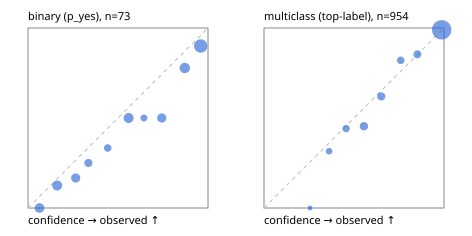

# Evaluation report

- model `Qwen/Qwen3.5-4B` @ `851bf6e806` (shared-prefix tree, forward only: text once per request, each question once, then each candidate), adapter/checkpoint `weights/selfjev_4b`, prompt `challenger-state-first-v1` (6c9d8459ac44)
- data data/ova/eval_images_heldout.jsonl; splits ['test']; n=1027; calibration `None`
- cuda / bfloat16; 2026-09-30T23:12:18+0000; wall 121.9s

## Overall

question accuracy 88.3%

**binary**: n 73, positives 37, accuracy 0.781, precision 0.733, recall 0.892, f1 0.805, auroc 0.877, brier 0.153, log_loss 0.460, ece 0.086

**multiclass**: n 954, accuracy 0.891, macro_f1 0.680, log_loss 0.256, brier 0.140, ece_top_label 0.014

## By family

| family | n | question acc % | details |
|---|---|---|---|
| held_ai2d | 150 | 82.7 | mc acc 82.7 mF1 82.6 ECE 0.047 |
| held_chartqa | 150 | 84.7 | bin acc 72.0 F1 74.1 AUROC 0.877 ECE 0.187; mc acc 87.2 mF1 86.5 ECE 0.042 |
| held_cvbench | 150 | 87.3 | mc acc 87.3 mF1 50.8 ECE 0.052 |
| held_docvqa | 150 | 98.0 | mc acc 98.0 mF1 97.9 ECE 0.015 |
| held_realworldqa | 150 | 75.3 | mc acc 75.3 mF1 81.0 ECE 0.061 |
| held_textvqa | 150 | 98.0 | bin acc 90.0 F1 94.1 AUROC 1.000 ECE 0.129; mc acc 98.6 mF1 98.5 ECE 0.035 |
| held_vizwiz | 127 | 92.9 | bin acc 78.9 F1 78.9 AUROC 0.852 ECE 0.171; mc acc 98.9 mF1 98.9 ECE 0.029 |

## by hard case

| slice | n | question acc % |
|---|---|---|
| (none) | 1027 | 88.3 |

## by state tokens

| slice | n | question acc % |
|---|---|---|
| 00000-00127 | 1027 | 88.3 |

## by candidates

| slice | n | question acc % |
|---|---|---|
| 01 | 73 | 78.1 |
| 02 | 141 | 89.4 |
| 03 | 132 | 78.0 |
| 04 | 674 | 91.7 |
| 05 | 3 | 33.3 |
| 06 | 4 | 50.0 |

## Paraphrase groups

0 groups; same prediction —%; all correct —%

## Multiclass abstention (coverage vs error on accepted)

| abstain_below | coverage % | error % |
|---|---|---|
| 0.0 | 100.0 | 10.9 |
| 0.4 | 97.8 | 9.5 |
| 0.5 | 94.2 | 7.8 |
| 0.6 | 88.5 | 4.7 |
| 0.7 | 83.2 | 2.6 |
| 0.8 | 79.1 | 1.9 |
| 0.9 | 74.1 | 1.0 |

## Reliability: binary

| bin | n | mean confidence | observed frequency |
|---|---|---|---|
| [0.0,0.1) | 7 | 0.064 | 0.000 |
| [0.1,0.2) | 8 | 0.162 | 0.125 |
| [0.2,0.3) | 6 | 0.265 | 0.167 |
| [0.3,0.4) | 4 | 0.336 | 0.250 |
| [0.4,0.5) | 3 | 0.443 | 0.333 |
| [0.5,0.6) | 8 | 0.559 | 0.500 |
| [0.6,0.7) | 2 | 0.644 | 0.500 |
| [0.7,0.8) | 6 | 0.743 | 0.500 |
| [0.8,0.9) | 9 | 0.871 | 0.778 |
| [0.9,1.0] | 20 | 0.959 | 0.900 |

## Reliability: multiclass

| bin | n | mean confidence | observed frequency |
|---|---|---|---|
| [0.2,0.3) | 2 | 0.256 | 0.000 |
| [0.3,0.4) | 19 | 0.362 | 0.316 |
| [0.4,0.5) | 34 | 0.456 | 0.441 |
| [0.5,0.6) | 55 | 0.555 | 0.455 |
| [0.6,0.7) | 50 | 0.651 | 0.620 |
| [0.7,0.8) | 39 | 0.759 | 0.821 |
| [0.8,0.9) | 48 | 0.852 | 0.854 |
| [0.9,1.0] | 707 | 0.987 | 0.990 |
