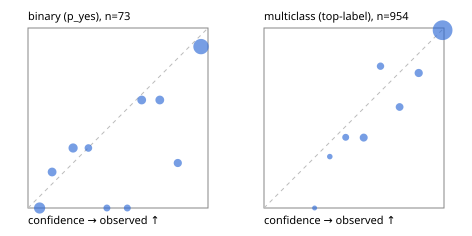

# Evaluation report

- model `Qwen/Qwen3.5-4B` @ `851bf6e806` (shared-prefix tree, forward only: text once per request, each question once, then each candidate), adapter/checkpoint `weights/selfjev_4b_vision`, prompt `challenger-state-first-v1` (6c9d8459ac44)
- data data/ova/eval_images_heldout.jsonl; splits ['test']; n=1027; calibration `None`
- cuda / bfloat16; 2026-09-30T23:10:01+0000; wall 230.9s

## Overall

question accuracy 88.7%

**binary**: n 73, positives 37, accuracy 0.781, precision 0.733, recall 0.892, f1 0.805, auroc 0.897, brier 0.151, log_loss 0.454, ece 0.118

**multiclass**: n 954, accuracy 0.895, macro_f1 0.682, log_loss 0.259, brier 0.140, ece_top_label 0.033

## By family

| family | n | question acc % | details |
|---|---|---|---|
| held_ai2d | 150 | 84.0 | mc acc 84.0 mF1 83.9 ECE 0.066 |
| held_chartqa | 150 | 83.3 | bin acc 72.0 F1 74.1 AUROC 0.916 ECE 0.190; mc acc 85.6 mF1 85.6 ECE 0.050 |
| held_cvbench | 150 | 88.7 | mc acc 88.7 mF1 51.3 ECE 0.054 |
| held_docvqa | 150 | 98.7 | mc acc 98.7 mF1 98.7 ECE 0.013 |
| held_realworldqa | 150 | 75.3 | mc acc 75.3 mF1 81.1 ECE 0.078 |
| held_textvqa | 150 | 98.7 | bin acc 90.0 F1 94.1 AUROC 1.000 ECE 0.122; mc acc 99.3 mF1 99.3 ECE 0.028 |
| held_vizwiz | 127 | 92.9 | bin acc 78.9 F1 78.9 AUROC 0.880 ECE 0.182; mc acc 98.9 mF1 99.0 ECE 0.007 |

## by hard case

| slice | n | question acc % |
|---|---|---|
| (none) | 1027 | 88.7 |

## by state tokens

| slice | n | question acc % |
|---|---|---|
| 00000-00127 | 1027 | 88.7 |

## by candidates

| slice | n | question acc % |
|---|---|---|
| 01 | 73 | 78.1 |
| 02 | 141 | 90.8 |
| 03 | 132 | 78.0 |
| 04 | 674 | 92.0 |
| 05 | 3 | 33.3 |
| 06 | 4 | 50.0 |

## Paraphrase groups

0 groups; same prediction —%; all correct —%

## Multiclass abstention (coverage vs error on accepted)

| abstain_below | coverage % | error % |
|---|---|---|
| 0.0 | 100.0 | 10.5 |
| 0.4 | 99.0 | 9.7 |
| 0.5 | 96.0 | 8.2 |
| 0.6 | 91.2 | 5.4 |
| 0.7 | 87.7 | 4.8 |
| 0.8 | 83.4 | 2.8 |
| 0.9 | 78.0 | 1.2 |

## Reliability: binary

| bin | n | mean confidence | observed frequency |
|---|---|---|---|
| [0.0,0.1) | 12 | 0.064 | 0.000 |
| [0.1,0.2) | 5 | 0.134 | 0.200 |
| [0.2,0.3) | 6 | 0.250 | 0.333 |
| [0.3,0.4) | 3 | 0.335 | 0.333 |
| [0.4,0.5) | 2 | 0.438 | 0.000 |
| [0.5,0.6) | 2 | 0.552 | 0.000 |
| [0.6,0.7) | 5 | 0.632 | 0.600 |
| [0.7,0.8) | 5 | 0.732 | 0.600 |
| [0.8,0.9) | 4 | 0.832 | 0.250 |
| [0.9,1.0] | 29 | 0.961 | 0.897 |

## Reliability: multiclass

| bin | n | mean confidence | observed frequency |
|---|---|---|---|
| [0.2,0.3) | 3 | 0.281 | 0.000 |
| [0.3,0.4) | 7 | 0.366 | 0.286 |
| [0.4,0.5) | 28 | 0.454 | 0.393 |
| [0.5,0.6) | 46 | 0.554 | 0.391 |
| [0.6,0.7) | 33 | 0.647 | 0.788 |
| [0.7,0.8) | 41 | 0.753 | 0.561 |
| [0.8,0.9) | 52 | 0.860 | 0.750 |
| [0.9,1.0] | 744 | 0.992 | 0.988 |
