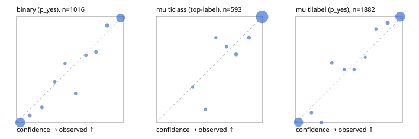

# Evaluation report

- model `Qwen/Qwen3.5-4B` @ `851bf6e806` (shared-prefix tree, forward only: text once per request, each question once, then each candidate), adapter/checkpoint `runs/images_v2/adapter`, prompt `challenger-state-first-v1` (6c9d8459ac44)
- data data/ova/eval2.jsonl; splits ['test']; n=1991; calibration `None`
- cuda / bfloat16; 2026-10-01T02:33:21+0000; wall 335.0s

## Overall

question accuracy 95.2%

**binary**: n 1016, positives 435, accuracy 0.961, precision 0.942, recall 0.968, f1 0.955, auroc 0.995, brier 0.026, log_loss 0.105, ece 0.032

**multiclass**: n 593, accuracy 0.963, macro_f1 0.937, log_loss 0.096, brier 0.049, ece_top_label 0.014

**multilabel**: n 382, labels 1882, exact_match 0.914, micro_f1 0.980, macro_f1 0.961, label_auroc 0.998, brier 0.015, log_loss 0.069, ece 0.029

## By family

| family | n | question acc % | details |
|---|---|---|---|
| e2_hard | 673 | 93.8 | bin acc 96.3 F1 94.9 AUROC 0.996 ECE 0.053; mc acc 93.3 mF1 87.2 ECE 0.030; ml EM 87.9 µF1 96.5 ECE 0.029 |
| e2_simple | 664 | 98.2 | bin acc 97.1 F1 97.3 AUROC 0.997 ECE 0.023; mc acc 100.0 mF1 100.0 ECE 0.007; ml EM 98.3 µF1 99.7 ECE 0.029 |
| e2_very_hard | 654 | 93.7 | bin acc 94.8 F1 93.2 AUROC 0.994 ECE 0.040; mc acc 95.5 mF1 94.2 ECE 0.016; ml EM 88.5 µF1 97.7 ECE 0.032 |

## by hard case

| slice | n | question acc % |
|---|---|---|
| (none) | 569 | 98.4 |
| contradiction | 172 | 97.1 |
| distractor | 474 | 93.9 |
| double_negation | 126 | 96.8 |
| evidence_end | 57 | 100.0 |
| evidence_middle | 114 | 95.6 |
| evidence_start | 17 | 100.0 |
| exception | 213 | 94.4 |
| hypothetical | 128 | 96.1 |
| injection | 151 | 94.7 |
| lexical_overlap | 201 | 98.0 |
| long_state | 191 | 96.9 |
| missing_evidence | 141 | 97.9 |
| multi_positive | 322 | 91.3 |
| multi_turn | 149 | 92.6 |
| negation | 257 | 96.1 |
| nota | 118 | 91.5 |
| numeric_reasoning | 224 | 87.9 |
| paraphrase | 218 | 93.1 |
| role_reversal | 187 | 93.0 |
| sarcasm | 149 | 96.0 |
| temporal_reasoning | 203 | 84.7 |
| zero_positive | 73 | 97.3 |
| zero_positive_distractor | 1 | 100.0 |

## by state tokens

| slice | n | question acc % |
|---|---|---|
| 00000-00127 | 666 | 93.7 |
| 00128-00511 | 469 | 93.6 |
| 00512-02047 | 488 | 96.7 |
| 02048-08191 | 329 | 98.2 |
| 08192+ | 39 | 97.4 |

## by candidates

| slice | n | question acc % |
|---|---|---|
| 01 | 1016 | 96.1 |
| 03 | 128 | 94.5 |
| 04 | 515 | 95.3 |
| 05 | 224 | 92.0 |
| 06 | 86 | 94.2 |
| 07 | 18 | 100.0 |
| 08 | 4 | 75.0 |

## Paraphrase groups

76 groups; same prediction 77.6%; all correct 85.5%

## Multiclass abstention (coverage vs error on accepted)

| abstain_below | coverage % | error % |
|---|---|---|
| 0.0 | 100.0 | 3.7 |
| 0.4 | 99.5 | 3.4 |
| 0.5 | 98.1 | 2.2 |
| 0.6 | 97.3 | 2.1 |
| 0.7 | 96.1 | 1.8 |
| 0.8 | 93.8 | 0.9 |
| 0.9 | 91.2 | 0.4 |

## Reliability: binary

| bin | n | mean confidence | observed frequency |
|---|---|---|---|
| [0.0,0.1) | 503 | 0.034 | 0.000 |
| [0.1,0.2) | 30 | 0.123 | 0.067 |
| [0.2,0.3) | 14 | 0.238 | 0.143 |
| [0.3,0.4) | 13 | 0.358 | 0.385 |
| [0.4,0.5) | 9 | 0.455 | 0.556 |
| [0.5,0.6) | 11 | 0.555 | 0.273 |
| [0.6,0.7) | 11 | 0.651 | 0.636 |
| [0.7,0.8) | 18 | 0.746 | 0.667 |
| [0.8,0.9) | 36 | 0.850 | 0.917 |
| [0.9,1.0] | 371 | 0.977 | 0.987 |

## Reliability: multiclass

| bin | n | mean confidence | observed frequency |
|---|---|---|---|
| [0.3,0.4) | 3 | 0.341 | 0.333 |
| [0.4,0.5) | 8 | 0.461 | 0.125 |
| [0.5,0.6) | 5 | 0.560 | 0.800 |
| [0.6,0.7) | 7 | 0.659 | 0.714 |
| [0.7,0.8) | 14 | 0.750 | 0.643 |
| [0.8,0.9) | 15 | 0.870 | 0.800 |
| [0.9,1.0] | 541 | 0.994 | 0.996 |

## Reliability: multilabel

| bin | n | mean confidence | observed frequency |
|---|---|---|---|
| [0.0,0.1) | 773 | 0.026 | 0.003 |
| [0.1,0.2) | 43 | 0.144 | 0.093 |
| [0.2,0.3) | 14 | 0.239 | 0.000 |
| [0.3,0.4) | 16 | 0.338 | 0.562 |
| [0.4,0.5) | 16 | 0.453 | 0.500 |
| [0.5,0.6) | 14 | 0.546 | 0.500 |
| [0.6,0.7) | 13 | 0.651 | 0.615 |
| [0.7,0.8) | 17 | 0.752 | 0.882 |
| [0.8,0.9) | 50 | 0.862 | 0.940 |
| [0.9,1.0] | 926 | 0.979 | 0.999 |
