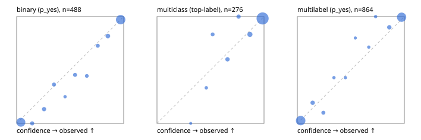

# Evaluation report

- model `Qwen/Qwen3.5-4B` @ `851bf6e806` (shared-prefix tree, forward only: text once per request, each question once, then each candidate), adapter/checkpoint `runs/images_v2/adapter`, prompt `challenger-state-first-v1` (6c9d8459ac44)
- data data/ova/eval_llm.jsonl; splits ['test']; n=946; calibration `None`
- cuda / bfloat16; 2026-10-01T02:35:27+0000; wall 111.2s

## Overall

question accuracy 92.4%

**binary**: n 488, positives 245, accuracy 0.932, precision 0.908, recall 0.963, f1 0.935, auroc 0.982, brier 0.050, log_loss 0.180, ece 0.029

**multiclass**: n 276, accuracy 0.946, macro_f1 0.916, log_loss 0.172, brier 0.087, ece_top_label 0.025

**multilabel**: n 182, labels 864, exact_match 0.868, micro_f1 0.962, macro_f1 0.928, label_auroc 0.990, brier 0.033, log_loss 0.126, ece 0.022

## By family

| family | n | question acc % | details |
|---|---|---|---|
| tllm_guardrail_hard | 60 | 90.0 | bin acc 87.5 F1 87.5 AUROC 1.000 ECE 0.167; mc acc 100.0 mF1 100.0 ECE 0.057; ml EM 81.8 µF1 95.0 ECE 0.077 |
| tllm_guardrail_simple | 67 | 98.5 | bin acc 100.0 F1 100.0 AUROC 1.000 ECE 0.025; mc acc 100.0 mF1 100.0 ECE 0.017; ml EM 92.9 µF1 98.5 ECE 0.037 |
| tllm_guardrail_very_hard | 43 | 97.7 | bin acc 100.0 F1 100.0 AUROC 1.000 ECE 0.073; mc acc 92.9 mF1 83.3 ECE 0.050; ml EM 100.0 µF1 100.0 ECE 0.049 |
| tllm_jailbreak_hard | 59 | 100.0 | bin acc 100.0 F1 100.0 AUROC 1.000 ECE 0.057; mc acc 100.0 mF1 100.0 ECE 0.052; ml EM 100.0 µF1 100.0 ECE 0.046 |
| tllm_jailbreak_simple | 70 | 95.7 | bin acc 100.0 F1 100.0 AUROC 1.000 ECE 0.032; mc acc 90.9 mF1 81.2 ECE 0.074; ml EM 90.9 µF1 98.6 ECE 0.033 |
| tllm_jailbreak_very_hard | 60 | 86.7 | bin acc 87.5 F1 85.7 AUROC 0.968 ECE 0.115; mc acc 88.9 mF1 82.4 ECE 0.090; ml EM 80.0 µF1 96.3 ECE 0.058 |
| tllm_judge_hard | 86 | 95.3 | bin acc 95.0 F1 93.3 AUROC 0.968 ECE 0.059; mc acc 96.0 mF1 90.9 ECE 0.036; ml EM 95.2 µF1 96.2 ECE 0.024 |
| tllm_judge_simple | 72 | 97.2 | bin acc 97.4 F1 97.9 AUROC 0.997 ECE 0.069; mc acc 100.0 mF1 100.0 ECE 0.033; ml EM 92.9 µF1 98.8 ECE 0.046 |
| tllm_judge_very_hard | 64 | 92.2 | bin acc 96.9 F1 97.3 AUROC 1.000 ECE 0.081; mc acc 95.2 mF1 96.7 ECE 0.066; ml EM 72.7 µF1 95.8 ECE 0.059 |
| tllm_score_hard | 62 | 93.5 | bin acc 94.1 F1 94.1 AUROC 1.000 ECE 0.101; mc acc 100.0 mF1 100.0 ECE 0.065; ml EM 83.3 µF1 96.0 ECE 0.071 |
| tllm_score_simple | 62 | 98.4 | bin acc 97.1 F1 98.0 AUROC 0.983 ECE 0.056; mc acc 100.0 mF1 100.0 ECE 0.040; ml EM 100.0 µF1 100.0 ECE 0.034 |
| tllm_score_very_hard | 76 | 82.9 | bin acc 84.2 F1 75.0 AUROC 0.973 ECE 0.143; mc acc 90.9 mF1 82.6 ECE 0.124; ml EM 68.8 µF1 89.2 ECE 0.072 |
| tllm_verify_hard | 50 | 78.0 | bin acc 76.9 F1 76.9 AUROC 0.848 ECE 0.135; mc acc 87.5 mF1 76.5 ECE 0.194; ml EM 62.5 µF1 74.1 ECE 0.164 |
| tllm_verify_simple | 60 | 96.7 | bin acc 97.0 F1 97.6 AUROC 0.996 ECE 0.049; mc acc 100.0 mF1 100.0 ECE 0.005; ml EM 91.7 µF1 98.5 ECE 0.049 |
| tllm_verify_very_hard | 55 | 80.0 | bin acc 83.9 F1 80.0 AUROC 0.885 ECE 0.194; mc acc 73.3 mF1 60.8 ECE 0.144; ml EM 77.8 µF1 88.9 ECE 0.055 |

## by hard case

| slice | n | question acc % |
|---|---|---|
| (none) | 265 | 97.4 |
| answer_trace_mismatch | 45 | 88.9 |
| benign_lookalike | 88 | 90.9 |
| confident_wrong | 39 | 71.8 |
| contradiction | 22 | 95.5 |
| distractor | 117 | 88.9 |
| double_negation | 3 | 100.0 |
| evidence_end | 11 | 90.9 |
| evidence_middle | 20 | 80.0 |
| evidence_start | 2 | 50.0 |
| exception | 20 | 95.0 |
| fake_authority | 1 | 100.0 |
| flawed_step | 44 | 65.9 |
| format_near_miss | 46 | 87.0 |
| gradual_escalation | 1 | 100.0 |
| hypothetical | 7 | 100.0 |
| indirect_injection | 25 | 92.0 |
| injection | 22 | 100.0 |
| judge_injection | 112 | 92.0 |
| length_bias | 7 | 100.0 |
| lexical_overlap | 103 | 89.3 |
| long_state | 74 | 90.5 |
| missing_evidence | 35 | 94.3 |
| multi_positive | 124 | 86.3 |
| multi_turn | 44 | 86.4 |
| negation | 62 | 95.2 |
| nota | 55 | 89.1 |
| numeric_reasoning | 109 | 81.7 |
| obfuscation | 1 | 100.0 |
| over_refusal | 50 | 90.0 |
| paraphrase | 73 | 91.8 |
| partial_compliance | 31 | 77.4 |
| role_reversal | 6 | 66.7 |
| sarcasm | 8 | 87.5 |
| speaker_confusion | 58 | 87.9 |
| subtle_violation | 16 | 100.0 |
| sycophancy | 13 | 100.0 |
| temporal_reasoning | 20 | 90.0 |
| tool_misuse | 6 | 83.3 |
| unsupported_claim | 96 | 89.6 |
| zero_positive | 55 | 94.5 |
| zero_positive_partial | 1 | 100.0 |

## by state tokens

| slice | n | question acc % |
|---|---|---|
| 00000-00127 | 308 | 90.3 |
| 00128-00511 | 284 | 95.8 |
| 00512-02047 | 222 | 93.2 |
| 02048-08191 | 125 | 88.0 |
| 08192+ | 7 | 100.0 |

## by candidates

| slice | n | question acc % |
|---|---|---|
| 01 | 488 | 93.2 |
| 03 | 82 | 95.1 |
| 04 | 239 | 93.3 |
| 05 | 98 | 85.7 |
| 06 | 33 | 87.9 |
| 07 | 3 | 100.0 |
| 08 | 3 | 66.7 |

## Paraphrase groups

29 groups; same prediction 96.6%; all correct 86.2%

## Multiclass abstention (coverage vs error on accepted)

| abstain_below | coverage % | error % |
|---|---|---|
| 0.0 | 100.0 | 5.4 |
| 0.4 | 99.6 | 5.1 |
| 0.5 | 98.6 | 4.4 |
| 0.6 | 96.4 | 4.1 |
| 0.7 | 92.8 | 2.7 |
| 0.8 | 89.5 | 2.8 |
| 0.9 | 83.0 | 1.7 |

## Reliability: binary

| bin | n | mean confidence | observed frequency |
|---|---|---|---|
| [0.0,0.1) | 185 | 0.039 | 0.011 |
| [0.1,0.2) | 13 | 0.145 | 0.000 |
| [0.2,0.3) | 15 | 0.256 | 0.133 |
| [0.3,0.4) | 11 | 0.349 | 0.364 |
| [0.4,0.5) | 4 | 0.452 | 0.250 |
| [0.5,0.6) | 11 | 0.546 | 0.455 |
| [0.6,0.7) | 9 | 0.656 | 0.444 |
| [0.7,0.8) | 11 | 0.758 | 0.727 |
| [0.8,0.9) | 22 | 0.852 | 0.818 |
| [0.9,1.0] | 207 | 0.972 | 0.971 |

## Reliability: multiclass

| bin | n | mean confidence | observed frequency |
|---|---|---|---|
| [0.3,0.4) | 1 | 0.315 | 0.000 |
| [0.4,0.5) | 3 | 0.460 | 0.333 |
| [0.5,0.6) | 6 | 0.520 | 0.833 |
| [0.6,0.7) | 10 | 0.659 | 0.600 |
| [0.7,0.8) | 9 | 0.762 | 1.000 |
| [0.8,0.9) | 18 | 0.868 | 0.833 |
| [0.9,1.0] | 229 | 0.986 | 0.983 |

## Reliability: multilabel

| bin | n | mean confidence | observed frequency |
|---|---|---|---|
| [0.0,0.1) | 387 | 0.031 | 0.026 |
| [0.1,0.2) | 31 | 0.143 | 0.194 |
| [0.2,0.3) | 20 | 0.243 | 0.100 |
| [0.3,0.4) | 7 | 0.342 | 0.429 |
| [0.4,0.5) | 7 | 0.450 | 0.429 |
| [0.5,0.6) | 5 | 0.542 | 0.800 |
| [0.6,0.7) | 7 | 0.668 | 0.714 |
| [0.7,0.8) | 7 | 0.732 | 1.000 |
| [0.8,0.9) | 30 | 0.860 | 0.900 |
| [0.9,1.0] | 363 | 0.974 | 0.994 |
