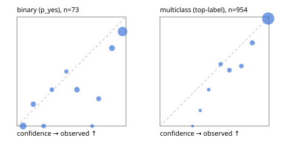

# Evaluation report

- model `Qwen/Qwen3.5-4B` @ `851bf6e806` (shared-prefix tree, forward only: text once per request, each question once, then each candidate), adapter/checkpoint `runs/images_v2/adapter`, prompt `challenger-state-first-v1` (6c9d8459ac44)
- data data/ova/eval_images_heldout.jsonl; splits ['test']; n=1027; calibration `None`
- cuda / bfloat16; 2026-10-01T02:25:28+0000; wall 122.0s

## Overall

question accuracy 89.5%

**binary**: n 73, positives 37, accuracy 0.767, precision 0.708, recall 0.919, f1 0.800, auroc 0.902, brier 0.156, log_loss 0.482, ece 0.136

**multiclass**: n 954, accuracy 0.905, macro_f1 0.856, log_loss 0.239, brier 0.130, ece_top_label 0.028

## By family

| family | n | question acc % | details |
|---|---|---|---|
| held_ai2d | 150 | 86.7 | mc acc 86.7 mF1 86.6 ECE 0.045 |
| held_chartqa | 150 | 83.3 | bin acc 68.0 F1 71.4 AUROC 0.929 ECE 0.216; mc acc 86.4 mF1 86.4 ECE 0.045 |
| held_cvbench | 150 | 90.7 | mc acc 90.7 mF1 76.5 ECE 0.038 |
| held_docvqa | 150 | 98.7 | mc acc 98.7 mF1 98.7 ECE 0.013 |
| held_realworldqa | 150 | 74.7 | mc acc 74.7 mF1 80.5 ECE 0.097 |
| held_textvqa | 150 | 100.0 | bin acc 100.0 F1 100.0 AUROC 1.000 ECE 0.090; mc acc 100.0 mF1 100.0 ECE 0.008 |
| held_vizwiz | 127 | 92.9 | bin acc 76.3 F1 76.9 AUROC 0.880 ECE 0.175; mc acc 100.0 mF1 100.0 ECE 0.001 |

## by hard case

| slice | n | question acc % |
|---|---|---|
| (none) | 1027 | 89.5 |

## by state tokens

| slice | n | question acc % |
|---|---|---|
| 00000-00127 | 1027 | 89.5 |

## by candidates

| slice | n | question acc % |
|---|---|---|
| 01 | 73 | 76.7 |
| 02 | 141 | 90.8 |
| 03 | 132 | 76.5 |
| 04 | 674 | 93.5 |
| 05 | 3 | 33.3 |
| 06 | 4 | 75.0 |

## Paraphrase groups

0 groups; same prediction —%; all correct —%

## Multiclass abstention (coverage vs error on accepted)

| abstain_below | coverage % | error % |
|---|---|---|
| 0.0 | 100.0 | 9.5 |
| 0.4 | 99.2 | 8.9 |
| 0.5 | 97.9 | 8.1 |
| 0.6 | 94.8 | 7.0 |
| 0.7 | 90.5 | 5.0 |
| 0.8 | 86.3 | 3.0 |
| 0.9 | 80.1 | 1.4 |

## Reliability: binary

| bin | n | mean confidence | observed frequency |
|---|---|---|---|
| [0.0,0.1) | 12 | 0.055 | 0.000 |
| [0.1,0.2) | 5 | 0.149 | 0.200 |
| [0.2,0.3) | 3 | 0.245 | 0.000 |
| [0.3,0.4) | 3 | 0.320 | 0.333 |
| [0.4,0.5) | 2 | 0.453 | 0.500 |
| [0.5,0.6) | 6 | 0.550 | 0.333 |
| [0.6,0.7) | 1 | 0.689 | 0.000 |
| [0.7,0.8) | 4 | 0.749 | 0.250 |
| [0.8,0.9) | 7 | 0.871 | 0.714 |
| [0.9,1.0] | 30 | 0.968 | 0.867 |

## Reliability: multiclass

| bin | n | mean confidence | observed frequency |
|---|---|---|---|
| [0.2,0.3) | 1 | 0.299 | 0.000 |
| [0.3,0.4) | 7 | 0.369 | 0.143 |
| [0.4,0.5) | 12 | 0.447 | 0.333 |
| [0.5,0.6) | 30 | 0.555 | 0.567 |
| [0.6,0.7) | 41 | 0.637 | 0.512 |
| [0.7,0.8) | 40 | 0.746 | 0.550 |
| [0.8,0.9) | 59 | 0.847 | 0.763 |
| [0.9,1.0] | 764 | 0.992 | 0.986 |
