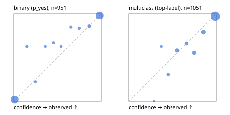

# Evaluation report

- model `Qwen/Qwen3.5-4B` @ `851bf6e806` (shared-prefix tree, forward only: text once per request, each question once, then each candidate), adapter/checkpoint `runs/images_v2/adapter`, prompt `challenger-state-first-v1` (6c9d8459ac44)
- data data/ova/eval_images_v1.jsonl; splits ['test']; n=2002; calibration `None`
- cuda / bfloat16; 2026-10-01T02:27:31+0000; wall 107.5s

## Overall

question accuracy 90.9%

**binary**: n 951, positives 508, accuracy 0.942, precision 0.956, recall 0.935, f1 0.945, auroc 0.985, brier 0.044, log_loss 0.157, ece 0.024

**multiclass**: n 1051, accuracy 0.878, macro_f1 0.926, log_loss 0.322, brier 0.175, ece_top_label 0.036

## By family

| family | n | question acc % | details |
|---|---|---|---|
| img_beans | 204 | 99.5 | bin acc 99.0 F1 99.0 AUROC 0.998 ECE 0.016; mc acc 100.0 mF1 100.0 ECE 0.028 |
| img_eurosat | 200 | 93.0 | bin acc 95.0 F1 95.0 AUROC 0.986 ECE 0.030; mc acc 91.0 mF1 90.9 ECE 0.041 |
| img_fashion | 200 | 88.5 | bin acc 96.0 F1 96.0 AUROC 0.980 ECE 0.043; mc acc 81.0 mF1 80.4 ECE 0.101 |
| img_hurricane | 100 | 66.0 | mc acc 66.0 mF1 65.9 ECE 0.199 |
| img_indoor | 268 | 96.3 | bin acc 96.3 F1 96.2 AUROC 0.996 ECE 0.037; mc acc 96.3 mF1 96.0 ECE 0.029 |
| img_painting | 204 | 72.1 | bin acc 80.4 F1 79.2 AUROC 0.923 ECE 0.142; mc acc 63.7 mF1 61.3 ECE 0.099 |
| img_pets | 222 | 97.3 | bin acc 97.3 F1 98.0 AUROC 0.999 ECE 0.029; mc acc 97.3 mF1 97.3 ECE 0.024 |
| img_rice | 200 | 93.0 | bin acc 93.0 F1 93.5 AUROC 0.951 ECE 0.062; mc acc 93.0 mF1 93.0 ECE 0.030 |
| img_snacks | 200 | 93.0 | bin acc 93.0 F1 93.8 AUROC 0.995 ECE 0.066; mc acc 93.0 mF1 93.1 ECE 0.040 |
| img_trash | 204 | 95.1 | bin acc 97.1 F1 97.1 AUROC 0.999 ECE 0.035; mc acc 93.1 mF1 93.1 ECE 0.033 |

## by hard case

| slice | n | question acc % |
|---|---|---|
| (none) | 2002 | 90.9 |

## by state tokens

| slice | n | question acc % |
|---|---|---|
| 00000-00127 | 2002 | 90.9 |

## by candidates

| slice | n | question acc % |
|---|---|---|
| 01 | 951 | 94.2 |
| 02 | 100 | 66.0 |
| 03 | 102 | 100.0 |
| 05 | 100 | 93.0 |
| 06 | 102 | 93.1 |
| 10 | 200 | 86.0 |
| 12 | 447 | 88.4 |

## Paraphrase groups

0 groups; same prediction —%; all correct —%

## Multiclass abstention (coverage vs error on accepted)

| abstain_below | coverage % | error % |
|---|---|---|
| 0.0 | 100.0 | 12.2 |
| 0.4 | 99.1 | 11.9 |
| 0.5 | 96.7 | 10.4 |
| 0.6 | 91.4 | 8.6 |
| 0.7 | 87.3 | 7.4 |
| 0.8 | 81.3 | 4.7 |
| 0.9 | 73.5 | 3.0 |

## Reliability: binary

| bin | n | mean confidence | observed frequency |
|---|---|---|---|
| [0.0,0.1) | 409 | 0.010 | 0.020 |
| [0.1,0.2) | 16 | 0.152 | 0.625 |
| [0.2,0.3) | 9 | 0.247 | 0.222 |
| [0.3,0.4) | 8 | 0.362 | 0.625 |
| [0.4,0.5) | 12 | 0.453 | 0.667 |
| [0.5,0.6) | 8 | 0.542 | 0.625 |
| [0.6,0.7) | 13 | 0.652 | 0.846 |
| [0.7,0.8) | 18 | 0.750 | 0.833 |
| [0.8,0.9) | 35 | 0.862 | 0.857 |
| [0.9,1.0] | 423 | 0.982 | 0.979 |

## Reliability: multiclass

| bin | n | mean confidence | observed frequency |
|---|---|---|---|
| [0.2,0.3) | 1 | 0.291 | 0.000 |
| [0.3,0.4) | 8 | 0.373 | 0.625 |
| [0.4,0.5) | 26 | 0.449 | 0.308 |
| [0.5,0.6) | 55 | 0.553 | 0.582 |
| [0.6,0.7) | 44 | 0.658 | 0.659 |
| [0.7,0.8) | 63 | 0.748 | 0.556 |
| [0.8,0.9) | 81 | 0.852 | 0.790 |
| [0.9,1.0] | 773 | 0.988 | 0.970 |
