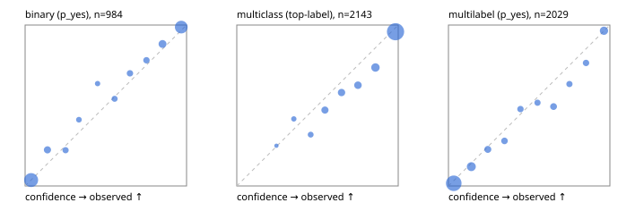

# Evaluation report

- model `Qwen/Qwen3.5-4B` @ `851bf6e806` (shared-prefix tree, forward only: text once per request, each question once, then each candidate), adapter/checkpoint `runs/images_v2/adapter`, prompt `challenger-state-first-v1` (6c9d8459ac44)
- data data/ova/hf.jsonl, data/ova/eval.jsonl; splits ['test']; n=3471; calibration `None`
- cuda / bfloat16; 2026-10-01T02:37:47+0000; wall 123.3s

## Overall

question accuracy 83.5%

**binary**: n 984, positives 475, accuracy 0.914, precision 0.917, recall 0.903, f1 0.910, auroc 0.973, brier 0.064, log_loss 0.218, ece 0.020

**multiclass**: n 2143, accuracy 0.853, macro_f1 0.932, log_loss 0.425, brier 0.213, ece_top_label 0.047

**multilabel**: n 344, labels 2029, exact_match 0.506, micro_f1 0.735, macro_f1 0.836, label_auroc 0.942, brier 0.078, log_loss 0.251, ece 0.029

## By family

| family | n | question acc % | details |
|---|---|---|---|
| eval_adversarial | 27 | 96.3 | bin acc 93.3 F1 90.9 AUROC 0.963 ECE 0.051; mc acc 100.0 mF1 100.0 ECE 0.002; ml EM 100.0 µF1 100.0 ECE 0.037 |
| eval_agent_output | 26 | 92.3 | bin acc 100.0 F1 100.0 AUROC 1.000 ECE 0.066; mc acc 85.7 mF1 86.7 ECE 0.206; ml EM 80.0 µF1 94.1 ECE 0.085 |
| eval_evidence | 17 | 94.1 | bin acc 100.0 F1 100.0 AUROC 1.000 ECE 0.029; ml EM 50.0 µF1 66.7 ECE 0.178 |
| eval_multilabel | 32 | 96.9 | bin acc 100.0 F1 100.0 AUROC 1.000 ECE 0.069; mc acc 100.0 mF1 100.0 ECE 0.009; ml EM 95.8 µF1 98.0 ECE 0.030 |
| eval_policy | 22 | 68.2 | bin acc 76.9 F1 80.0 AUROC 0.929 ECE 0.247; mc acc 60.0 mF1 42.9 ECE 0.401; ml EM 50.0 µF1 88.9 ECE 0.183 |
| eval_routing | 25 | 96.0 | bin acc 100.0 F1 100.0 AUROC 1.000 ECE 0.026; mc acc 100.0 mF1 100.0 ECE 0.061; ml EM 50.0 µF1 80.0 ECE 0.110 |
| eval_urgency_sentiment | 22 | 95.5 | bin acc 90.0 F1 92.3 AUROC 0.958 ECE 0.135; mc acc 100.0 mF1 100.0 ECE 0.065; ml EM 100.0 µF1 100.0 ECE 0.023 |
| heldout_boolq | 300 | 88.0 | bin acc 88.0 F1 89.8 AUROC 0.953 ECE 0.042 |
| heldout_emotion_multiclass | 300 | 56.3 | mc acc 56.3 mF1 47.6 ECE 0.203 |
| heldout_intent_clinc | 300 | 96.3 | mc acc 96.3 mF1 95.9 ECE 0.015 |
| heldout_question_type_trec | 300 | 91.0 | mc acc 91.0 mF1 91.0 ECE 0.044 |
| heldout_sentiment_sst2 | 300 | 92.7 | bin acc 92.7 F1 92.4 AUROC 0.980 ECE 0.056 |
| heldout_topic_dbpedia | 300 | 98.0 | mc acc 98.0 mF1 97.8 ECE 0.012 |
| hf_emotions_multilabel | 300 | 45.3 | ml EM 45.3 µF1 68.0 ECE 0.031 |
| hf_intent_banking77 | 300 | 96.0 | mc acc 96.0 mF1 96.0 ECE 0.012 |
| hf_nli | 300 | 92.7 | bin acc 92.7 F1 90.3 AUROC 0.985 ECE 0.045 |
| hf_sentiment_tweets | 300 | 68.0 | mc acc 68.0 mF1 69.2 ECE 0.115 |
| hf_topic_agnews | 300 | 90.0 | mc acc 90.0 mF1 90.0 ECE 0.049 |

## by hard case

| slice | n | question acc % |
|---|---|---|
| (none) | 3042 | 83.3 |
| contradiction | 107 | 99.1 |
| distractor | 33 | 84.8 |
| double_negation | 6 | 83.3 |
| evidence_end | 13 | 92.3 |
| evidence_middle | 11 | 81.8 |
| evidence_start | 9 | 100.0 |
| exception | 7 | 57.1 |
| hypothetical | 7 | 100.0 |
| injection | 10 | 90.0 |
| lexical_overlap | 20 | 100.0 |
| long_state | 50 | 90.0 |
| missing_evidence | 104 | 85.6 |
| multi_positive | 81 | 48.1 |
| multi_turn | 9 | 88.9 |
| negation | 30 | 100.0 |
| new_label_names | 3 | 100.0 |
| nota | 46 | 100.0 |
| numeric_reasoning | 16 | 87.5 |
| paraphrase | 22 | 95.5 |
| role_reversal | 15 | 93.3 |
| sarcasm | 12 | 100.0 |
| temporal_reasoning | 29 | 72.4 |
| zero_positive | 6 | 100.0 |

## by state tokens

| slice | n | question acc % |
|---|---|---|
| 00000-00127 | 3213 | 83.1 |
| 00128-00511 | 206 | 88.3 |
| 00512-02047 | 52 | 90.4 |

## by candidates

| slice | n | question acc % |
|---|---|---|
| 01 | 984 | 91.4 |
| 03 | 310 | 69.0 |
| 04 | 333 | 89.2 |
| 05 | 22 | 95.5 |
| 06 | 1218 | 72.9 |
| 07 | 49 | 100.0 |
| 08 | 555 | 95.9 |

## Paraphrase groups

11 groups; same prediction 72.7%; all correct 90.9%

## Multiclass abstention (coverage vs error on accepted)

| abstain_below | coverage % | error % |
|---|---|---|
| 0.0 | 100.0 | 14.7 |
| 0.4 | 98.7 | 14.1 |
| 0.5 | 96.5 | 12.9 |
| 0.6 | 91.6 | 10.8 |
| 0.7 | 86.3 | 8.9 |
| 0.8 | 80.2 | 6.7 |
| 0.9 | 71.0 | 4.1 |

## Reliability: binary

| bin | n | mean confidence | observed frequency |
|---|---|---|---|
| [0.0,0.1) | 412 | 0.037 | 0.036 |
| [0.1,0.2) | 49 | 0.138 | 0.224 |
| [0.2,0.3) | 27 | 0.250 | 0.222 |
| [0.3,0.4) | 17 | 0.333 | 0.412 |
| [0.4,0.5) | 11 | 0.449 | 0.636 |
| [0.5,0.6) | 24 | 0.554 | 0.542 |
| [0.6,0.7) | 30 | 0.650 | 0.700 |
| [0.7,0.8) | 32 | 0.752 | 0.781 |
| [0.8,0.9) | 68 | 0.851 | 0.882 |
| [0.9,1.0] | 314 | 0.967 | 0.987 |

## Reliability: multiclass

| bin | n | mean confidence | observed frequency |
|---|---|---|---|
| [0.2,0.3) | 4 | 0.246 | 0.250 |
| [0.3,0.4) | 24 | 0.354 | 0.417 |
| [0.4,0.5) | 47 | 0.458 | 0.319 |
| [0.5,0.6) | 106 | 0.546 | 0.472 |
| [0.6,0.7) | 112 | 0.649 | 0.580 |
| [0.7,0.8) | 131 | 0.751 | 0.626 |
| [0.8,0.9) | 197 | 0.859 | 0.736 |
| [0.9,1.0] | 1522 | 0.983 | 0.959 |

## Reliability: multilabel

| bin | n | mean confidence | observed frequency |
|---|---|---|---|
| [0.0,0.1) | 1135 | 0.033 | 0.017 |
| [0.1,0.2) | 233 | 0.142 | 0.120 |
| [0.2,0.3) | 88 | 0.244 | 0.227 |
| [0.3,0.4) | 75 | 0.347 | 0.280 |
| [0.4,0.5) | 67 | 0.446 | 0.478 |
| [0.5,0.6) | 58 | 0.552 | 0.517 |
| [0.6,0.7) | 77 | 0.651 | 0.494 |
| [0.7,0.8) | 60 | 0.750 | 0.633 |
| [0.8,0.9) | 68 | 0.852 | 0.765 |
| [0.9,1.0] | 168 | 0.963 | 0.964 |
