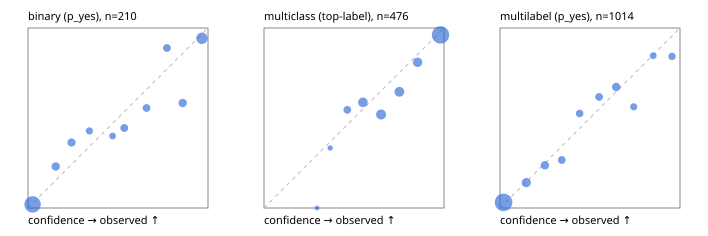

# Evaluation report

- model `jinaai/jina-reranker-v3.5` @ `e8a93f33f0` (jina listwise (jina-v1)), adapter/checkpoint `runs/jina_r2b/adapter`, prompt `jina-v1` (8bf5a0abfcae)
- data data/hf.jsonl, data/eval.jsonl; splits ['calibration']; n=859; calibration `None`
- cuda / bfloat16; 2026-09-24T08:47:27+0000; wall 20.6s

## Overall

question accuracy 74.0%

**binary**: n 210, positives 71, accuracy 0.852, precision 0.770, recall 0.803, f1 0.786, auroc 0.935, brier 0.101, log_loss 0.317, ece 0.051

**multiclass**: n 476, accuracy 0.807, macro_f1 0.786, log_loss 0.496, brier 0.274, ece_top_label 0.048

**multilabel**: n 173, labels 1014, exact_match 0.422, micro_f1 0.671, macro_f1 0.479, label_auroc 0.897, brier 0.099, log_loss 0.324, ece 0.029

## By family

| family | n | question acc % | details |
|---|---|---|---|
| eval_adversarial | 19 | 84.2 | bin acc 78.6 F1 76.9 AUROC 0.898 ECE 0.151; mc acc 100.0 mF1 100.0 ECE 0.458; ml EM 100.0 µF1 100.0 ECE 0.058 |
| eval_agent_output | 9 | 33.3 | bin acc 60.0 F1 75.0 AUROC 0.667 ECE 0.239; mc acc 0.0 mF1 0.0 ECE 0.739; ml EM 0.0 µF1 33.3 ECE 0.376 |
| eval_evidence | 19 | 73.7 | bin acc 87.5 F1 83.3 AUROC 0.909 ECE 0.198; ml EM 0.0 µF1 50.0 ECE 0.260 |
| eval_multilabel | 12 | 8.3 | bin acc 0.0 F1 0.0 AUROC — ECE 0.774; mc acc 50.0 mF1 33.3 ECE 0.365; ml EM 0.0 µF1 61.1 ECE 0.230 |
| eval_policy | 16 | 37.5 | bin acc 62.5 F1 40.0 AUROC 0.667 ECE 0.265; mc acc 0.0 mF1 0.0 ECE 0.713; ml EM 25.0 µF1 60.0 ECE 0.278 |
| eval_routing | 15 | 86.7 | bin acc 85.7 F1 85.7 AUROC 0.917 ECE 0.193; mc acc 85.7 mF1 71.4 ECE 0.182; ml EM 100.0 µF1 100.0 ECE 0.085 |
| eval_urgency_sentiment | 19 | 57.9 | bin acc 37.5 F1 28.6 AUROC 0.583 ECE 0.459; mc acc 87.5 mF1 83.3 ECE 0.229; ml EM 33.3 µF1 85.7 ECE 0.194 |
| hf_emotions_multilabel | 150 | 45.3 | ml EM 45.3 µF1 67.8 ECE 0.025 |
| hf_intent_banking77 | 150 | 94.0 | mc acc 94.0 mF1 91.3 ECE 0.031 |
| hf_nli | 150 | 91.3 | bin acc 91.3 F1 85.7 AUROC 0.970 ECE 0.053 |
| hf_sentiment_tweets | 150 | 65.3 | mc acc 65.3 mF1 62.7 ECE 0.073 |
| hf_topic_agnews | 150 | 85.3 | mc acc 85.3 mF1 85.4 ECE 0.064 |

## by hard case

| slice | n | question acc % |
|---|---|---|
| (none) | 624 | 76.3 |
| contradiction | 58 | 91.4 |
| distractor | 25 | 56.0 |
| double_negation | 3 | 33.3 |
| evidence_end | 11 | 54.5 |
| evidence_middle | 6 | 50.0 |
| evidence_start | 7 | 71.4 |
| exception | 4 | 0.0 |
| hypothetical | 7 | 85.7 |
| injection | 6 | 66.7 |
| lexical_overlap | 16 | 68.8 |
| long_state | 42 | 59.5 |
| missing_evidence | 62 | 91.9 |
| multi_positive | 42 | 23.8 |
| multi_turn | 12 | 50.0 |
| negation | 12 | 50.0 |
| new_label_names | 5 | 80.0 |
| nota | 4 | 50.0 |
| numeric_reasoning | 15 | 33.3 |
| paraphrase | 10 | 20.0 |
| role_reversal | 13 | 38.5 |
| sarcasm | 1 | 0.0 |
| temporal_reasoning | 14 | 50.0 |
| zero_positive | 4 | 25.0 |

## by state tokens

| slice | n | question acc % |
|---|---|---|
| 00000-00127 | 780 | 75.3 |
| 00128-00511 | 37 | 64.9 |
| 00512-02047 | 42 | 59.5 |

## by candidates

| slice | n | question acc % |
|---|---|---|
| 01 | 210 | 85.2 |
| 03 | 158 | 64.6 |
| 04 | 168 | 85.1 |
| 05 | 15 | 20.0 |
| 06 | 157 | 43.3 |
| 07 | 1 | 0.0 |
| 08 | 150 | 94.0 |

## Paraphrase groups

5 groups; same prediction 80.0%; all correct 20.0%

## Multiclass abstention (coverage vs error on accepted)

| abstain_below | coverage % | error % |
|---|---|---|
| 0.0 | 100.0 | 19.3 |
| 0.4 | 99.2 | 18.9 |
| 0.5 | 94.5 | 17.6 |
| 0.6 | 84.9 | 14.9 |
| 0.7 | 73.9 | 9.9 |
| 0.8 | 63.9 | 5.9 |
| 0.9 | 55.0 | 3.8 |

## Reliability: binary

| bin | n | mean confidence | observed frequency |
|---|---|---|---|
| [0.0,0.1) | 100 | 0.026 | 0.020 |
| [0.1,0.2) | 13 | 0.154 | 0.231 |
| [0.2,0.3) | 11 | 0.242 | 0.364 |
| [0.3,0.4) | 7 | 0.341 | 0.429 |
| [0.4,0.5) | 5 | 0.470 | 0.400 |
| [0.5,0.6) | 9 | 0.535 | 0.444 |
| [0.6,0.7) | 9 | 0.659 | 0.556 |
| [0.7,0.8) | 9 | 0.772 | 0.889 |
| [0.8,0.9) | 12 | 0.859 | 0.583 |
| [0.9,1.0] | 35 | 0.966 | 0.943 |

## Reliability: multiclass

| bin | n | mean confidence | observed frequency |
|---|---|---|---|
| [0.2,0.3) | 1 | 0.294 | 0.000 |
| [0.3,0.4) | 3 | 0.368 | 0.333 |
| [0.4,0.5) | 22 | 0.463 | 0.545 |
| [0.5,0.6) | 46 | 0.549 | 0.587 |
| [0.6,0.7) | 52 | 0.650 | 0.519 |
| [0.7,0.8) | 48 | 0.752 | 0.646 |
| [0.8,0.9) | 42 | 0.853 | 0.810 |
| [0.9,1.0] | 262 | 0.981 | 0.962 |

## Reliability: multilabel

| bin | n | mean confidence | observed frequency |
|---|---|---|---|
| [0.0,0.1) | 581 | 0.020 | 0.031 |
| [0.1,0.2) | 85 | 0.146 | 0.141 |
| [0.2,0.3) | 59 | 0.249 | 0.237 |
| [0.3,0.4) | 45 | 0.343 | 0.267 |
| [0.4,0.5) | 40 | 0.442 | 0.525 |
| [0.5,0.6) | 47 | 0.550 | 0.617 |
| [0.6,0.7) | 61 | 0.646 | 0.672 |
| [0.7,0.8) | 32 | 0.743 | 0.562 |
| [0.8,0.9) | 26 | 0.851 | 0.846 |
| [0.9,1.0] | 38 | 0.956 | 0.842 |
