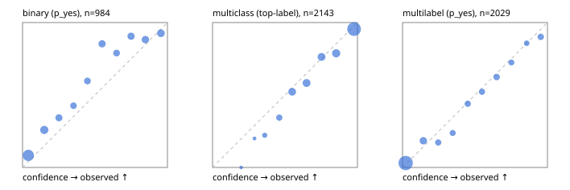

# Evaluation report

- model `jinaai/jina-reranker-v3.5` @ `e8a93f33f0` (jina listwise (jina-v1)), adapter/checkpoint `runs/jina_r2b/adapter`, prompt `jina-v1` (8bf5a0abfcae)
- data data/hf.jsonl, data/eval.jsonl; splits ['test']; n=3471; calibration `None`
- cuda / bfloat16; 2026-09-24T08:48:54+0000; wall 80.0s

## Overall

question accuracy 76.6%

**binary**: n 984, positives 475, accuracy 0.814, precision 0.878, recall 0.714, f1 0.787, auroc 0.888, brier 0.145, log_loss 0.455, ece 0.094

**multiclass**: n 2143, accuracy 0.794, macro_f1 0.842, log_loss 0.569, brier 0.288, ece_top_label 0.037

**multilabel**: n 344, labels 2029, exact_match 0.451, micro_f1 0.698, macro_f1 0.633, label_auroc 0.912, brier 0.091, log_loss 0.299, ece 0.022

## By family

| family | n | question acc % | details |
|---|---|---|---|
| eval_adversarial | 27 | 81.5 | bin acc 86.7 F1 85.7 AUROC 0.889 ECE 0.172; mc acc 85.7 mF1 77.8 ECE 0.102; ml EM 60.0 µF1 85.7 ECE 0.097 |
| eval_agent_output | 26 | 38.5 | bin acc 50.0 F1 58.8 AUROC 0.510 ECE 0.344; mc acc 14.3 mF1 7.4 ECE 0.496; ml EM 40.0 µF1 77.8 ECE 0.168 |
| eval_evidence | 17 | 82.4 | bin acc 93.3 F1 90.9 AUROC 0.980 ECE 0.099; ml EM 0.0 µF1 44.4 ECE 0.407 |
| eval_multilabel | 32 | 46.9 | bin acc 100.0 F1 100.0 AUROC 1.000 ECE 0.120; mc acc 0.0 mF1 0.0 ECE 0.523; ml EM 33.3 µF1 78.5 ECE 0.066 |
| eval_policy | 22 | 31.8 | bin acc 38.5 F1 33.3 AUROC 0.381 ECE 0.436; mc acc 40.0 mF1 23.8 ECE 0.465; ml EM 0.0 µF1 70.0 ECE 0.355 |
| eval_routing | 25 | 84.0 | bin acc 80.0 F1 75.0 AUROC 0.958 ECE 0.176; mc acc 84.6 mF1 81.8 ECE 0.035; ml EM 100.0 µF1 100.0 ECE 0.124 |
| eval_urgency_sentiment | 22 | 63.6 | bin acc 70.0 F1 72.7 AUROC 0.875 ECE 0.285; mc acc 60.0 mF1 50.0 ECE 0.298; ml EM 50.0 µF1 90.9 ECE 0.145 |
| heldout_boolq | 300 | 71.0 | bin acc 71.0 F1 71.5 AUROC 0.809 ECE 0.200 |
| heldout_emotion_multiclass | 300 | 54.0 | mc acc 54.0 mF1 44.5 ECE 0.196 |
| heldout_intent_clinc | 300 | 90.0 | mc acc 90.0 mF1 91.9 ECE 0.049 |
| heldout_question_type_trec | 300 | 74.3 | mc acc 74.3 mF1 75.5 ECE 0.036 |
| heldout_sentiment_sst2 | 300 | 84.7 | bin acc 84.7 F1 82.8 AUROC 0.926 ECE 0.135 |
| heldout_topic_dbpedia | 300 | 93.3 | mc acc 93.3 mF1 93.2 ECE 0.021 |
| hf_emotions_multilabel | 300 | 46.3 | ml EM 46.3 µF1 67.4 ECE 0.023 |
| hf_intent_banking77 | 300 | 93.0 | mc acc 93.0 mF1 92.2 ECE 0.026 |
| hf_nli | 300 | 91.0 | bin acc 91.0 F1 87.1 AUROC 0.961 ECE 0.031 |
| hf_sentiment_tweets | 300 | 63.7 | mc acc 63.7 mF1 64.4 ECE 0.038 |
| hf_topic_agnews | 300 | 90.3 | mc acc 90.3 mF1 90.4 ECE 0.030 |

## by hard case

| slice | n | question acc % |
|---|---|---|
| (none) | 3042 | 76.9 |
| contradiction | 107 | 95.3 |
| distractor | 33 | 51.5 |
| double_negation | 6 | 83.3 |
| evidence_end | 13 | 61.5 |
| evidence_middle | 11 | 45.5 |
| evidence_start | 9 | 66.7 |
| exception | 7 | 28.6 |
| hypothetical | 7 | 100.0 |
| injection | 10 | 70.0 |
| lexical_overlap | 20 | 60.0 |
| long_state | 50 | 56.0 |
| missing_evidence | 104 | 91.3 |
| multi_positive | 81 | 30.9 |
| multi_turn | 9 | 77.8 |
| negation | 30 | 70.0 |
| new_label_names | 3 | 33.3 |
| nota | 46 | 84.8 |
| numeric_reasoning | 16 | 43.8 |
| paraphrase | 22 | 40.9 |
| role_reversal | 15 | 53.3 |
| sarcasm | 12 | 41.7 |
| temporal_reasoning | 29 | 27.6 |
| zero_positive | 6 | 50.0 |

## by state tokens

| slice | n | question acc % |
|---|---|---|
| 00000-00127 | 3211 | 77.6 |
| 00128-00511 | 208 | 65.4 |
| 00512-02047 | 52 | 57.7 |

## by candidates

| slice | n | question acc % |
|---|---|---|
| 01 | 984 | 81.4 |
| 03 | 310 | 63.9 |
| 04 | 333 | 87.4 |
| 05 | 22 | 36.4 |
| 06 | 1218 | 66.5 |
| 07 | 49 | 81.6 |
| 08 | 555 | 91.9 |

## Paraphrase groups

11 groups; same prediction 72.7%; all correct 36.4%

## Multiclass abstention (coverage vs error on accepted)

| abstain_below | coverage % | error % |
|---|---|---|
| 0.0 | 100.0 | 20.6 |
| 0.4 | 98.0 | 19.4 |
| 0.5 | 93.7 | 17.3 |
| 0.6 | 84.2 | 13.9 |
| 0.7 | 73.5 | 9.8 |
| 0.8 | 63.5 | 7.6 |
| 0.9 | 51.8 | 4.5 |

## Reliability: binary

| bin | n | mean confidence | observed frequency |
|---|---|---|---|
| [0.0,0.1) | 301 | 0.040 | 0.083 |
| [0.1,0.2) | 116 | 0.150 | 0.259 |
| [0.2,0.3) | 70 | 0.251 | 0.343 |
| [0.3,0.4) | 54 | 0.352 | 0.426 |
| [0.4,0.5) | 57 | 0.448 | 0.596 |
| [0.5,0.6) | 75 | 0.549 | 0.853 |
| [0.6,0.7) | 57 | 0.649 | 0.789 |
| [0.7,0.8) | 74 | 0.749 | 0.905 |
| [0.8,0.9) | 85 | 0.848 | 0.882 |
| [0.9,1.0] | 95 | 0.955 | 0.926 |

## Reliability: multiclass

| bin | n | mean confidence | observed frequency |
|---|---|---|---|
| [0.1,0.2) | 1 | 0.198 | 0.000 |
| [0.2,0.3) | 5 | 0.289 | 0.200 |
| [0.3,0.4) | 36 | 0.360 | 0.222 |
| [0.4,0.5) | 93 | 0.461 | 0.344 |
| [0.5,0.6) | 203 | 0.549 | 0.522 |
| [0.6,0.7) | 230 | 0.649 | 0.583 |
| [0.7,0.8) | 215 | 0.752 | 0.763 |
| [0.8,0.9) | 250 | 0.853 | 0.788 |
| [0.9,1.0] | 1110 | 0.977 | 0.955 |

## Reliability: multilabel

| bin | n | mean confidence | observed frequency |
|---|---|---|---|
| [0.0,0.1) | 1186 | 0.022 | 0.030 |
| [0.1,0.2) | 168 | 0.144 | 0.185 |
| [0.2,0.3) | 87 | 0.246 | 0.172 |
| [0.3,0.4) | 80 | 0.346 | 0.237 |
| [0.4,0.5) | 91 | 0.450 | 0.440 |
| [0.5,0.6) | 90 | 0.548 | 0.522 |
| [0.6,0.7) | 101 | 0.650 | 0.624 |
| [0.7,0.8) | 69 | 0.751 | 0.725 |
| [0.8,0.9) | 56 | 0.857 | 0.857 |
| [0.9,1.0] | 101 | 0.954 | 0.901 |
