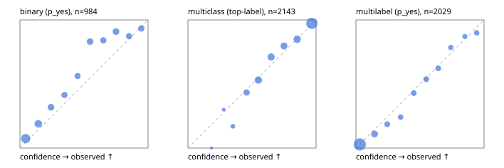

# Evaluation report

- model `jinaai/jina-reranker-v3.5` @ `e8a93f33f0` (jina listwise (jina-v1)), adapter/checkpoint `runs/jina_r2b/adapter`, prompt `jina-v1` (8bf5a0abfcae)
- data data/hf.jsonl, data/eval.jsonl; splits ['test']; n=3471; calibration `{'method': 'temperature scaling per output type, grid search on NLL', 'min_n': 30, 'model': 'jinaai/jina-reranker-v3.5', 'revision': 'e8a93f33f0b22108f8c2364f8484ce3422552fbc', 'adapter': 'runs/jina_r2b/adapter', 'adapter_sha256': 'b617fd1ea83c36c0a3e311b642341197b102dfd13f9fe05496366531512a1710', 'prompt_sha': '8bf5a0abfcae', 'fit_report': 'reports/jina_r2b/calibration/report.json', 'fit_report_sha256': '328f66aa9d0d9ec7db3175a5a9465020d131fa6b31b250f0cc8e8addeed37d94', 'fit_data': [{'path': 'data/hf.jsonl', 'sha256': 'fe29b29286d5a372271e925825e8b9794f3f64be9a9fc04cad458b4b94ada510'}, {'path': 'data/eval.jsonl', 'sha256': 'be888eb38dcca063823924430e03985ddf2186b874e792d5734936ba93ba6910'}], 'created': '2026-09-24T08:48:59+0000', 'n': {'binary': 210, 'multiclass': 476, 'multilabel': 1014}, 'nll_before': {'binary': 0.31730860206663, 'multiclass': 0.4955877207360509, 'multilabel': 0.323948450110501}, 'nll_after': {'binary': 0.31389265586730286, 'multiclass': 0.4844380516706075, 'multilabel': 0.32015231453568044}, 'skipped': {}, 'threshold_report': 'reports/jina_r2b/validation/report.json', 'threshold_report_sha256': '8dc15fbbb4a79fc15afb5a9549766f998aacaef3afb9e347346dd6238aaac097', 'threshold_rule': 'max F1 on validation after temperature scaling', 'file': 'calib/jina_r2b.json', 'file_sha256': '0a4fdd35543d65f51c6cfedb53515b2c7bf61eb5b0aa7bd4a98e560c5e1f3cc6'}`
- cuda / bfloat16; 2026-09-24T08:50:26+0000; wall 80.0s

## Overall

question accuracy 75.9%

**binary**: n 984, positives 475, accuracy 0.820, precision 0.830, recall 0.789, f1 0.809, auroc 0.888, brier 0.144, log_loss 0.450, ece 0.086

**multiclass**: n 2143, accuracy 0.794, macro_f1 0.842, log_loss 0.558, brier 0.287, ece_top_label 0.023

**multilabel**: n 344, labels 2029, exact_match 0.363, micro_f1 0.699, macro_f1 0.604, label_auroc 0.912, brier 0.092, log_loss 0.298, ece 0.019

## By family

| family | n | question acc % | details |
|---|---|---|---|
| eval_adversarial | 27 | 77.8 | bin acc 80.0 F1 80.0 AUROC 0.889 ECE 0.186; mc acc 85.7 mF1 77.8 ECE 0.113; ml EM 60.0 µF1 85.7 ECE 0.101 |
| eval_agent_output | 26 | 30.8 | bin acc 50.0 F1 58.8 AUROC 0.510 ECE 0.374; mc acc 14.3 mF1 7.4 ECE 0.470; ml EM 0.0 µF1 69.6 ECE 0.181 |
| eval_evidence | 17 | 76.5 | bin acc 86.7 F1 83.3 AUROC 0.980 ECE 0.116; ml EM 0.0 µF1 50.0 ECE 0.291 |
| eval_multilabel | 32 | 40.6 | bin acc 100.0 F1 100.0 AUROC 1.000 ECE 0.145; mc acc 0.0 mF1 0.0 ECE 0.460; ml EM 25.0 µF1 75.0 ECE 0.071 |
| eval_policy | 22 | 31.8 | bin acc 38.5 F1 42.9 AUROC 0.381 ECE 0.355; mc acc 40.0 mF1 23.8 ECE 0.427; ml EM 0.0 µF1 72.7 ECE 0.357 |
| eval_routing | 25 | 84.0 | bin acc 90.0 F1 88.9 AUROC 0.958 ECE 0.191; mc acc 84.6 mF1 81.8 ECE 0.060; ml EM 50.0 µF1 85.7 ECE 0.141 |
| eval_urgency_sentiment | 22 | 68.2 | bin acc 80.0 F1 83.3 AUROC 0.875 ECE 0.291; mc acc 60.0 mF1 50.0 ECE 0.101; ml EM 50.0 µF1 90.9 ECE 0.165 |
| heldout_boolq | 300 | 73.0 | bin acc 73.0 F1 74.9 AUROC 0.809 ECE 0.191 |
| heldout_emotion_multiclass | 300 | 54.0 | mc acc 54.0 mF1 44.5 ECE 0.139 |
| heldout_intent_clinc | 300 | 90.0 | mc acc 90.0 mF1 91.9 ECE 0.093 |
| heldout_question_type_trec | 300 | 74.3 | mc acc 74.3 mF1 75.5 ECE 0.056 |
| heldout_sentiment_sst2 | 300 | 86.0 | bin acc 86.0 F1 85.8 AUROC 0.926 ECE 0.146 |
| heldout_topic_dbpedia | 300 | 93.3 | mc acc 93.3 mF1 93.2 ECE 0.042 |
| hf_emotions_multilabel | 300 | 38.0 | ml EM 38.0 µF1 68.6 ECE 0.020 |
| hf_intent_banking77 | 300 | 93.0 | mc acc 93.0 mF1 92.2 ECE 0.024 |
| hf_nli | 300 | 89.7 | bin acc 89.7 F1 86.1 AUROC 0.961 ECE 0.044 |
| hf_sentiment_tweets | 300 | 63.7 | mc acc 63.7 mF1 64.4 ECE 0.037 |
| hf_topic_agnews | 300 | 90.3 | mc acc 90.3 mF1 90.4 ECE 0.018 |

## by hard case

| slice | n | question acc % |
|---|---|---|
| (none) | 3042 | 76.5 |
| contradiction | 107 | 93.5 |
| distractor | 33 | 45.5 |
| double_negation | 6 | 66.7 |
| evidence_end | 13 | 46.2 |
| evidence_middle | 11 | 54.5 |
| evidence_start | 9 | 66.7 |
| exception | 7 | 28.6 |
| hypothetical | 7 | 71.4 |
| injection | 10 | 60.0 |
| lexical_overlap | 20 | 60.0 |
| long_state | 50 | 56.0 |
| missing_evidence | 104 | 83.7 |
| multi_positive | 81 | 30.9 |
| multi_turn | 9 | 77.8 |
| negation | 30 | 63.3 |
| new_label_names | 3 | 33.3 |
| nota | 46 | 84.8 |
| numeric_reasoning | 16 | 56.2 |
| paraphrase | 22 | 36.4 |
| role_reversal | 15 | 53.3 |
| sarcasm | 12 | 41.7 |
| temporal_reasoning | 29 | 27.6 |
| zero_positive | 6 | 16.7 |

## by state tokens

| slice | n | question acc % |
|---|---|---|
| 00000-00127 | 3211 | 76.8 |
| 00128-00511 | 208 | 65.9 |
| 00512-02047 | 52 | 57.7 |

## by candidates

| slice | n | question acc % |
|---|---|---|
| 01 | 984 | 82.0 |
| 03 | 310 | 63.9 |
| 04 | 333 | 86.8 |
| 05 | 22 | 27.3 |
| 06 | 1218 | 64.4 |
| 07 | 49 | 81.6 |
| 08 | 555 | 91.9 |

## Paraphrase groups

11 groups; same prediction 63.6%; all correct 27.3%

## Multiclass abstention (coverage vs error on accepted)

| abstain_below | coverage % | error % |
|---|---|---|
| 0.0 | 100.0 | 20.6 |
| 0.4 | 97.3 | 18.9 |
| 0.5 | 90.0 | 15.8 |
| 0.6 | 77.7 | 10.9 |
| 0.7 | 66.3 | 7.8 |
| 0.8 | 55.7 | 5.4 |
| 0.9 | 43.3 | 2.7 |

## Reliability: binary

| bin | n | mean confidence | observed frequency |
|---|---|---|---|
| [0.0,0.1) | 244 | 0.045 | 0.074 |
| [0.1,0.2) | 132 | 0.143 | 0.189 |
| [0.2,0.3) | 88 | 0.242 | 0.318 |
| [0.3,0.4) | 70 | 0.348 | 0.414 |
| [0.4,0.5) | 64 | 0.450 | 0.562 |
| [0.5,0.6) | 83 | 0.547 | 0.831 |
| [0.6,0.7) | 69 | 0.651 | 0.841 |
| [0.7,0.8) | 88 | 0.750 | 0.909 |
| [0.8,0.9) | 71 | 0.852 | 0.873 |
| [0.9,1.0] | 75 | 0.947 | 0.933 |

## Reliability: multiclass

| bin | n | mean confidence | observed frequency |
|---|---|---|---|
| [0.1,0.2) | 1 | 0.183 | 0.000 |
| [0.2,0.3) | 10 | 0.279 | 0.300 |
| [0.3,0.4) | 47 | 0.351 | 0.170 |
| [0.4,0.5) | 157 | 0.458 | 0.433 |
| [0.5,0.6) | 262 | 0.549 | 0.531 |
| [0.6,0.7) | 246 | 0.649 | 0.711 |
| [0.7,0.8) | 226 | 0.750 | 0.796 |
| [0.8,0.9) | 266 | 0.853 | 0.850 |
| [0.9,1.0] | 928 | 0.967 | 0.973 |

## Reliability: multilabel

| bin | n | mean confidence | observed frequency |
|---|---|---|---|
| [0.0,0.1) | 1102 | 0.030 | 0.028 |
| [0.1,0.2) | 201 | 0.145 | 0.109 |
| [0.2,0.3) | 113 | 0.244 | 0.186 |
| [0.3,0.4) | 91 | 0.349 | 0.242 |
| [0.4,0.5) | 105 | 0.451 | 0.429 |
| [0.5,0.6) | 108 | 0.549 | 0.537 |
| [0.6,0.7) | 98 | 0.642 | 0.622 |
| [0.7,0.8) | 70 | 0.740 | 0.786 |
| [0.8,0.9) | 62 | 0.850 | 0.871 |
| [0.9,1.0] | 79 | 0.943 | 0.899 |
