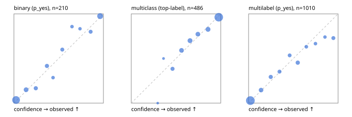

# Evaluation report

- model `jinaai/jina-reranker-v3.5` @ `e8a93f33f0` (jina listwise (jina-v1)), adapter/checkpoint `runs/jina_r2b/adapter`, prompt `jina-v1` (8bf5a0abfcae)
- data data/hf.jsonl, data/eval.jsonl; splits ['validation']; n=868; calibration `None`
- cuda / bfloat16; 2026-09-24T08:47:00+0000; wall 20.3s

## Overall

question accuracy 75.5%

**binary**: n 210, positives 79, accuracy 0.886, precision 0.877, recall 0.810, f1 0.842, auroc 0.941, brier 0.090, log_loss 0.301, ece 0.035

**multiclass**: n 486, accuracy 0.831, macro_f1 0.754, log_loss 0.483, brier 0.248, ece_top_label 0.028

**multilabel**: n 172, labels 1010, exact_match 0.378, micro_f1 0.608, macro_f1 0.470, label_auroc 0.884, brier 0.109, log_loss 0.352, ece 0.034

## By family

| family | n | question acc % | details |
|---|---|---|---|
| eval_adversarial | 14 | 100.0 | bin acc 100.0 F1 100.0 AUROC 1.000 ECE 0.129; mc acc 100.0 mF1 100.0 ECE 0.136; ml EM 100.0 µF1 100.0 ECE 0.073 |
| eval_agent_output | 20 | 55.0 | bin acc 83.3 F1 85.7 AUROC 0.861 ECE 0.259; mc acc 0.0 mF1 0.0 ECE 0.531; ml EM 33.3 µF1 0.0 ECE 0.413 |
| eval_evidence | 17 | 70.6 | bin acc 85.7 F1 80.0 AUROC 0.844 ECE 0.262; ml EM 0.0 µF1 61.5 ECE 0.277 |
| eval_multilabel | 12 | 41.7 | bin acc 100.0 F1 0.0 AUROC — ECE 0.391; mc acc 100.0 mF1 100.0 ECE 0.274; ml EM 22.2 µF1 71.7 ECE 0.152 |
| eval_policy | 24 | 45.8 | bin acc 66.7 F1 60.0 AUROC 0.771 ECE 0.363; mc acc 27.3 mF1 14.8 ECE 0.376; ml EM 0.0 µF1 40.0 ECE 0.532 |
| eval_routing | 16 | 81.2 | bin acc 71.4 F1 80.0 AUROC 0.900 ECE 0.263; mc acc 100.0 mF1 100.0 ECE 0.117; ml EM 0.0 µF1 0.0 ECE 0.241 |
| eval_urgency_sentiment | 15 | 66.7 | bin acc 42.9 F1 33.3 AUROC 0.750 ECE 0.349; mc acc 100.0 mF1 100.0 ECE 0.105; ml EM 66.7 µF1 66.7 ECE 0.138 |
| hf_emotions_multilabel | 150 | 38.7 | ml EM 38.7 µF1 59.7 ECE 0.023 |
| hf_intent_banking77 | 150 | 94.7 | mc acc 94.7 mF1 93.3 ECE 0.042 |
| hf_nli | 150 | 93.3 | bin acc 93.3 F1 89.1 AUROC 0.973 ECE 0.033 |
| hf_sentiment_tweets | 150 | 71.3 | mc acc 71.3 mF1 65.5 ECE 0.044 |
| hf_topic_agnews | 150 | 88.0 | mc acc 88.0 mF1 88.2 ECE 0.044 |

## by hard case

| slice | n | question acc % |
|---|---|---|
| (none) | 634 | 77.0 |
| contradiction | 63 | 93.7 |
| distractor | 20 | 50.0 |
| double_negation | 3 | 100.0 |
| evidence_end | 4 | 50.0 |
| evidence_middle | 7 | 71.4 |
| evidence_start | 3 | 66.7 |
| exception | 7 | 28.6 |
| hypothetical | 6 | 83.3 |
| injection | 16 | 68.8 |
| lexical_overlap | 13 | 76.9 |
| long_state | 26 | 57.7 |
| missing_evidence | 59 | 93.2 |
| multi_positive | 40 | 10.0 |
| multi_turn | 21 | 66.7 |
| negation | 9 | 44.4 |
| new_label_names | 5 | 20.0 |
| nota | 4 | 75.0 |
| numeric_reasoning | 13 | 23.1 |
| paraphrase | 10 | 40.0 |
| role_reversal | 7 | 57.1 |
| sarcasm | 5 | 60.0 |
| temporal_reasoning | 15 | 53.3 |
| zero_positive | 7 | 57.1 |

## by state tokens

| slice | n | question acc % |
|---|---|---|
| 00000-00127 | 796 | 76.5 |
| 00128-00511 | 46 | 67.4 |
| 00512-02047 | 26 | 57.7 |

## by candidates

| slice | n | question acc % |
|---|---|---|
| 01 | 210 | 88.6 |
| 03 | 162 | 70.4 |
| 04 | 174 | 86.2 |
| 05 | 13 | 30.8 |
| 06 | 159 | 37.1 |
| 08 | 150 | 94.7 |

## Paraphrase groups

5 groups; same prediction 60.0%; all correct 40.0%

## Multiclass abstention (coverage vs error on accepted)

| abstain_below | coverage % | error % |
|---|---|---|
| 0.0 | 100.0 | 16.9 |
| 0.4 | 98.8 | 16.2 |
| 0.5 | 93.4 | 13.7 |
| 0.6 | 84.4 | 10.7 |
| 0.7 | 74.1 | 8.1 |
| 0.8 | 65.0 | 6.0 |
| 0.9 | 54.3 | 3.8 |

## Reliability: binary

| bin | n | mean confidence | observed frequency |
|---|---|---|---|
| [0.0,0.1) | 86 | 0.024 | 0.035 |
| [0.1,0.2) | 20 | 0.136 | 0.150 |
| [0.2,0.3) | 12 | 0.245 | 0.167 |
| [0.3,0.4) | 12 | 0.369 | 0.417 |
| [0.4,0.5) | 7 | 0.437 | 0.286 |
| [0.5,0.6) | 10 | 0.540 | 0.600 |
| [0.6,0.7) | 7 | 0.649 | 0.857 |
| [0.7,0.8) | 6 | 0.738 | 0.833 |
| [0.8,0.9) | 10 | 0.857 | 0.800 |
| [0.9,1.0] | 40 | 0.963 | 0.975 |

## Reliability: multiclass

| bin | n | mean confidence | observed frequency |
|---|---|---|---|
| [0.2,0.3) | 2 | 0.295 | 0.000 |
| [0.3,0.4) | 4 | 0.361 | 0.500 |
| [0.4,0.5) | 26 | 0.461 | 0.385 |
| [0.5,0.6) | 44 | 0.562 | 0.591 |
| [0.6,0.7) | 50 | 0.657 | 0.700 |
| [0.7,0.8) | 44 | 0.744 | 0.773 |
| [0.8,0.9) | 52 | 0.858 | 0.827 |
| [0.9,1.0] | 264 | 0.978 | 0.962 |

## Reliability: multilabel

| bin | n | mean confidence | observed frequency |
|---|---|---|---|
| [0.0,0.1) | 569 | 0.020 | 0.028 |
| [0.1,0.2) | 82 | 0.139 | 0.146 |
| [0.2,0.3) | 58 | 0.248 | 0.293 |
| [0.3,0.4) | 51 | 0.346 | 0.353 |
| [0.4,0.5) | 43 | 0.459 | 0.535 |
| [0.5,0.6) | 64 | 0.550 | 0.453 |
| [0.6,0.7) | 38 | 0.645 | 0.632 |
| [0.7,0.8) | 30 | 0.747 | 0.667 |
| [0.8,0.9) | 27 | 0.853 | 0.741 |
| [0.9,1.0] | 48 | 0.947 | 0.729 |
