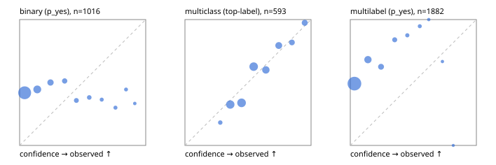

# Evaluation report

- model `jinaai/jina-reranker-v3.5` @ `e8a93f33f0` (jina listwise (jina-v1)), adapter/checkpoint `None`, prompt `jina-v1` (8bf5a0abfcae)
- data data/eval2.jsonl; splits ['test']; n=1991; calibration `None`
- cuda / bfloat16; 2026-09-24T07:34:48+0000; wall 101.9s

## Overall

question accuracy 46.5%

**binary**: n 1016, positives 435, accuracy 0.558, precision 0.370, recall 0.046, f1 0.082, auroc 0.540, brier 0.362, log_loss 1.235, ece 0.337

**multiclass**: n 593, accuracy 0.545, macro_f1 0.399, log_loss 1.040, brier 0.562, ece_top_label 0.063

**multilabel**: n 382, labels 1882, exact_match 0.094, micro_f1 0.044, macro_f1 0.021, label_auroc 0.669, brier 0.449, log_loss 1.604, ece 0.464

## By family

| family | n | question acc % | details |
|---|---|---|---|
| e2_hard | 673 | 50.4 | bin acc 61.5 F1 6.9 AUROC 0.509 ECE 0.283; mc acc 56.0 mF1 39.9 ECE 0.077; ml EM 12.9 µF1 3.0 ECE 0.435 |
| e2_simple | 664 | 46.1 | bin acc 47.4 F1 9.0 AUROC 0.625 ECE 0.440; mc acc 67.5 mF1 53.1 ECE 0.080; ml EM 6.7 µF1 5.6 ECE 0.528 |
| e2_very_hard | 654 | 43.0 | bin acc 58.6 F1 8.2 AUROC 0.516 ECE 0.292; mc acc 40.0 mF1 26.1 ECE 0.107; ml EM 8.5 µF1 4.5 ECE 0.437 |

## by hard case

| slice | n | question acc % |
|---|---|---|
| (none) | 569 | 49.4 |
| contradiction | 172 | 52.3 |
| distractor | 474 | 42.8 |
| double_negation | 126 | 41.3 |
| evidence_end | 57 | 31.6 |
| evidence_middle | 114 | 43.0 |
| evidence_start | 17 | 47.1 |
| exception | 213 | 50.2 |
| hypothetical | 128 | 51.6 |
| injection | 151 | 41.7 |
| lexical_overlap | 201 | 49.3 |
| long_state | 191 | 36.6 |
| missing_evidence | 141 | 57.4 |
| multi_positive | 322 | 15.2 |
| multi_turn | 149 | 45.6 |
| negation | 257 | 52.9 |
| nota | 118 | 30.5 |
| numeric_reasoning | 224 | 42.0 |
| paraphrase | 218 | 49.1 |
| role_reversal | 187 | 43.9 |
| sarcasm | 149 | 45.6 |
| temporal_reasoning | 203 | 44.3 |
| zero_positive | 73 | 75.3 |
| zero_positive_distractor | 1 | 0.0 |

## by state tokens

| slice | n | question acc % |
|---|---|---|
| 00000-00127 | 662 | 48.9 |
| 00128-00511 | 477 | 50.7 |
| 00512-02047 | 484 | 46.3 |
| 02048-08191 | 329 | 37.4 |
| 08192+ | 39 | 33.3 |

## by candidates

| slice | n | question acc % |
|---|---|---|
| 01 | 1016 | 55.8 |
| 03 | 128 | 62.5 |
| 04 | 515 | 47.2 |
| 05 | 224 | 15.2 |
| 06 | 86 | 2.3 |
| 07 | 18 | 0.0 |
| 08 | 4 | 0.0 |

## Paraphrase groups

76 groups; same prediction 81.6%; all correct 32.9%

## Multiclass abstention (coverage vs error on accepted)

| abstain_below | coverage % | error % |
|---|---|---|
| 0.0 | 100.0 | 45.5 |
| 0.4 | 78.4 | 39.1 |
| 0.5 | 57.0 | 29.0 |
| 0.6 | 36.3 | 24.2 |
| 0.7 | 22.8 | 14.8 |
| 0.8 | 12.1 | 9.7 |
| 0.9 | 6.6 | 2.6 |

## Reliability: binary

| bin | n | mean confidence | observed frequency |
|---|---|---|---|
| [0.0,0.1) | 653 | 0.040 | 0.418 |
| [0.1,0.2) | 164 | 0.140 | 0.445 |
| [0.2,0.3) | 76 | 0.245 | 0.500 |
| [0.3,0.4) | 41 | 0.357 | 0.512 |
| [0.4,0.5) | 28 | 0.450 | 0.357 |
| [0.5,0.6) | 21 | 0.552 | 0.381 |
| [0.6,0.7) | 11 | 0.651 | 0.364 |
| [0.7,0.8) | 10 | 0.760 | 0.300 |
| [0.8,0.9) | 9 | 0.844 | 0.444 |
| [0.9,1.0] | 3 | 0.913 | 0.333 |

## Reliability: multiclass

| bin | n | mean confidence | observed frequency |
|---|---|---|---|
| [0.2,0.3) | 11 | 0.280 | 0.182 |
| [0.3,0.4) | 117 | 0.359 | 0.325 |
| [0.4,0.5) | 127 | 0.449 | 0.339 |
| [0.5,0.6) | 123 | 0.545 | 0.626 |
| [0.6,0.7) | 80 | 0.641 | 0.600 |
| [0.7,0.8) | 63 | 0.744 | 0.794 |
| [0.8,0.9) | 33 | 0.848 | 0.818 |
| [0.9,1.0] | 39 | 0.950 | 0.974 |

## Reliability: multilabel

| bin | n | mean confidence | observed frequency |
|---|---|---|---|
| [0.0,0.1) | 1419 | 0.033 | 0.491 |
| [0.1,0.2) | 245 | 0.140 | 0.682 |
| [0.2,0.3) | 112 | 0.244 | 0.625 |
| [0.3,0.4) | 56 | 0.352 | 0.839 |
| [0.4,0.5) | 24 | 0.452 | 0.875 |
| [0.5,0.6) | 19 | 0.551 | 0.947 |
| [0.6,0.7) | 3 | 0.622 | 1.000 |
| [0.7,0.8) | 3 | 0.731 | 0.667 |
| [0.8,0.9) | 1 | 0.817 | 0.000 |
