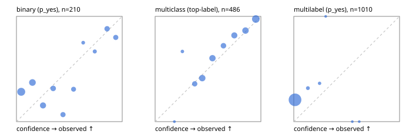

# Evaluation report

- model `jinaai/jina-reranker-v3.5` @ `e8a93f33f0` (jina listwise (jina-v1)), adapter/checkpoint `None`, prompt `jina-v1` (8bf5a0abfcae)
- data data/hf.jsonl, data/eval.jsonl; splits ['validation']; n=868; calibration `None`
- cuda / bfloat16; 2026-09-24T07:33:00+0000; wall 20.0s

## Overall

question accuracy 58.6%

**binary**: n 210, positives 79, accuracy 0.724, precision 0.691, recall 0.481, f1 0.567, auroc 0.677, brier 0.216, log_loss 0.709, ece 0.177

**multiclass**: n 486, accuracy 0.722, macro_f1 0.683, log_loss 0.710, brier 0.376, ece_top_label 0.043

**multilabel**: n 172, labels 1010, exact_match 0.035, micro_f1 0.000, macro_f1 0.000, label_auroc 0.729, brier 0.202, log_loss 0.890, ece 0.196

## By family

| family | n | question acc % | details |
|---|---|---|---|
| eval_adversarial | 14 | 42.9 | bin acc 28.6 F1 0.0 AUROC 0.700 ECE 0.615; mc acc 80.0 mF1 66.7 ECE 0.234; ml EM 0.0 µF1 0.0 ECE 0.313 |
| eval_agent_output | 20 | 35.0 | bin acc 41.7 F1 0.0 AUROC 0.444 ECE 0.563; mc acc 20.0 mF1 16.7 ECE 0.587; ml EM 33.3 µF1 0.0 ECE 0.268 |
| eval_evidence | 17 | 64.7 | bin acc 71.4 F1 33.3 AUROC 0.911 ECE 0.216; ml EM 33.3 µF1 0.0 ECE 0.192 |
| eval_multilabel | 12 | 16.7 | bin acc 100.0 F1 0.0 AUROC — ECE 0.012; mc acc 0.0 mF1 0.0 ECE 0.611; ml EM 11.1 µF1 0.0 ECE 0.331 |
| eval_policy | 24 | 41.7 | bin acc 58.3 F1 44.4 AUROC 0.429 ECE 0.532; mc acc 27.3 mF1 16.7 ECE 0.367; ml EM 0.0 µF1 0.0 ECE 0.447 |
| eval_routing | 16 | 50.0 | bin acc 28.6 F1 0.0 AUROC 0.900 ECE 0.590; mc acc 62.5 mF1 59.5 ECE 0.325; ml EM 100.0 µF1 0.0 ECE 0.013 |
| eval_urgency_sentiment | 15 | 53.3 | bin acc 42.9 F1 0.0 AUROC 0.417 ECE 0.589; mc acc 60.0 mF1 42.9 ECE 0.364; ml EM 66.7 µF1 0.0 ECE 0.079 |
| hf_emotions_multilabel | 150 | 0.0 | ml EM 0.0 µF1 0.0 ECE 0.190 |
| hf_intent_banking77 | 150 | 93.3 | mc acc 93.3 mF1 92.7 ECE 0.123 |
| hf_nli | 150 | 81.3 | bin acc 81.3 F1 71.4 AUROC 0.849 ECE 0.116 |
| hf_sentiment_tweets | 150 | 54.7 | mc acc 54.7 mF1 46.5 ECE 0.109 |
| hf_topic_agnews | 150 | 75.3 | mc acc 75.3 mF1 74.8 ECE 0.043 |

## by hard case

| slice | n | question acc % |
|---|---|---|
| (none) | 634 | 59.5 |
| contradiction | 63 | 87.3 |
| distractor | 20 | 50.0 |
| double_negation | 3 | 66.7 |
| evidence_end | 4 | 0.0 |
| evidence_middle | 7 | 42.9 |
| evidence_start | 3 | 33.3 |
| exception | 7 | 42.9 |
| hypothetical | 6 | 66.7 |
| injection | 16 | 50.0 |
| lexical_overlap | 13 | 61.5 |
| long_state | 26 | 30.8 |
| missing_evidence | 59 | 84.7 |
| multi_positive | 40 | 0.0 |
| multi_turn | 21 | 47.6 |
| negation | 9 | 33.3 |
| new_label_names | 5 | 20.0 |
| nota | 4 | 0.0 |
| numeric_reasoning | 13 | 38.5 |
| paraphrase | 10 | 10.0 |
| role_reversal | 7 | 42.9 |
| sarcasm | 5 | 0.0 |
| temporal_reasoning | 15 | 33.3 |
| zero_positive | 7 | 85.7 |

## by state tokens

| slice | n | question acc % |
|---|---|---|
| 00000-00127 | 796 | 60.2 |
| 00128-00511 | 46 | 47.8 |
| 00512-02047 | 26 | 30.8 |

## by candidates

| slice | n | question acc % |
|---|---|---|
| 01 | 210 | 72.4 |
| 03 | 162 | 54.9 |
| 04 | 174 | 71.3 |
| 05 | 13 | 30.8 |
| 06 | 159 | 0.0 |
| 08 | 150 | 93.3 |

## Paraphrase groups

5 groups; same prediction 80.0%; all correct 0.0%

## Multiclass abstention (coverage vs error on accepted)

| abstain_below | coverage % | error % |
|---|---|---|
| 0.0 | 100.0 | 27.8 |
| 0.4 | 90.5 | 24.3 |
| 0.5 | 75.1 | 17.3 |
| 0.6 | 61.1 | 12.1 |
| 0.7 | 52.3 | 9.4 |
| 0.8 | 39.7 | 6.7 |
| 0.9 | 24.5 | 2.5 |

## Reliability: binary

| bin | n | mean confidence | observed frequency |
|---|---|---|---|
| [0.0,0.1) | 60 | 0.045 | 0.283 |
| [0.1,0.2) | 35 | 0.151 | 0.371 |
| [0.2,0.3) | 26 | 0.251 | 0.154 |
| [0.3,0.4) | 19 | 0.347 | 0.316 |
| [0.4,0.5) | 15 | 0.440 | 0.067 |
| [0.5,0.6) | 13 | 0.540 | 0.308 |
| [0.6,0.7) | 4 | 0.631 | 0.750 |
| [0.7,0.8) | 6 | 0.740 | 0.667 |
| [0.8,0.9) | 17 | 0.857 | 0.882 |
| [0.9,1.0] | 15 | 0.939 | 0.800 |

## Reliability: multiclass

| bin | n | mean confidence | observed frequency |
|---|---|---|---|
| [0.1,0.2) | 1 | 0.182 | 0.000 |
| [0.2,0.3) | 6 | 0.258 | 0.667 |
| [0.3,0.4) | 39 | 0.374 | 0.359 |
| [0.4,0.5) | 75 | 0.446 | 0.413 |
| [0.5,0.6) | 68 | 0.542 | 0.603 |
| [0.6,0.7) | 43 | 0.646 | 0.721 |
| [0.7,0.8) | 61 | 0.749 | 0.820 |
| [0.8,0.9) | 74 | 0.854 | 0.865 |
| [0.9,1.0] | 119 | 0.952 | 0.975 |

## Reliability: multilabel

| bin | n | mean confidence | observed frequency |
|---|---|---|---|
| [0.0,0.1) | 974 | 0.012 | 0.207 |
| [0.1,0.2) | 22 | 0.134 | 0.318 |
| [0.2,0.3) | 11 | 0.244 | 0.364 |
| [0.3,0.4) | 1 | 0.302 | 1.000 |
| [0.5,0.6) | 1 | 0.553 | 0.000 |
| [0.6,0.7) | 1 | 0.619 | 0.000 |
