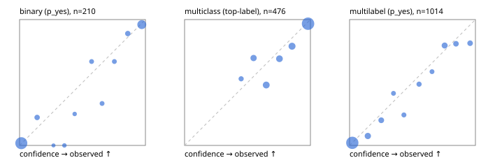

# Evaluation report

- model `Qwen/Qwen3-Reranker-4B` @ `22e683669b` (stock reranker pairs), adapter/checkpoint `runs/lora_4b/adapter`, prompt `answer-v1` (724795e9b666)
- data data/hf.jsonl, data/eval.jsonl; splits ['calibration']; n=859; calibration `None`
- cuda / bfloat16; 2026-09-23T20:32:40+0000; wall 44.7s

## Overall

question accuracy 79.5%

**binary**: n 210, positives 71, accuracy 0.924, precision 0.857, recall 0.930, f1 0.892, auroc 0.974, brier 0.060, log_loss 0.199, ece 0.037

**multiclass**: n 476, accuracy 0.834, macro_f1 0.851, log_loss 0.420, brier 0.240, ece_top_label 0.053

**multilabel**: n 173, labels 1014, exact_match 0.532, micro_f1 0.751, macro_f1 0.592, label_auroc 0.929, brier 0.085, log_loss 0.284, ece 0.033

## By family

| family | n | question acc % | details |
|---|---|---|---|
| eval_adversarial | 19 | 84.2 | bin acc 92.9 F1 93.3 AUROC 1.000 ECE 0.098; mc acc 66.7 mF1 50.0 ECE 0.196; ml EM 50.0 µF1 66.7 ECE 0.086 |
| eval_agent_output | 9 | 88.9 | bin acc 100.0 F1 100.0 AUROC 1.000 ECE 0.113; mc acc 100.0 mF1 100.0 ECE 0.176; ml EM 50.0 µF1 40.0 ECE 0.252 |
| eval_evidence | 19 | 84.2 | bin acc 87.5 F1 83.3 AUROC 1.000 ECE 0.115; ml EM 66.7 µF1 70.6 ECE 0.253 |
| eval_multilabel | 12 | 75.0 | bin acc 100.0 F1 100.0 AUROC — ECE 0.046; mc acc 100.0 mF1 100.0 ECE 0.050; ml EM 62.5 µF1 85.7 ECE 0.075 |
| eval_policy | 16 | 50.0 | bin acc 75.0 F1 66.7 AUROC 0.867 ECE 0.272; mc acc 25.0 mF1 14.3 ECE 0.581; ml EM 25.0 µF1 57.1 ECE 0.445 |
| eval_routing | 15 | 93.3 | bin acc 100.0 F1 100.0 AUROC 1.000 ECE 0.080; mc acc 85.7 mF1 71.4 ECE 0.167; ml EM 100.0 µF1 100.0 ECE 0.038 |
| eval_urgency_sentiment | 19 | 73.7 | bin acc 62.5 F1 57.1 AUROC 1.000 ECE 0.321; mc acc 87.5 mF1 83.3 ECE 0.177; ml EM 66.7 µF1 92.3 ECE 0.089 |
| hf_emotions_multilabel | 150 | 52.7 | ml EM 52.7 µF1 74.8 ECE 0.028 |
| hf_intent_banking77 | 150 | 95.3 | mc acc 95.3 mF1 92.9 ECE 0.047 |
| hf_nli | 150 | 94.7 | bin acc 94.7 F1 91.3 AUROC 0.985 ECE 0.046 |
| hf_sentiment_tweets | 150 | 70.7 | mc acc 70.7 mF1 70.0 ECE 0.121 |
| hf_topic_agnews | 150 | 85.3 | mc acc 85.3 mF1 85.5 ECE 0.051 |

## by hard case

| slice | n | question acc % |
|---|---|---|
| (none) | 624 | 79.8 |
| contradiction | 58 | 98.3 |
| distractor | 25 | 80.0 |
| double_negation | 3 | 100.0 |
| evidence_end | 11 | 90.9 |
| evidence_middle | 6 | 66.7 |
| evidence_start | 7 | 85.7 |
| exception | 4 | 75.0 |
| hypothetical | 7 | 71.4 |
| injection | 6 | 66.7 |
| lexical_overlap | 16 | 68.8 |
| long_state | 42 | 76.2 |
| missing_evidence | 62 | 91.9 |
| multi_positive | 42 | 40.5 |
| multi_turn | 12 | 75.0 |
| negation | 12 | 91.7 |
| new_label_names | 5 | 80.0 |
| nota | 4 | 50.0 |
| numeric_reasoning | 15 | 66.7 |
| paraphrase | 10 | 70.0 |
| role_reversal | 13 | 30.8 |
| sarcasm | 1 | 0.0 |
| temporal_reasoning | 14 | 71.4 |
| zero_positive | 4 | 75.0 |

## by state tokens

| slice | n | question acc % |
|---|---|---|
| 00000-00127 | 780 | 79.9 |
| 00128-00511 | 37 | 75.7 |
| 00512-02047 | 42 | 76.2 |

## by candidates

| slice | n | question acc % |
|---|---|---|
| 01 | 210 | 92.4 |
| 03 | 158 | 69.0 |
| 04 | 168 | 83.9 |
| 05 | 15 | 86.7 |
| 06 | 157 | 52.9 |
| 07 | 1 | 0.0 |
| 08 | 150 | 95.3 |

## Paraphrase groups

5 groups; same prediction 80.0%; all correct 60.0%

## Multiclass abstention (coverage vs error on accepted)

| abstain_below | coverage % | error % |
|---|---|---|
| 0.0 | 100.0 | 16.6 |
| 0.4 | 100.0 | 16.6 |
| 0.5 | 96.4 | 15.5 |
| 0.6 | 88.9 | 14.2 |
| 0.7 | 78.4 | 9.1 |
| 0.8 | 68.9 | 6.1 |
| 0.9 | 58.0 | 3.3 |

## Reliability: binary

| bin | n | mean confidence | observed frequency |
|---|---|---|---|
| [0.0,0.1) | 114 | 0.014 | 0.018 |
| [0.1,0.2) | 9 | 0.139 | 0.222 |
| [0.2,0.3) | 2 | 0.270 | 0.000 |
| [0.3,0.4) | 4 | 0.356 | 0.000 |
| [0.4,0.5) | 4 | 0.438 | 0.250 |
| [0.5,0.6) | 6 | 0.572 | 0.667 |
| [0.6,0.7) | 6 | 0.656 | 0.333 |
| [0.7,0.8) | 6 | 0.753 | 0.667 |
| [0.8,0.9) | 9 | 0.860 | 0.889 |
| [0.9,1.0] | 50 | 0.971 | 0.960 |

## Reliability: multiclass

| bin | n | mean confidence | observed frequency |
|---|---|---|---|
| [0.4,0.5) | 17 | 0.450 | 0.529 |
| [0.5,0.6) | 36 | 0.548 | 0.694 |
| [0.6,0.7) | 50 | 0.649 | 0.480 |
| [0.7,0.8) | 45 | 0.754 | 0.689 |
| [0.8,0.9) | 52 | 0.854 | 0.788 |
| [0.9,1.0] | 276 | 0.981 | 0.967 |

## Reliability: multilabel

| bin | n | mean confidence | observed frequency |
|---|---|---|---|
| [0.0,0.1) | 583 | 0.022 | 0.021 |
| [0.1,0.2) | 80 | 0.145 | 0.075 |
| [0.2,0.3) | 55 | 0.252 | 0.200 |
| [0.3,0.4) | 29 | 0.349 | 0.414 |
| [0.4,0.5) | 33 | 0.432 | 0.242 |
| [0.5,0.6) | 37 | 0.552 | 0.486 |
| [0.6,0.7) | 29 | 0.655 | 0.586 |
| [0.7,0.8) | 68 | 0.756 | 0.794 |
| [0.8,0.9) | 52 | 0.846 | 0.808 |
| [0.9,1.0] | 48 | 0.958 | 0.812 |
