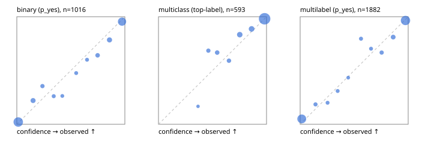

# Evaluation report

- model `Qwen/Qwen3-Reranker-4B` @ `22e683669b` (stock reranker pairs), adapter/checkpoint `runs/lora_4b/adapter`, prompt `answer-v1` (724795e9b666)
- data data/eval2.jsonl; splits ['test']; n=1991; calibration `None`
- cuda / bfloat16; 2026-09-24T07:58:23+0000; wall 2011.2s

## Overall

question accuracy 86.5%

**binary**: n 1016, positives 435, accuracy 0.897, precision 0.865, recall 0.899, f1 0.882, auroc 0.961, brier 0.078, log_loss 0.258, ece 0.033

**multiclass**: n 593, accuracy 0.916, macro_f1 0.860, log_loss 0.309, brier 0.141, ece_top_label 0.026

**multilabel**: n 382, labels 1882, exact_match 0.704, micro_f1 0.920, macro_f1 0.857, label_auroc 0.963, brier 0.072, log_loss 0.256, ece 0.032

## By family

| family | n | question acc % | details |
|---|---|---|---|
| e2_hard | 673 | 84.2 | bin acc 87.4 F1 83.6 AUROC 0.942 ECE 0.056; mc acc 88.6 mF1 80.4 ECE 0.030; ml EM 69.7 µF1 91.2 ECE 0.046 |
| e2_simple | 664 | 92.8 | bin acc 93.9 F1 94.4 AUROC 0.987 ECE 0.028; mc acc 98.0 mF1 95.7 ECE 0.035; ml EM 80.8 µF1 95.3 ECE 0.043 |
| e2_very_hard | 654 | 82.6 | bin acc 87.7 F1 83.7 AUROC 0.942 ECE 0.041; mc acc 88.0 mF1 80.0 ECE 0.031; ml EM 61.5 µF1 89.6 ECE 0.047 |

## by hard case

| slice | n | question acc % |
|---|---|---|
| (none) | 569 | 94.2 |
| contradiction | 172 | 89.5 |
| distractor | 474 | 81.9 |
| double_negation | 126 | 85.7 |
| evidence_end | 57 | 91.2 |
| evidence_middle | 114 | 91.2 |
| evidence_start | 17 | 88.2 |
| exception | 213 | 80.8 |
| hypothetical | 128 | 88.3 |
| injection | 151 | 76.8 |
| lexical_overlap | 201 | 89.1 |
| long_state | 191 | 87.4 |
| missing_evidence | 141 | 88.7 |
| multi_positive | 322 | 72.4 |
| multi_turn | 149 | 87.9 |
| negation | 257 | 88.3 |
| nota | 118 | 80.5 |
| numeric_reasoning | 224 | 75.0 |
| paraphrase | 218 | 83.0 |
| role_reversal | 187 | 82.4 |
| sarcasm | 149 | 82.6 |
| temporal_reasoning | 203 | 70.0 |
| zero_positive | 73 | 89.0 |
| zero_positive_distractor | 1 | 100.0 |

## by state tokens

| slice | n | question acc % |
|---|---|---|
| 00000-00127 | 662 | 85.6 |
| 00128-00511 | 477 | 82.2 |
| 00512-02047 | 484 | 91.1 |
| 02048-08191 | 329 | 88.4 |
| 08192+ | 39 | 82.1 |

## by candidates

| slice | n | question acc % |
|---|---|---|
| 01 | 1016 | 89.7 |
| 03 | 128 | 89.1 |
| 04 | 515 | 88.7 |
| 05 | 224 | 72.8 |
| 06 | 86 | 76.7 |
| 07 | 18 | 55.6 |
| 08 | 4 | 50.0 |

## Paraphrase groups

76 groups; same prediction 75.0%; all correct 71.1%

## Multiclass abstention (coverage vs error on accepted)

| abstain_below | coverage % | error % |
|---|---|---|
| 0.0 | 100.0 | 8.4 |
| 0.4 | 99.0 | 7.7 |
| 0.5 | 95.8 | 6.9 |
| 0.6 | 91.7 | 5.7 |
| 0.7 | 88.0 | 4.2 |
| 0.8 | 79.9 | 3.0 |
| 0.9 | 71.0 | 1.9 |

## Reliability: binary

| bin | n | mean confidence | observed frequency |
|---|---|---|---|
| [0.0,0.1) | 432 | 0.013 | 0.021 |
| [0.1,0.2) | 59 | 0.151 | 0.220 |
| [0.2,0.3) | 31 | 0.237 | 0.355 |
| [0.3,0.4) | 23 | 0.342 | 0.261 |
| [0.4,0.5) | 19 | 0.421 | 0.263 |
| [0.5,0.6) | 21 | 0.549 | 0.476 |
| [0.6,0.7) | 20 | 0.650 | 0.600 |
| [0.7,0.8) | 39 | 0.748 | 0.641 |
| [0.8,0.9) | 65 | 0.858 | 0.785 |
| [0.9,1.0] | 307 | 0.974 | 0.954 |

## Reliability: multiclass

| bin | n | mean confidence | observed frequency |
|---|---|---|---|
| [0.3,0.4) | 6 | 0.366 | 0.167 |
| [0.4,0.5) | 19 | 0.461 | 0.684 |
| [0.5,0.6) | 24 | 0.544 | 0.667 |
| [0.6,0.7) | 22 | 0.652 | 0.591 |
| [0.7,0.8) | 48 | 0.752 | 0.833 |
| [0.8,0.9) | 53 | 0.861 | 0.887 |
| [0.9,1.0] | 421 | 0.982 | 0.981 |

## Reliability: multilabel

| bin | n | mean confidence | observed frequency |
|---|---|---|---|
| [0.0,0.1) | 682 | 0.015 | 0.050 |
| [0.1,0.2) | 54 | 0.142 | 0.185 |
| [0.2,0.3) | 40 | 0.254 | 0.200 |
| [0.3,0.4) | 42 | 0.347 | 0.310 |
| [0.4,0.5) | 30 | 0.445 | 0.433 |
| [0.5,0.6) | 44 | 0.563 | 0.795 |
| [0.6,0.7) | 37 | 0.656 | 0.703 |
| [0.7,0.8) | 63 | 0.755 | 0.667 |
| [0.8,0.9) | 95 | 0.861 | 0.811 |
| [0.9,1.0] | 795 | 0.975 | 0.965 |
