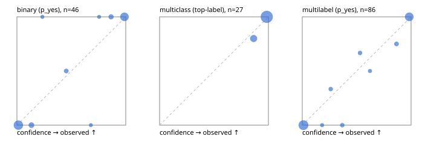

# Evaluation report

- model `Qwen/Qwen3-Reranker-4B` @ `22e683669b` (stock reranker pairs), adapter/checkpoint `runs/lora_4b/adapter`, prompt `answer-v1` (724795e9b666)
- data data/synthetic.jsonl; splits ['test']; n=96; calibration `None`
- cuda / bfloat16; 2026-09-23T20:38:57+0000; wall 9.3s

## Overall

question accuracy 92.7%

**binary**: n 46, positives 21, accuracy 0.935, precision 0.950, recall 0.905, f1 0.927, auroc 0.994, brier 0.038, log_loss 0.123, ece 0.069

**multiclass**: n 27, accuracy 0.963, macro_f1 0.923, log_loss 0.119, brier 0.066, ece_top_label 0.024

**multilabel**: n 23, labels 86, exact_match 0.870, micro_f1 0.946, macro_f1 0.897, label_auroc 0.991, brier 0.039, log_loss 0.126, ece 0.043

## By family

| family | n | question acc % | details |
|---|---|---|---|
| syn_adversarial | 13 | 92.3 | bin acc 100.0 F1 100.0 AUROC 1.000 ECE 0.029; mc acc 100.0 mF1 100.0 ECE 0.002; ml EM 66.7 µF1 93.3 ECE 0.097 |
| syn_evidence | 23 | 95.7 | bin acc 100.0 F1 100.0 AUROC 1.000 ECE 0.020; mc acc 100.0 mF1 100.0 ECE 0.005; ml EM 75.0 µF1 87.5 ECE 0.130 |
| syn_multilabel | 8 | 100.0 | bin acc 100.0 F1 100.0 AUROC — ECE 0.245; mc acc 100.0 mF1 100.0 ECE 0.020; ml EM 100.0 µF1 100.0 ECE 0.053 |
| syn_policy | 19 | 78.9 | bin acc 75.0 F1 50.0 AUROC 0.933 ECE 0.152; mc acc 85.7 mF1 75.0 ECE 0.108; ml EM 75.0 µF1 90.9 ECE 0.157 |
| syn_routing | 12 | 100.0 | bin acc 100.0 F1 100.0 AUROC 1.000 ECE 0.013; mc acc 100.0 mF1 100.0 ECE 0.028; ml EM 100.0 µF1 100.0 ECE 0.033 |
| syn_urgency_sentiment | 21 | 95.2 | bin acc 90.9 F1 92.3 AUROC 1.000 ECE 0.102; mc acc 100.0 mF1 100.0 ECE 0.034; ml EM 100.0 µF1 100.0 ECE 0.015 |

## by hard case

| slice | n | question acc % |
|---|---|---|
| (none) | 9 | 100.0 |
| contradiction | 8 | 87.5 |
| distractor | 18 | 94.4 |
| double_negation | 2 | 100.0 |
| evidence_end | 4 | 100.0 |
| evidence_middle | 2 | 100.0 |
| evidence_start | 4 | 100.0 |
| exception | 20 | 90.0 |
| hypothetical | 2 | 100.0 |
| injection | 6 | 100.0 |
| lexical_overlap | 17 | 100.0 |
| long_state | 18 | 100.0 |
| missing_evidence | 5 | 100.0 |
| multi_positive | 13 | 84.6 |
| multi_turn | 4 | 100.0 |
| negation | 16 | 100.0 |
| nota | 2 | 100.0 |
| numeric_reasoning | 16 | 93.8 |
| paraphrase | 1 | 100.0 |
| role_reversal | 10 | 80.0 |
| sarcasm | 3 | 66.7 |
| temporal_reasoning | 10 | 80.0 |
| zero_positive | 3 | 100.0 |

## by state tokens

| slice | n | question acc % |
|---|---|---|
| 00000-00127 | 48 | 93.8 |
| 00128-00511 | 29 | 86.2 |
| 00512-02047 | 19 | 100.0 |

## by candidates

| slice | n | question acc % |
|---|---|---|
| 01 | 46 | 93.5 |
| 03 | 8 | 87.5 |
| 04 | 38 | 92.1 |
| 05 | 4 | 100.0 |

## Paraphrase groups

0 groups; same prediction —%; all correct —%

## Multiclass abstention (coverage vs error on accepted)

| abstain_below | coverage % | error % |
|---|---|---|
| 0.0 | 100.0 | 3.7 |
| 0.4 | 100.0 | 3.7 |
| 0.5 | 100.0 | 3.7 |
| 0.6 | 100.0 | 3.7 |
| 0.7 | 100.0 | 3.7 |
| 0.8 | 100.0 | 3.7 |
| 0.9 | 81.5 | 0.0 |

## Reliability: binary

| bin | n | mean confidence | observed frequency |
|---|---|---|---|
| [0.0,0.1) | 19 | 0.014 | 0.000 |
| [0.1,0.2) | 4 | 0.133 | 0.000 |
| [0.2,0.3) | 1 | 0.234 | 1.000 |
| [0.4,0.5) | 2 | 0.453 | 0.500 |
| [0.6,0.7) | 1 | 0.679 | 0.000 |
| [0.7,0.8) | 1 | 0.755 | 1.000 |
| [0.8,0.9) | 3 | 0.865 | 1.000 |
| [0.9,1.0] | 15 | 0.988 | 1.000 |

## Reliability: multiclass

| bin | n | mean confidence | observed frequency |
|---|---|---|---|
| [0.8,0.9) | 5 | 0.864 | 0.800 |
| [0.9,1.0] | 22 | 0.985 | 1.000 |

## Reliability: multilabel

| bin | n | mean confidence | observed frequency |
|---|---|---|---|
| [0.0,0.1) | 40 | 0.011 | 0.000 |
| [0.1,0.2) | 2 | 0.182 | 0.000 |
| [0.2,0.3) | 3 | 0.261 | 0.333 |
| [0.3,0.4) | 3 | 0.368 | 0.000 |
| [0.5,0.6) | 3 | 0.531 | 0.667 |
| [0.6,0.7) | 2 | 0.622 | 0.500 |
| [0.8,0.9) | 4 | 0.866 | 0.750 |
| [0.9,1.0] | 29 | 0.983 | 1.000 |
