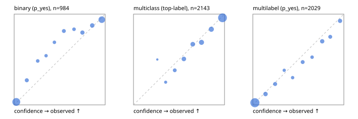

# Evaluation report

- model `Qwen/Qwen3-Reranker-4B` @ `22e683669b` (stock reranker pairs), adapter/checkpoint `runs/lora_4b/adapter`, prompt `answer-v1` (724795e9b666)
- data data/hf.jsonl, data/eval.jsonl; splits ['test']; n=3471; calibration `None`
- cuda / bfloat16; 2026-09-23T20:35:38+0000; wall 171.5s

## Overall

question accuracy 80.3%

**binary**: n 984, positives 475, accuracy 0.875, precision 0.891, recall 0.844, f1 0.867, auroc 0.945, brier 0.094, log_loss 0.307, ece 0.056

**multiclass**: n 2143, accuracy 0.823, macro_f1 0.862, log_loss 0.519, brier 0.258, ece_top_label 0.029

**multilabel**: n 344, labels 2029, exact_match 0.477, micro_f1 0.736, macro_f1 0.714, label_auroc 0.930, brier 0.085, log_loss 0.275, ece 0.024

## By family

| family | n | question acc % | details |
|---|---|---|---|
| eval_adversarial | 27 | 81.5 | bin acc 86.7 F1 85.7 AUROC 0.926 ECE 0.141; mc acc 100.0 mF1 100.0 ECE 0.069; ml EM 40.0 µF1 73.7 ECE 0.181 |
| eval_agent_output | 26 | 53.8 | bin acc 85.7 F1 87.5 AUROC 0.918 ECE 0.234; mc acc 14.3 mF1 6.2 ECE 0.613; ml EM 20.0 µF1 73.7 ECE 0.190 |
| eval_evidence | 17 | 82.4 | bin acc 93.3 F1 90.9 AUROC 1.000 ECE 0.046; ml EM 0.0 µF1 57.1 ECE 0.255 |
| eval_multilabel | 32 | 75.0 | bin acc 85.7 F1 85.7 AUROC 1.000 ECE 0.133; mc acc 0.0 mF1 0.0 ECE 0.517; ml EM 75.0 µF1 93.5 ECE 0.069 |
| eval_policy | 22 | 50.0 | bin acc 61.5 F1 66.7 AUROC 0.619 ECE 0.413; mc acc 40.0 mF1 23.8 ECE 0.364; ml EM 25.0 µF1 80.0 ECE 0.226 |
| eval_routing | 25 | 84.0 | bin acc 100.0 F1 100.0 AUROC 1.000 ECE 0.058; mc acc 76.9 mF1 66.7 ECE 0.121; ml EM 50.0 µF1 80.0 ECE 0.126 |
| eval_urgency_sentiment | 22 | 68.2 | bin acc 70.0 F1 72.7 AUROC 0.896 ECE 0.243; mc acc 70.0 mF1 58.3 ECE 0.199; ml EM 50.0 µF1 83.3 ECE 0.159 |
| heldout_boolq | 300 | 83.3 | bin acc 83.3 F1 86.4 AUROC 0.903 ECE 0.072 |
| heldout_emotion_multiclass | 300 | 58.0 | mc acc 58.0 mF1 49.9 ECE 0.129 |
| heldout_intent_clinc | 300 | 93.0 | mc acc 93.0 mF1 93.5 ECE 0.044 |
| heldout_question_type_trec | 300 | 76.3 | mc acc 76.3 mF1 76.5 ECE 0.032 |
| heldout_sentiment_sst2 | 300 | 88.0 | bin acc 88.0 F1 86.5 AUROC 0.989 ECE 0.156 |
| heldout_topic_dbpedia | 300 | 96.0 | mc acc 96.0 mF1 95.5 ECE 0.009 |
| hf_emotions_multilabel | 300 | 46.7 | ml EM 46.7 µF1 70.5 ECE 0.019 |
| hf_intent_banking77 | 300 | 96.7 | mc acc 96.7 mF1 95.8 ECE 0.020 |
| hf_nli | 300 | 92.3 | bin acc 92.3 F1 89.0 AUROC 0.977 ECE 0.042 |
| hf_sentiment_tweets | 300 | 69.3 | mc acc 69.3 mF1 69.7 ECE 0.045 |
| hf_topic_agnews | 300 | 89.3 | mc acc 89.3 mF1 89.4 ECE 0.038 |

## by hard case

| slice | n | question acc % |
|---|---|---|
| (none) | 3042 | 80.5 |
| contradiction | 107 | 99.1 |
| distractor | 33 | 51.5 |
| double_negation | 6 | 66.7 |
| evidence_end | 13 | 76.9 |
| evidence_middle | 11 | 54.5 |
| evidence_start | 9 | 77.8 |
| exception | 7 | 0.0 |
| hypothetical | 7 | 71.4 |
| injection | 10 | 70.0 |
| lexical_overlap | 20 | 80.0 |
| long_state | 50 | 64.0 |
| missing_evidence | 104 | 91.3 |
| multi_positive | 81 | 38.3 |
| multi_turn | 9 | 88.9 |
| negation | 30 | 90.0 |
| new_label_names | 3 | 33.3 |
| nota | 46 | 97.8 |
| numeric_reasoning | 16 | 50.0 |
| paraphrase | 22 | 59.1 |
| role_reversal | 15 | 60.0 |
| sarcasm | 12 | 66.7 |
| temporal_reasoning | 29 | 41.4 |
| zero_positive | 6 | 16.7 |

## by state tokens

| slice | n | question acc % |
|---|---|---|
| 00000-00127 | 3211 | 80.6 |
| 00128-00511 | 208 | 80.8 |
| 00512-02047 | 52 | 63.5 |

## by candidates

| slice | n | question acc % |
|---|---|---|
| 01 | 984 | 87.5 |
| 03 | 310 | 70.0 |
| 04 | 333 | 87.1 |
| 05 | 22 | 31.8 |
| 06 | 1218 | 69.2 |
| 07 | 49 | 93.9 |
| 08 | 555 | 94.4 |

## Paraphrase groups

11 groups; same prediction 63.6%; all correct 54.5%

## Multiclass abstention (coverage vs error on accepted)

| abstain_below | coverage % | error % |
|---|---|---|
| 0.0 | 100.0 | 17.7 |
| 0.4 | 98.4 | 16.8 |
| 0.5 | 94.5 | 15.0 |
| 0.6 | 87.0 | 12.0 |
| 0.7 | 78.7 | 9.8 |
| 0.8 | 67.6 | 6.3 |
| 0.9 | 55.6 | 4.0 |

## Reliability: binary

| bin | n | mean confidence | observed frequency |
|---|---|---|---|
| [0.0,0.1) | 402 | 0.023 | 0.032 |
| [0.1,0.2) | 48 | 0.139 | 0.271 |
| [0.2,0.3) | 31 | 0.259 | 0.484 |
| [0.3,0.4) | 24 | 0.350 | 0.542 |
| [0.4,0.5) | 29 | 0.442 | 0.690 |
| [0.5,0.6) | 43 | 0.546 | 0.814 |
| [0.6,0.7) | 30 | 0.658 | 0.833 |
| [0.7,0.8) | 59 | 0.750 | 0.797 |
| [0.8,0.9) | 72 | 0.858 | 0.875 |
| [0.9,1.0] | 246 | 0.963 | 0.939 |

## Reliability: multiclass

| bin | n | mean confidence | observed frequency |
|---|---|---|---|
| [0.2,0.3) | 2 | 0.262 | 0.500 |
| [0.3,0.4) | 32 | 0.354 | 0.250 |
| [0.4,0.5) | 84 | 0.453 | 0.381 |
| [0.5,0.6) | 160 | 0.553 | 0.506 |
| [0.6,0.7) | 178 | 0.651 | 0.669 |
| [0.7,0.8) | 238 | 0.747 | 0.689 |
| [0.8,0.9) | 258 | 0.855 | 0.833 |
| [0.9,1.0] | 1191 | 0.978 | 0.960 |

## Reliability: multilabel

| bin | n | mean confidence | observed frequency |
|---|---|---|---|
| [0.0,0.1) | 1211 | 0.023 | 0.024 |
| [0.1,0.2) | 142 | 0.140 | 0.120 |
| [0.2,0.3) | 100 | 0.245 | 0.230 |
| [0.3,0.4) | 42 | 0.345 | 0.381 |
| [0.4,0.5) | 50 | 0.437 | 0.300 |
| [0.5,0.6) | 89 | 0.548 | 0.472 |
| [0.6,0.7) | 59 | 0.651 | 0.525 |
| [0.7,0.8) | 127 | 0.762 | 0.701 |
| [0.8,0.9) | 88 | 0.851 | 0.750 |
| [0.9,1.0] | 121 | 0.958 | 0.926 |
