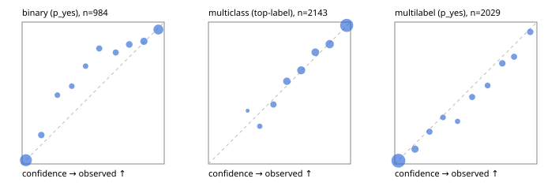

# Evaluation report

- model `Qwen/Qwen3-Reranker-4B` @ `22e683669b` (stock reranker pairs), adapter/checkpoint `runs/lora_4b/adapter`, prompt `answer-v1` (724795e9b666)
- data data/hf.jsonl, data/eval.jsonl; splits ['test']; n=3471; calibration `{'method': 'temperature scaling per output type, grid search on NLL', 'min_n': 30, 'model': 'Qwen/Qwen3-Reranker-4B', 'revision': '22e683669bc0f0bd69640a1354a6d0aebcfeede5', 'adapter': 'runs/lora_4b/adapter', 'adapter_sha256': '26d326d4fb6c9e86e3f6df88c91cdf50a8f4c816ff82f636deecc2c148be1cb7', 'prompt_sha': '724795e9b666', 'fit_report': 'reports/lora_4b/calibration/report.json', 'fit_report_sha256': '4406c3ce32f0b5268abf4f77342760dac5023048da9c48b70b02b3980f88743a', 'fit_data': [{'path': 'data/hf.jsonl', 'sha256': 'fe29b29286d5a372271e925825e8b9794f3f64be9a9fc04cad458b4b94ada510'}, {'path': 'data/eval.jsonl', 'sha256': 'be888eb38dcca063823924430e03985ddf2186b874e792d5734936ba93ba6910'}], 'created': '2026-09-23T20:35:43+0000', 'n': {'binary': 210, 'multiclass': 476, 'multilabel': 1014}, 'nll_before': {'binary': 0.19912905812652965, 'multiclass': 0.42012908709535357, 'multilabel': 0.28374654770136715}, 'nll_after': {'binary': 0.19847450878328918, 'multiclass': 0.4135636969401714, 'multilabel': 0.2831351546852146}, 'skipped': {}, 'threshold_report': 'reports/lora_4b/validation/report.json', 'threshold_report_sha256': 'e384693ddb14c40f1f2eca0a66babbfe81c03766a183298ec343e289bb25333b', 'threshold_rule': 'max F1 on validation after temperature scaling', 'file': 'calib/lora_4b.json', 'file_sha256': '2518e32e180dca35596cdbf401ef1ab4eb01bb7bbdeb22b5f4beca1688bf349b'}`
- cuda / bfloat16; 2026-09-23T20:38:42+0000; wall 171.6s

## Overall

question accuracy 80.6%

**binary**: n 984, positives 475, accuracy 0.886, precision 0.879, recall 0.886, f1 0.883, auroc 0.945, brier 0.093, log_loss 0.304, ece 0.051

**multiclass**: n 2143, accuracy 0.823, macro_f1 0.862, log_loss 0.505, brier 0.257, ece_top_label 0.015

**multilabel**: n 344, labels 2029, exact_match 0.471, micro_f1 0.731, macro_f1 0.691, label_auroc 0.930, brier 0.085, log_loss 0.274, ece 0.024

## By family

| family | n | question acc % | details |
|---|---|---|---|
| eval_adversarial | 27 | 81.5 | bin acc 86.7 F1 85.7 AUROC 0.926 ECE 0.142; mc acc 100.0 mF1 100.0 ECE 0.097; ml EM 40.0 µF1 73.7 ECE 0.159 |
| eval_agent_output | 26 | 50.0 | bin acc 78.6 F1 82.4 AUROC 0.918 ECE 0.225; mc acc 14.3 mF1 6.2 ECE 0.565; ml EM 20.0 µF1 73.7 ECE 0.182 |
| eval_evidence | 17 | 82.4 | bin acc 93.3 F1 90.9 AUROC 1.000 ECE 0.050; ml EM 0.0 µF1 75.0 ECE 0.256 |
| eval_multilabel | 32 | 65.6 | bin acc 85.7 F1 85.7 AUROC 1.000 ECE 0.136; mc acc 0.0 mF1 0.0 ECE 0.490; ml EM 62.5 µF1 87.7 ECE 0.069 |
| eval_policy | 22 | 50.0 | bin acc 61.5 F1 66.7 AUROC 0.619 ECE 0.423; mc acc 40.0 mF1 23.8 ECE 0.332; ml EM 25.0 µF1 80.0 ECE 0.223 |
| eval_routing | 25 | 80.0 | bin acc 90.0 F1 88.9 AUROC 1.000 ECE 0.063; mc acc 76.9 mF1 66.7 ECE 0.128; ml EM 50.0 µF1 80.0 ECE 0.124 |
| eval_urgency_sentiment | 22 | 72.7 | bin acc 80.0 F1 83.3 AUROC 0.896 ECE 0.246; mc acc 70.0 mF1 58.3 ECE 0.229; ml EM 50.0 µF1 83.3 ECE 0.141 |
| heldout_boolq | 300 | 83.0 | bin acc 83.0 F1 86.5 AUROC 0.903 ECE 0.060 |
| heldout_emotion_multiclass | 300 | 58.0 | mc acc 58.0 mF1 49.9 ECE 0.090 |
| heldout_intent_clinc | 300 | 93.0 | mc acc 93.0 mF1 93.5 ECE 0.073 |
| heldout_question_type_trec | 300 | 76.3 | mc acc 76.3 mF1 76.5 ECE 0.055 |
| heldout_sentiment_sst2 | 300 | 91.7 | bin acc 91.7 F1 91.0 AUROC 0.989 ECE 0.159 |
| heldout_topic_dbpedia | 300 | 96.0 | mc acc 96.0 mF1 95.5 ECE 0.011 |
| hf_emotions_multilabel | 300 | 47.0 | ml EM 47.0 µF1 70.7 ECE 0.020 |
| hf_intent_banking77 | 300 | 96.7 | mc acc 96.7 mF1 95.8 ECE 0.035 |
| hf_nli | 300 | 93.0 | bin acc 93.0 F1 90.1 AUROC 0.977 ECE 0.044 |
| hf_sentiment_tweets | 300 | 69.3 | mc acc 69.3 mF1 69.7 ECE 0.028 |
| hf_topic_agnews | 300 | 89.3 | mc acc 89.3 mF1 89.4 ECE 0.027 |

## by hard case

| slice | n | question acc % |
|---|---|---|
| (none) | 3042 | 80.8 |
| contradiction | 107 | 99.1 |
| distractor | 33 | 48.5 |
| double_negation | 6 | 66.7 |
| evidence_end | 13 | 76.9 |
| evidence_middle | 11 | 54.5 |
| evidence_start | 9 | 77.8 |
| exception | 7 | 0.0 |
| hypothetical | 7 | 71.4 |
| injection | 10 | 70.0 |
| lexical_overlap | 20 | 60.0 |
| long_state | 50 | 62.0 |
| missing_evidence | 104 | 90.4 |
| multi_positive | 81 | 40.7 |
| multi_turn | 9 | 88.9 |
| negation | 30 | 83.3 |
| new_label_names | 3 | 33.3 |
| nota | 46 | 97.8 |
| numeric_reasoning | 16 | 43.8 |
| paraphrase | 22 | 54.5 |
| role_reversal | 15 | 60.0 |
| sarcasm | 12 | 58.3 |
| temporal_reasoning | 29 | 37.9 |
| zero_positive | 6 | 16.7 |

## by state tokens

| slice | n | question acc % |
|---|---|---|
| 00000-00127 | 3211 | 81.0 |
| 00128-00511 | 208 | 78.8 |
| 00512-02047 | 52 | 61.5 |

## by candidates

| slice | n | question acc % |
|---|---|---|
| 01 | 984 | 88.6 |
| 03 | 310 | 70.0 |
| 04 | 333 | 87.1 |
| 05 | 22 | 27.3 |
| 06 | 1218 | 69.1 |
| 07 | 49 | 93.9 |
| 08 | 555 | 94.4 |

## Paraphrase groups

11 groups; same prediction 54.5%; all correct 45.5%

## Multiclass abstention (coverage vs error on accepted)

| abstain_below | coverage % | error % |
|---|---|---|
| 0.0 | 100.0 | 17.7 |
| 0.4 | 97.3 | 16.3 |
| 0.5 | 92.4 | 14.0 |
| 0.6 | 83.7 | 11.1 |
| 0.7 | 72.0 | 7.4 |
| 0.8 | 61.7 | 5.1 |
| 0.9 | 48.5 | 2.3 |

## Reliability: binary

| bin | n | mean confidence | observed frequency |
|---|---|---|---|
| [0.0,0.1) | 387 | 0.027 | 0.026 |
| [0.1,0.2) | 54 | 0.135 | 0.204 |
| [0.2,0.3) | 33 | 0.248 | 0.485 |
| [0.3,0.4) | 31 | 0.349 | 0.548 |
| [0.4,0.5) | 29 | 0.447 | 0.690 |
| [0.5,0.6) | 43 | 0.543 | 0.814 |
| [0.6,0.7) | 42 | 0.659 | 0.786 |
| [0.7,0.8) | 57 | 0.754 | 0.842 |
| [0.8,0.9) | 81 | 0.857 | 0.864 |
| [0.9,1.0] | 227 | 0.959 | 0.947 |

## Reliability: multiclass

| bin | n | mean confidence | observed frequency |
|---|---|---|---|
| [0.2,0.3) | 8 | 0.276 | 0.375 |
| [0.3,0.4) | 49 | 0.361 | 0.265 |
| [0.4,0.5) | 105 | 0.457 | 0.419 |
| [0.5,0.6) | 187 | 0.552 | 0.583 |
| [0.6,0.7) | 250 | 0.653 | 0.660 |
| [0.7,0.8) | 221 | 0.752 | 0.787 |
| [0.8,0.9) | 283 | 0.853 | 0.845 |
| [0.9,1.0] | 1040 | 0.973 | 0.977 |

## Reliability: multilabel

| bin | n | mean confidence | observed frequency |
|---|---|---|---|
| [0.0,0.1) | 1174 | 0.025 | 0.023 |
| [0.1,0.2) | 172 | 0.142 | 0.105 |
| [0.2,0.3) | 88 | 0.244 | 0.227 |
| [0.3,0.4) | 61 | 0.340 | 0.328 |
| [0.4,0.5) | 50 | 0.441 | 0.300 |
| [0.5,0.6) | 89 | 0.545 | 0.472 |
| [0.6,0.7) | 76 | 0.653 | 0.553 |
| [0.7,0.8) | 110 | 0.757 | 0.709 |
| [0.8,0.9) | 94 | 0.839 | 0.755 |
| [0.9,1.0] | 115 | 0.953 | 0.930 |
