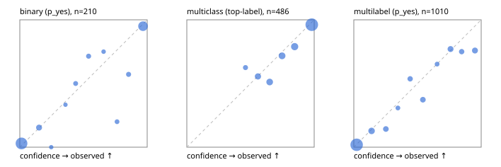

# Evaluation report

- model `Qwen/Qwen3-Reranker-4B` @ `22e683669b` (stock reranker pairs), adapter/checkpoint `runs/lora_4b/adapter`, prompt `answer-v1` (724795e9b666)
- data data/hf.jsonl, data/eval.jsonl; splits ['validation']; n=868; calibration `None`
- cuda / bfloat16; 2026-09-23T20:31:48+0000; wall 44.3s

## Overall

question accuracy 77.5%

**binary**: n 210, positives 79, accuracy 0.895, precision 0.843, recall 0.886, f1 0.864, auroc 0.960, brier 0.079, log_loss 0.262, ece 0.049

**multiclass**: n 486, accuracy 0.837, macro_f1 0.749, log_loss 0.441, brier 0.238, ece_top_label 0.039

**multilabel**: n 172, labels 1010, exact_match 0.453, micro_f1 0.694, macro_f1 0.576, label_auroc 0.918, brier 0.092, log_loss 0.299, ece 0.037

## By family

| family | n | question acc % | details |
|---|---|---|---|
| eval_adversarial | 14 | 92.9 | bin acc 85.7 F1 90.9 AUROC 0.900 ECE 0.197; mc acc 100.0 mF1 100.0 ECE 0.129; ml EM 100.0 µF1 100.0 ECE 0.010 |
| eval_agent_output | 20 | 70.0 | bin acc 83.3 F1 85.7 AUROC 0.903 ECE 0.112; mc acc 60.0 mF1 33.3 ECE 0.202; ml EM 33.3 µF1 0.0 ECE 0.278 |
| eval_evidence | 17 | 88.2 | bin acc 92.9 F1 90.9 AUROC 1.000 ECE 0.103; ml EM 66.7 µF1 88.9 ECE 0.051 |
| eval_multilabel | 12 | 33.3 | bin acc 0.0 F1 0.0 AUROC — ECE 0.844; mc acc 100.0 mF1 100.0 ECE 0.001; ml EM 22.2 µF1 79.2 ECE 0.157 |
| eval_policy | 24 | 33.3 | bin acc 50.0 F1 57.1 AUROC 0.514 ECE 0.504; mc acc 18.2 mF1 10.5 ECE 0.599; ml EM 0.0 µF1 80.0 ECE 0.392 |
| eval_routing | 16 | 87.5 | bin acc 85.7 F1 90.9 AUROC 1.000 ECE 0.136; mc acc 100.0 mF1 100.0 ECE 0.074; ml EM 0.0 µF1 0.0 ECE 0.160 |
| eval_urgency_sentiment | 15 | 80.0 | bin acc 100.0 F1 100.0 AUROC 1.000 ECE 0.049; mc acc 80.0 mF1 66.7 ECE 0.170; ml EM 33.3 µF1 40.0 ECE 0.243 |
| hf_emotions_multilabel | 150 | 46.7 | ml EM 46.7 µF1 68.1 ECE 0.030 |
| hf_intent_banking77 | 150 | 95.3 | mc acc 95.3 mF1 93.0 ECE 0.034 |
| hf_nli | 150 | 93.3 | bin acc 93.3 F1 89.1 AUROC 0.983 ECE 0.040 |
| hf_sentiment_tweets | 150 | 72.0 | mc acc 72.0 mF1 66.5 ECE 0.081 |
| hf_topic_agnews | 150 | 88.0 | mc acc 88.0 mF1 88.1 ECE 0.050 |

## by hard case

| slice | n | question acc % |
|---|---|---|
| (none) | 634 | 79.0 |
| contradiction | 63 | 92.1 |
| distractor | 20 | 65.0 |
| double_negation | 3 | 100.0 |
| evidence_end | 4 | 25.0 |
| evidence_middle | 7 | 85.7 |
| evidence_start | 3 | 100.0 |
| exception | 7 | 57.1 |
| hypothetical | 6 | 50.0 |
| injection | 16 | 81.2 |
| lexical_overlap | 13 | 69.2 |
| long_state | 26 | 61.5 |
| missing_evidence | 59 | 93.2 |
| multi_positive | 40 | 20.0 |
| multi_turn | 21 | 71.4 |
| negation | 9 | 44.4 |
| new_label_names | 5 | 20.0 |
| nota | 4 | 75.0 |
| numeric_reasoning | 13 | 53.8 |
| paraphrase | 10 | 40.0 |
| role_reversal | 7 | 42.9 |
| sarcasm | 5 | 80.0 |
| temporal_reasoning | 15 | 33.3 |
| zero_positive | 7 | 57.1 |

## by state tokens

| slice | n | question acc % |
|---|---|---|
| 00000-00127 | 796 | 78.4 |
| 00128-00511 | 46 | 71.7 |
| 00512-02047 | 26 | 61.5 |

## by candidates

| slice | n | question acc % |
|---|---|---|
| 01 | 210 | 89.5 |
| 03 | 162 | 71.0 |
| 04 | 174 | 84.5 |
| 05 | 13 | 61.5 |
| 06 | 159 | 45.3 |
| 08 | 150 | 95.3 |

## Paraphrase groups

5 groups; same prediction 60.0%; all correct 40.0%

## Multiclass abstention (coverage vs error on accepted)

| abstain_below | coverage % | error % |
|---|---|---|
| 0.0 | 100.0 | 16.3 |
| 0.4 | 100.0 | 16.3 |
| 0.5 | 96.7 | 15.5 |
| 0.6 | 89.3 | 13.1 |
| 0.7 | 80.5 | 9.2 |
| 0.8 | 71.0 | 6.7 |
| 0.9 | 59.3 | 3.8 |

## Reliability: binary

| bin | n | mean confidence | observed frequency |
|---|---|---|---|
| [0.0,0.1) | 102 | 0.013 | 0.029 |
| [0.1,0.2) | 13 | 0.151 | 0.154 |
| [0.2,0.3) | 3 | 0.247 | 0.000 |
| [0.3,0.4) | 3 | 0.358 | 0.333 |
| [0.4,0.5) | 6 | 0.438 | 0.500 |
| [0.5,0.6) | 7 | 0.540 | 0.714 |
| [0.6,0.7) | 4 | 0.658 | 0.750 |
| [0.7,0.8) | 5 | 0.764 | 0.200 |
| [0.8,0.9) | 7 | 0.854 | 0.571 |
| [0.9,1.0] | 60 | 0.967 | 0.950 |

## Reliability: multiclass

| bin | n | mean confidence | observed frequency |
|---|---|---|---|
| [0.4,0.5) | 16 | 0.461 | 0.625 |
| [0.5,0.6) | 36 | 0.558 | 0.556 |
| [0.6,0.7) | 43 | 0.651 | 0.512 |
| [0.7,0.8) | 46 | 0.748 | 0.717 |
| [0.8,0.9) | 57 | 0.847 | 0.789 |
| [0.9,1.0] | 288 | 0.981 | 0.962 |

## Reliability: multilabel

| bin | n | mean confidence | observed frequency |
|---|---|---|---|
| [0.0,0.1) | 575 | 0.022 | 0.019 |
| [0.1,0.2) | 86 | 0.140 | 0.128 |
| [0.2,0.3) | 49 | 0.252 | 0.143 |
| [0.3,0.4) | 26 | 0.346 | 0.308 |
| [0.4,0.5) | 41 | 0.442 | 0.537 |
| [0.5,0.6) | 51 | 0.542 | 0.373 |
| [0.6,0.7) | 23 | 0.654 | 0.652 |
| [0.7,0.8) | 61 | 0.759 | 0.770 |
| [0.8,0.9) | 40 | 0.847 | 0.750 |
| [0.9,1.0] | 58 | 0.951 | 0.759 |
