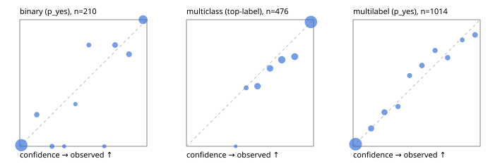

# Evaluation report

- model `Qwen/Qwen3-Reranker-8B` @ `77d193c791` (stock reranker pairs), adapter/checkpoint `runs/lora_8b/adapter`, prompt `task-v1` (f7b8d8022dfb)
- data data/hf.jsonl, data/eval.jsonl; splits ['calibration']; n=859; calibration `None`
- cuda / bfloat16; 2026-09-23T21:58:40+0000; wall 56.8s

## Overall

question accuracy 78.7%

**binary**: n 210, positives 71, accuracy 0.943, precision 0.893, recall 0.944, f1 0.918, auroc 0.985, brier 0.046, log_loss 0.152, ece 0.047

**multiclass**: n 476, accuracy 0.826, macro_f1 0.853, log_loss 0.406, brier 0.240, ece_top_label 0.037

**multilabel**: n 173, labels 1014, exact_match 0.491, micro_f1 0.722, macro_f1 0.653, label_auroc 0.934, brier 0.082, log_loss 0.267, ece 0.023

## By family

| family | n | question acc % | details |
|---|---|---|---|
| eval_adversarial | 19 | 94.7 | bin acc 100.0 F1 100.0 AUROC 1.000 ECE 0.058; mc acc 100.0 mF1 100.0 ECE 0.043; ml EM 50.0 µF1 66.7 ECE 0.091 |
| eval_agent_output | 9 | 88.9 | bin acc 100.0 F1 100.0 AUROC 1.000 ECE 0.216; mc acc 100.0 mF1 100.0 ECE 0.104; ml EM 50.0 µF1 40.0 ECE 0.264 |
| eval_evidence | 19 | 94.7 | bin acc 93.8 F1 90.9 AUROC 1.000 ECE 0.063; ml EM 100.0 µF1 100.0 ECE 0.041 |
| eval_multilabel | 12 | 66.7 | bin acc 100.0 F1 100.0 AUROC — ECE 0.085; mc acc 100.0 mF1 100.0 ECE 0.154; ml EM 50.0 µF1 86.7 ECE 0.102 |
| eval_policy | 16 | 68.8 | bin acc 87.5 F1 80.0 AUROC 1.000 ECE 0.190; mc acc 50.0 mF1 33.3 ECE 0.563; ml EM 50.0 µF1 60.0 ECE 0.365 |
| eval_routing | 15 | 93.3 | bin acc 100.0 F1 100.0 AUROC 1.000 ECE 0.043; mc acc 85.7 mF1 71.4 ECE 0.138; ml EM 100.0 µF1 100.0 ECE 0.030 |
| eval_urgency_sentiment | 19 | 89.5 | bin acc 87.5 F1 80.0 AUROC 1.000 ECE 0.176; mc acc 87.5 mF1 83.3 ECE 0.108; ml EM 100.0 µF1 100.0 ECE 0.039 |
| hf_emotions_multilabel | 150 | 46.7 | ml EM 46.7 µF1 69.6 ECE 0.025 |
| hf_intent_banking77 | 150 | 94.0 | mc acc 94.0 mF1 90.2 ECE 0.042 |
| hf_nli | 150 | 94.0 | bin acc 94.0 F1 90.5 AUROC 0.985 ECE 0.047 |
| hf_sentiment_tweets | 150 | 66.7 | mc acc 66.7 mF1 64.2 ECE 0.103 |
| hf_topic_agnews | 150 | 86.7 | mc acc 86.7 mF1 86.6 ECE 0.048 |

## by hard case

| slice | n | question acc % |
|---|---|---|
| (none) | 624 | 77.9 |
| contradiction | 58 | 96.6 |
| distractor | 25 | 92.0 |
| double_negation | 3 | 100.0 |
| evidence_end | 11 | 100.0 |
| evidence_middle | 6 | 66.7 |
| evidence_start | 7 | 100.0 |
| exception | 4 | 75.0 |
| hypothetical | 7 | 100.0 |
| injection | 6 | 50.0 |
| lexical_overlap | 16 | 87.5 |
| long_state | 42 | 85.7 |
| missing_evidence | 62 | 91.9 |
| multi_positive | 42 | 35.7 |
| multi_turn | 12 | 75.0 |
| negation | 12 | 75.0 |
| new_label_names | 5 | 80.0 |
| nota | 4 | 100.0 |
| numeric_reasoning | 15 | 73.3 |
| paraphrase | 10 | 60.0 |
| role_reversal | 13 | 76.9 |
| sarcasm | 1 | 0.0 |
| temporal_reasoning | 14 | 85.7 |
| zero_positive | 4 | 50.0 |

## by state tokens

| slice | n | question acc % |
|---|---|---|
| 00000-00127 | 780 | 77.7 |
| 00128-00511 | 37 | 91.9 |
| 00512-02047 | 42 | 85.7 |

## by candidates

| slice | n | question acc % |
|---|---|---|
| 01 | 210 | 94.3 |
| 03 | 158 | 67.1 |
| 04 | 168 | 85.7 |
| 05 | 15 | 80.0 |
| 06 | 157 | 47.8 |
| 07 | 1 | 0.0 |
| 08 | 150 | 94.0 |

## Paraphrase groups

5 groups; same prediction 40.0%; all correct 40.0%

## Multiclass abstention (coverage vs error on accepted)

| abstain_below | coverage % | error % |
|---|---|---|
| 0.0 | 100.0 | 17.4 |
| 0.4 | 99.6 | 17.1 |
| 0.5 | 96.8 | 16.1 |
| 0.6 | 88.4 | 12.6 |
| 0.7 | 80.3 | 9.9 |
| 0.8 | 67.6 | 5.9 |
| 0.9 | 57.6 | 1.8 |

## Reliability: binary

| bin | n | mean confidence | observed frequency |
|---|---|---|---|
| [0.0,0.1) | 116 | 0.012 | 0.009 |
| [0.1,0.2) | 8 | 0.134 | 0.250 |
| [0.2,0.3) | 6 | 0.253 | 0.000 |
| [0.3,0.4) | 2 | 0.349 | 0.000 |
| [0.4,0.5) | 3 | 0.438 | 0.333 |
| [0.5,0.6) | 5 | 0.543 | 0.800 |
| [0.6,0.7) | 2 | 0.665 | 0.000 |
| [0.7,0.8) | 10 | 0.750 | 0.800 |
| [0.8,0.9) | 11 | 0.859 | 0.727 |
| [0.9,1.0] | 47 | 0.970 | 1.000 |

## Reliability: multiclass

| bin | n | mean confidence | observed frequency |
|---|---|---|---|
| [0.3,0.4) | 2 | 0.387 | 0.000 |
| [0.4,0.5) | 13 | 0.470 | 0.462 |
| [0.5,0.6) | 40 | 0.559 | 0.475 |
| [0.6,0.7) | 39 | 0.658 | 0.615 |
| [0.7,0.8) | 60 | 0.750 | 0.683 |
| [0.8,0.9) | 48 | 0.852 | 0.708 |
| [0.9,1.0] | 274 | 0.979 | 0.982 |

## Reliability: multilabel

| bin | n | mean confidence | observed frequency |
|---|---|---|---|
| [0.0,0.1) | 608 | 0.019 | 0.016 |
| [0.1,0.2) | 71 | 0.142 | 0.141 |
| [0.2,0.3) | 67 | 0.247 | 0.269 |
| [0.3,0.4) | 35 | 0.353 | 0.314 |
| [0.4,0.5) | 34 | 0.444 | 0.559 |
| [0.5,0.6) | 47 | 0.541 | 0.638 |
| [0.6,0.7) | 37 | 0.645 | 0.757 |
| [0.7,0.8) | 40 | 0.744 | 0.700 |
| [0.8,0.9) | 25 | 0.859 | 0.840 |
| [0.9,1.0] | 50 | 0.960 | 0.880 |
