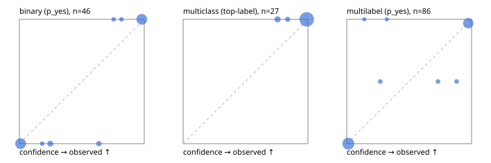

# Evaluation report

- model `Qwen/Qwen3-Reranker-8B` @ `77d193c791` (stock reranker pairs), adapter/checkpoint `runs/lora_8b/adapter`, prompt `task-v1` (f7b8d8022dfb)
- data data/synthetic.jsonl; splits ['test']; n=96; calibration `None`
- cuda / bfloat16; 2026-09-23T22:06:27+0000; wall 12.4s

## Overall

question accuracy 93.8%

**binary**: n 46, positives 21, accuracy 0.957, precision 0.913, recall 1.000, f1 0.955, auroc 1.000, brier 0.025, log_loss 0.090, ece 0.069

**multiclass**: n 27, accuracy 1.000, macro_f1 1.000, log_loss 0.036, brier 0.009, ece_top_label 0.032

**multilabel**: n 23, labels 86, exact_match 0.826, micro_f1 0.917, macro_f1 0.846, label_auroc 0.992, brier 0.047, log_loss 0.143, ece 0.046

## By family

| family | n | question acc % | details |
|---|---|---|---|
| syn_adversarial | 13 | 92.3 | bin acc 100.0 F1 100.0 AUROC 1.000 ECE 0.012; mc acc 100.0 mF1 100.0 ECE 0.013; ml EM 66.7 µF1 93.3 ECE 0.121 |
| syn_evidence | 23 | 95.7 | bin acc 100.0 F1 100.0 AUROC 1.000 ECE 0.046; mc acc 100.0 mF1 100.0 ECE 0.003; ml EM 75.0 µF1 87.5 ECE 0.112 |
| syn_multilabel | 8 | 100.0 | bin acc 100.0 F1 100.0 AUROC — ECE 0.053; mc acc 100.0 mF1 100.0 ECE 0.000; ml EM 100.0 µF1 100.0 ECE 0.026 |
| syn_policy | 19 | 84.2 | bin acc 87.5 F1 85.7 AUROC 1.000 ECE 0.197; mc acc 100.0 mF1 100.0 ECE 0.078; ml EM 50.0 µF1 66.7 ECE 0.192 |
| syn_routing | 12 | 100.0 | bin acc 100.0 F1 100.0 AUROC 1.000 ECE 0.008; mc acc 100.0 mF1 100.0 ECE 0.011; ml EM 100.0 µF1 100.0 ECE 0.001 |
| syn_urgency_sentiment | 21 | 95.2 | bin acc 90.9 F1 92.3 AUROC 1.000 ECE 0.073; mc acc 100.0 mF1 100.0 ECE 0.035; ml EM 100.0 µF1 100.0 ECE 0.015 |

## by hard case

| slice | n | question acc % |
|---|---|---|
| (none) | 9 | 100.0 |
| contradiction | 8 | 87.5 |
| distractor | 18 | 88.9 |
| double_negation | 2 | 100.0 |
| evidence_end | 4 | 100.0 |
| evidence_middle | 2 | 100.0 |
| evidence_start | 4 | 100.0 |
| exception | 20 | 85.0 |
| hypothetical | 2 | 100.0 |
| injection | 6 | 100.0 |
| lexical_overlap | 17 | 100.0 |
| long_state | 18 | 100.0 |
| missing_evidence | 5 | 80.0 |
| multi_positive | 13 | 84.6 |
| multi_turn | 4 | 100.0 |
| negation | 16 | 100.0 |
| nota | 2 | 100.0 |
| numeric_reasoning | 16 | 93.8 |
| paraphrase | 1 | 100.0 |
| role_reversal | 10 | 100.0 |
| sarcasm | 3 | 66.7 |
| temporal_reasoning | 10 | 80.0 |
| zero_positive | 3 | 100.0 |

## by state tokens

| slice | n | question acc % |
|---|---|---|
| 00000-00127 | 48 | 91.7 |
| 00128-00511 | 29 | 93.1 |
| 00512-02047 | 19 | 100.0 |

## by candidates

| slice | n | question acc % |
|---|---|---|
| 01 | 46 | 95.7 |
| 03 | 8 | 87.5 |
| 04 | 38 | 92.1 |
| 05 | 4 | 100.0 |

## Paraphrase groups

0 groups; same prediction —%; all correct —%

## Multiclass abstention (coverage vs error on accepted)

| abstain_below | coverage % | error % |
|---|---|---|
| 0.0 | 100.0 | 0.0 |
| 0.4 | 100.0 | 0.0 |
| 0.5 | 100.0 | 0.0 |
| 0.6 | 100.0 | 0.0 |
| 0.7 | 100.0 | 0.0 |
| 0.8 | 92.6 | 0.0 |
| 0.9 | 88.9 | 0.0 |

## Reliability: binary

| bin | n | mean confidence | observed frequency |
|---|---|---|---|
| [0.0,0.1) | 19 | 0.009 | 0.000 |
| [0.1,0.2) | 1 | 0.182 | 0.000 |
| [0.2,0.3) | 3 | 0.247 | 0.000 |
| [0.6,0.7) | 2 | 0.637 | 0.000 |
| [0.7,0.8) | 1 | 0.755 | 1.000 |
| [0.8,0.9) | 1 | 0.818 | 1.000 |
| [0.9,1.0] | 19 | 0.981 | 1.000 |

## Reliability: multiclass

| bin | n | mean confidence | observed frequency |
|---|---|---|---|
| [0.7,0.8) | 2 | 0.757 | 1.000 |
| [0.8,0.9) | 1 | 0.838 | 1.000 |
| [0.9,1.0] | 24 | 0.991 | 1.000 |

## Reliability: multilabel

| bin | n | mean confidence | observed frequency |
|---|---|---|---|
| [0.0,0.1) | 46 | 0.013 | 0.000 |
| [0.1,0.2) | 1 | 0.140 | 1.000 |
| [0.2,0.3) | 2 | 0.269 | 0.500 |
| [0.3,0.4) | 1 | 0.321 | 1.000 |
| [0.7,0.8) | 2 | 0.731 | 0.500 |
| [0.8,0.9) | 2 | 0.880 | 0.500 |
| [0.9,1.0] | 32 | 0.973 | 0.969 |
