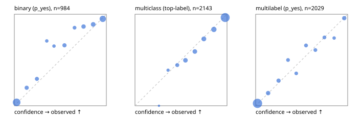

# Evaluation report

- model `Qwen/Qwen3-Reranker-8B` @ `77d193c791` (stock reranker pairs), adapter/checkpoint `runs/lora_8b/adapter`, prompt `task-v1` (f7b8d8022dfb)
- data data/hf.jsonl, data/eval.jsonl; splits ['test']; n=3471; calibration `None`
- cuda / bfloat16; 2026-09-23T22:02:21+0000; wall 213.4s

## Overall

question accuracy 80.7%

**binary**: n 984, positives 475, accuracy 0.873, precision 0.884, recall 0.848, f1 0.866, auroc 0.945, brier 0.094, log_loss 0.306, ece 0.051

**multiclass**: n 2143, accuracy 0.829, macro_f1 0.887, log_loss 0.468, brier 0.243, ece_top_label 0.023

**multilabel**: n 344, labels 2029, exact_match 0.480, micro_f1 0.721, macro_f1 0.748, label_auroc 0.931, brier 0.083, log_loss 0.268, ece 0.023

## By family

| family | n | question acc % | details |
|---|---|---|---|
| eval_adversarial | 27 | 81.5 | bin acc 86.7 F1 83.3 AUROC 0.981 ECE 0.128; mc acc 100.0 mF1 100.0 ECE 0.045; ml EM 40.0 µF1 85.7 ECE 0.159 |
| eval_agent_output | 26 | 53.8 | bin acc 78.6 F1 80.0 AUROC 0.867 ECE 0.178; mc acc 14.3 mF1 6.2 ECE 0.573; ml EM 40.0 µF1 82.4 ECE 0.197 |
| eval_evidence | 17 | 94.1 | bin acc 100.0 F1 100.0 AUROC 1.000 ECE 0.011; ml EM 50.0 µF1 57.1 ECE 0.276 |
| eval_multilabel | 32 | 84.4 | bin acc 100.0 F1 100.0 AUROC 1.000 ECE 0.042; mc acc 0.0 mF1 0.0 ECE 0.583; ml EM 83.3 µF1 96.2 ECE 0.032 |
| eval_policy | 22 | 50.0 | bin acc 53.8 F1 62.5 AUROC 0.524 ECE 0.367; mc acc 60.0 mF1 44.4 ECE 0.366; ml EM 25.0 µF1 73.7 ECE 0.258 |
| eval_routing | 25 | 92.0 | bin acc 100.0 F1 100.0 AUROC 1.000 ECE 0.028; mc acc 92.3 mF1 87.9 ECE 0.133; ml EM 50.0 µF1 80.0 ECE 0.115 |
| eval_urgency_sentiment | 22 | 68.2 | bin acc 60.0 F1 66.7 AUROC 0.750 ECE 0.337; mc acc 80.0 mF1 81.0 ECE 0.175; ml EM 50.0 µF1 90.9 ECE 0.173 |
| heldout_boolq | 300 | 83.0 | bin acc 83.0 F1 86.1 AUROC 0.903 ECE 0.041 |
| heldout_emotion_multiclass | 300 | 57.0 | mc acc 57.0 mF1 46.6 ECE 0.141 |
| heldout_intent_clinc | 300 | 93.7 | mc acc 93.7 mF1 94.9 ECE 0.033 |
| heldout_question_type_trec | 300 | 81.7 | mc acc 81.7 mF1 80.5 ECE 0.035 |
| heldout_sentiment_sst2 | 300 | 88.7 | bin acc 88.7 F1 87.2 AUROC 0.991 ECE 0.164 |
| heldout_topic_dbpedia | 300 | 96.0 | mc acc 96.0 mF1 95.7 ECE 0.020 |
| hf_emotions_multilabel | 300 | 45.7 | ml EM 45.7 µF1 67.3 ECE 0.026 |
| hf_intent_banking77 | 300 | 95.0 | mc acc 95.0 mF1 94.1 ECE 0.024 |
| hf_nli | 300 | 91.7 | bin acc 91.7 F1 88.6 AUROC 0.973 ECE 0.041 |
| hf_sentiment_tweets | 300 | 69.0 | mc acc 69.0 mF1 69.2 ECE 0.043 |
| hf_topic_agnews | 300 | 89.3 | mc acc 89.3 mF1 89.4 ECE 0.043 |

## by hard case

| slice | n | question acc % |
|---|---|---|
| (none) | 3042 | 80.9 |
| contradiction | 107 | 99.1 |
| distractor | 33 | 72.7 |
| double_negation | 6 | 50.0 |
| evidence_end | 13 | 92.3 |
| evidence_middle | 11 | 63.6 |
| evidence_start | 9 | 88.9 |
| exception | 7 | 28.6 |
| hypothetical | 7 | 71.4 |
| injection | 10 | 70.0 |
| lexical_overlap | 20 | 90.0 |
| long_state | 50 | 76.0 |
| missing_evidence | 104 | 87.5 |
| multi_positive | 81 | 37.0 |
| multi_turn | 9 | 77.8 |
| negation | 30 | 90.0 |
| new_label_names | 3 | 33.3 |
| nota | 46 | 95.7 |
| numeric_reasoning | 16 | 62.5 |
| paraphrase | 22 | 63.6 |
| role_reversal | 15 | 60.0 |
| sarcasm | 12 | 66.7 |
| temporal_reasoning | 29 | 51.7 |
| zero_positive | 6 | 50.0 |

## by state tokens

| slice | n | question acc % |
|---|---|---|
| 00000-00127 | 3211 | 80.7 |
| 00128-00511 | 208 | 81.2 |
| 00512-02047 | 52 | 75.0 |

## by candidates

| slice | n | question acc % |
|---|---|---|
| 01 | 984 | 87.3 |
| 03 | 310 | 69.7 |
| 04 | 333 | 87.1 |
| 05 | 22 | 50.0 |
| 06 | 1218 | 70.3 |
| 07 | 49 | 93.9 |
| 08 | 555 | 94.1 |

## Paraphrase groups

11 groups; same prediction 63.6%; all correct 54.5%

## Multiclass abstention (coverage vs error on accepted)

| abstain_below | coverage % | error % |
|---|---|---|
| 0.0 | 100.0 | 17.1 |
| 0.4 | 98.2 | 16.3 |
| 0.5 | 93.6 | 14.4 |
| 0.6 | 86.2 | 11.3 |
| 0.7 | 78.4 | 8.3 |
| 0.8 | 69.4 | 5.9 |
| 0.9 | 57.0 | 3.6 |

## Reliability: binary

| bin | n | mean confidence | observed frequency |
|---|---|---|---|
| [0.0,0.1) | 374 | 0.025 | 0.037 |
| [0.1,0.2) | 56 | 0.134 | 0.196 |
| [0.2,0.3) | 51 | 0.245 | 0.294 |
| [0.3,0.4) | 24 | 0.353 | 0.708 |
| [0.4,0.5) | 23 | 0.431 | 0.652 |
| [0.5,0.6) | 56 | 0.545 | 0.661 |
| [0.6,0.7) | 34 | 0.654 | 0.853 |
| [0.7,0.8) | 67 | 0.752 | 0.866 |
| [0.8,0.9) | 81 | 0.857 | 0.889 |
| [0.9,1.0] | 218 | 0.961 | 0.950 |

## Reliability: multiclass

| bin | n | mean confidence | observed frequency |
|---|---|---|---|
| [0.2,0.3) | 2 | 0.260 | 0.000 |
| [0.3,0.4) | 36 | 0.359 | 0.389 |
| [0.4,0.5) | 99 | 0.459 | 0.444 |
| [0.5,0.6) | 159 | 0.548 | 0.497 |
| [0.6,0.7) | 167 | 0.651 | 0.593 |
| [0.7,0.8) | 193 | 0.748 | 0.731 |
| [0.8,0.9) | 265 | 0.857 | 0.834 |
| [0.9,1.0] | 1222 | 0.980 | 0.964 |

## Reliability: multilabel

| bin | n | mean confidence | observed frequency |
|---|---|---|---|
| [0.0,0.1) | 1259 | 0.020 | 0.026 |
| [0.1,0.2) | 130 | 0.136 | 0.138 |
| [0.2,0.3) | 113 | 0.249 | 0.274 |
| [0.3,0.4) | 70 | 0.351 | 0.500 |
| [0.4,0.5) | 65 | 0.441 | 0.354 |
| [0.5,0.6) | 85 | 0.547 | 0.659 |
| [0.6,0.7) | 69 | 0.649 | 0.609 |
| [0.7,0.8) | 71 | 0.747 | 0.746 |
| [0.8,0.9) | 50 | 0.853 | 0.740 |
| [0.9,1.0] | 117 | 0.963 | 0.957 |
