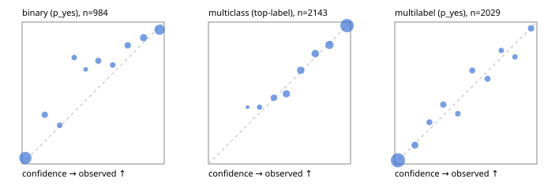

# Evaluation report

- model `Qwen/Qwen3-Reranker-8B` @ `77d193c791` (stock reranker pairs), adapter/checkpoint `runs/lora_8b/adapter`, prompt `task-v1` (f7b8d8022dfb)
- data data/hf.jsonl, data/eval.jsonl; splits ['test']; n=3471; calibration `{'method': 'temperature scaling per output type, grid search on NLL', 'min_n': 30, 'model': 'Qwen/Qwen3-Reranker-8B', 'revision': '77d193c791ed757ca307ee72715aa132723da912', 'adapter': 'runs/lora_8b/adapter', 'adapter_sha256': '9c0edc5ddd53478674103d0433127e81a27b34bda73ae4517a449b72e66123f4', 'prompt_sha': 'f7b8d8022dfb', 'fit_report': 'reports/lora_8b/calibration/report.json', 'fit_report_sha256': 'd1bd3132e8680901aecef025576664ab51487146c9bb99c6fe499ec8141388c3', 'fit_data': [{'path': 'data/hf.jsonl', 'sha256': 'fe29b29286d5a372271e925825e8b9794f3f64be9a9fc04cad458b4b94ada510'}, {'path': 'data/eval.jsonl', 'sha256': 'be888eb38dcca063823924430e03985ddf2186b874e792d5734936ba93ba6910'}], 'created': '2026-09-23T22:02:25+0000', 'n': {'binary': 210, 'multiclass': 476, 'multilabel': 1014}, 'nll_before': {'binary': 0.1516499001132063, 'multiclass': 0.40570309729069237, 'multilabel': 0.2666206200727651}, 'nll_after': {'binary': 0.15013900024564647, 'multiclass': 0.40174458431831855, 'multilabel': 0.26639550973382564}, 'skipped': {}, 'threshold_report': 'reports/lora_8b/validation/report.json', 'threshold_report_sha256': 'd04e8f7dd791e705f6c9a55c9efb279add183a0011b1509118f5541a924d1f48', 'threshold_rule': 'max F1 on validation after temperature scaling', 'file': 'calib/lora_8b.json', 'file_sha256': 'b7a2deaa2fd2259c4aabb1b8b5528bd1e81804393b2c72b503bbda5d6ab49375'}`
- cuda / bfloat16; 2026-09-23T22:06:07+0000; wall 214.3s

## Overall

question accuracy 80.0%

**binary**: n 984, positives 475, accuracy 0.850, precision 0.918, recall 0.756, f1 0.829, auroc 0.945, brier 0.095, log_loss 0.310, ece 0.055

**multiclass**: n 2143, accuracy 0.829, macro_f1 0.887, log_loss 0.461, brier 0.242, ece_top_label 0.011

**multilabel**: n 344, labels 2029, exact_match 0.480, micro_f1 0.740, macro_f1 0.718, label_auroc 0.931, brier 0.083, log_loss 0.267, ece 0.022

## By family

| family | n | question acc % | details |
|---|---|---|---|
| eval_adversarial | 27 | 81.5 | bin acc 86.7 F1 83.3 AUROC 0.981 ECE 0.138; mc acc 100.0 mF1 100.0 ECE 0.055; ml EM 40.0 µF1 85.7 ECE 0.160 |
| eval_agent_output | 26 | 46.2 | bin acc 78.6 F1 80.0 AUROC 0.867 ECE 0.182; mc acc 14.3 mF1 6.2 ECE 0.535; ml EM 0.0 µF1 66.7 ECE 0.227 |
| eval_evidence | 17 | 88.2 | bin acc 100.0 F1 100.0 AUROC 1.000 ECE 0.007; ml EM 0.0 µF1 50.0 ECE 0.275 |
| eval_multilabel | 32 | 84.4 | bin acc 100.0 F1 100.0 AUROC 1.000 ECE 0.034; mc acc 0.0 mF1 0.0 ECE 0.552; ml EM 83.3 µF1 95.2 ECE 0.035 |
| eval_policy | 22 | 50.0 | bin acc 53.8 F1 57.1 AUROC 0.524 ECE 0.382; mc acc 60.0 mF1 44.4 ECE 0.347; ml EM 25.0 µF1 73.7 ECE 0.255 |
| eval_routing | 25 | 92.0 | bin acc 100.0 F1 100.0 AUROC 1.000 ECE 0.021; mc acc 92.3 mF1 87.9 ECE 0.091; ml EM 50.0 µF1 80.0 ECE 0.116 |
| eval_urgency_sentiment | 22 | 68.2 | bin acc 60.0 F1 66.7 AUROC 0.750 ECE 0.345; mc acc 80.0 mF1 81.0 ECE 0.186; ml EM 50.0 µF1 83.3 ECE 0.172 |
| heldout_boolq | 300 | 81.7 | bin acc 81.7 F1 83.7 AUROC 0.903 ECE 0.057 |
| heldout_emotion_multiclass | 300 | 57.0 | mc acc 57.0 mF1 46.6 ECE 0.112 |
| heldout_intent_clinc | 300 | 93.7 | mc acc 93.7 mF1 94.9 ECE 0.048 |
| heldout_question_type_trec | 300 | 81.7 | mc acc 81.7 mF1 80.5 ECE 0.050 |
| heldout_sentiment_sst2 | 300 | 81.0 | bin acc 81.0 F1 76.5 AUROC 0.991 ECE 0.158 |
| heldout_topic_dbpedia | 300 | 96.0 | mc acc 96.0 mF1 95.7 ECE 0.018 |
| hf_emotions_multilabel | 300 | 46.7 | ml EM 46.7 µF1 71.1 ECE 0.027 |
| hf_intent_banking77 | 300 | 95.0 | mc acc 95.0 mF1 94.1 ECE 0.028 |
| hf_nli | 300 | 93.0 | bin acc 93.0 F1 90.0 AUROC 0.973 ECE 0.041 |
| hf_sentiment_tweets | 300 | 69.0 | mc acc 69.0 mF1 69.2 ECE 0.050 |
| hf_topic_agnews | 300 | 89.3 | mc acc 89.3 mF1 89.4 ECE 0.040 |

## by hard case

| slice | n | question acc % |
|---|---|---|
| (none) | 3042 | 79.7 |
| contradiction | 107 | 99.1 |
| distractor | 33 | 66.7 |
| double_negation | 6 | 50.0 |
| evidence_end | 13 | 100.0 |
| evidence_middle | 11 | 63.6 |
| evidence_start | 9 | 88.9 |
| exception | 7 | 28.6 |
| hypothetical | 7 | 71.4 |
| injection | 10 | 70.0 |
| lexical_overlap | 20 | 90.0 |
| long_state | 50 | 74.0 |
| missing_evidence | 104 | 94.2 |
| multi_positive | 81 | 48.1 |
| multi_turn | 9 | 77.8 |
| negation | 30 | 90.0 |
| new_label_names | 3 | 33.3 |
| nota | 46 | 95.7 |
| numeric_reasoning | 16 | 56.2 |
| paraphrase | 22 | 63.6 |
| role_reversal | 15 | 60.0 |
| sarcasm | 12 | 66.7 |
| temporal_reasoning | 29 | 51.7 |
| zero_positive | 6 | 33.3 |

## by state tokens

| slice | n | question acc % |
|---|---|---|
| 00000-00127 | 3211 | 80.1 |
| 00128-00511 | 208 | 79.3 |
| 00512-02047 | 52 | 75.0 |

## by candidates

| slice | n | question acc % |
|---|---|---|
| 01 | 984 | 85.0 |
| 03 | 310 | 69.7 |
| 04 | 333 | 86.8 |
| 05 | 22 | 40.9 |
| 06 | 1218 | 70.5 |
| 07 | 49 | 93.9 |
| 08 | 555 | 94.1 |

## Paraphrase groups

11 groups; same prediction 63.6%; all correct 54.5%

## Multiclass abstention (coverage vs error on accepted)

| abstain_below | coverage % | error % |
|---|---|---|
| 0.0 | 100.0 | 17.1 |
| 0.4 | 97.4 | 16.0 |
| 0.5 | 91.9 | 13.8 |
| 0.6 | 83.8 | 10.2 |
| 0.7 | 74.5 | 7.2 |
| 0.8 | 65.2 | 5.1 |
| 0.9 | 52.8 | 2.5 |

## Reliability: binary

| bin | n | mean confidence | observed frequency |
|---|---|---|---|
| [0.0,0.1) | 406 | 0.023 | 0.042 |
| [0.1,0.2) | 49 | 0.160 | 0.347 |
| [0.2,0.3) | 33 | 0.264 | 0.273 |
| [0.3,0.4) | 28 | 0.367 | 0.750 |
| [0.4,0.5) | 12 | 0.447 | 0.667 |
| [0.5,0.6) | 44 | 0.536 | 0.727 |
| [0.6,0.7) | 33 | 0.638 | 0.697 |
| [0.7,0.8) | 55 | 0.744 | 0.836 |
| [0.8,0.9) | 82 | 0.855 | 0.890 |
| [0.9,1.0] | 242 | 0.967 | 0.946 |

## Reliability: multiclass

| bin | n | mean confidence | observed frequency |
|---|---|---|---|
| [0.2,0.3) | 5 | 0.275 | 0.400 |
| [0.3,0.4) | 50 | 0.360 | 0.400 |
| [0.4,0.5) | 118 | 0.461 | 0.466 |
| [0.5,0.6) | 174 | 0.548 | 0.494 |
| [0.6,0.7) | 200 | 0.649 | 0.660 |
| [0.7,0.8) | 198 | 0.752 | 0.778 |
| [0.8,0.9) | 267 | 0.852 | 0.839 |
| [0.9,1.0] | 1131 | 0.975 | 0.975 |

## Reliability: multilabel

| bin | n | mean confidence | observed frequency |
|---|---|---|---|
| [0.0,0.1) | 1245 | 0.022 | 0.026 |
| [0.1,0.2) | 144 | 0.142 | 0.132 |
| [0.2,0.3) | 85 | 0.244 | 0.294 |
| [0.3,0.4) | 98 | 0.342 | 0.418 |
| [0.4,0.5) | 65 | 0.444 | 0.354 |
| [0.5,0.6) | 85 | 0.545 | 0.659 |
| [0.6,0.7) | 85 | 0.653 | 0.600 |
| [0.7,0.8) | 55 | 0.749 | 0.800 |
| [0.8,0.9) | 53 | 0.846 | 0.755 |
| [0.9,1.0] | 114 | 0.959 | 0.956 |
