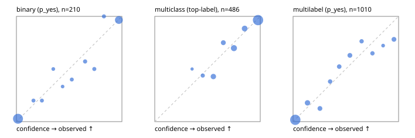

# Evaluation report

- model `Qwen/Qwen3-Reranker-8B` @ `77d193c791` (stock reranker pairs), adapter/checkpoint `runs/lora_8b/adapter`, prompt `task-v1` (f7b8d8022dfb)
- data data/hf.jsonl, data/eval.jsonl; splits ['validation']; n=868; calibration `None`
- cuda / bfloat16; 2026-09-23T21:57:36+0000; wall 55.5s

## Overall

question accuracy 78.6%

**binary**: n 210, positives 79, accuracy 0.910, precision 0.866, recall 0.899, f1 0.882, auroc 0.967, brier 0.063, log_loss 0.228, ece 0.031

**multiclass**: n 486, accuracy 0.842, macro_f1 0.788, log_loss 0.391, brier 0.217, ece_top_label 0.037

**multilabel**: n 172, labels 1010, exact_match 0.477, micro_f1 0.688, macro_f1 0.578, label_auroc 0.915, brier 0.094, log_loss 0.303, ece 0.043

## By family

| family | n | question acc % | details |
|---|---|---|---|
| eval_adversarial | 14 | 100.0 | bin acc 100.0 F1 100.0 AUROC 1.000 ECE 0.088; mc acc 100.0 mF1 100.0 ECE 0.027; ml EM 100.0 µF1 100.0 ECE 0.010 |
| eval_agent_output | 20 | 70.0 | bin acc 83.3 F1 85.7 AUROC 0.917 ECE 0.217; mc acc 60.0 mF1 33.3 ECE 0.293; ml EM 33.3 µF1 0.0 ECE 0.422 |
| eval_evidence | 17 | 94.1 | bin acc 100.0 F1 100.0 AUROC 1.000 ECE 0.047; ml EM 66.7 µF1 80.0 ECE 0.139 |
| eval_multilabel | 12 | 41.7 | bin acc 0.0 F1 0.0 AUROC — ECE 0.679; mc acc 100.0 mF1 100.0 ECE 0.003; ml EM 33.3 µF1 83.0 ECE 0.132 |
| eval_policy | 24 | 58.3 | bin acc 75.0 F1 76.9 AUROC 0.829 ECE 0.231; mc acc 45.5 mF1 29.2 ECE 0.362; ml EM 0.0 µF1 0.0 ECE 0.756 |
| eval_routing | 16 | 93.8 | bin acc 85.7 F1 88.9 AUROC 1.000 ECE 0.138; mc acc 100.0 mF1 100.0 ECE 0.015; ml EM 100.0 µF1 0.0 ECE 0.124 |
| eval_urgency_sentiment | 15 | 100.0 | bin acc 100.0 F1 100.0 AUROC 1.000 ECE 0.089; mc acc 100.0 mF1 100.0 ECE 0.083; ml EM 100.0 µF1 100.0 ECE 0.082 |
| hf_emotions_multilabel | 150 | 46.7 | ml EM 46.7 µF1 67.3 ECE 0.037 |
| hf_intent_banking77 | 150 | 94.0 | mc acc 94.0 mF1 90.5 ECE 0.031 |
| hf_nli | 150 | 92.0 | bin acc 92.0 F1 87.5 AUROC 0.975 ECE 0.041 |
| hf_sentiment_tweets | 150 | 70.7 | mc acc 70.7 mF1 67.3 ECE 0.091 |
| hf_topic_agnews | 150 | 89.3 | mc acc 89.3 mF1 89.4 ECE 0.048 |

## by hard case

| slice | n | question acc % |
|---|---|---|
| (none) | 634 | 78.5 |
| contradiction | 63 | 98.4 |
| distractor | 20 | 75.0 |
| double_negation | 3 | 100.0 |
| evidence_end | 4 | 50.0 |
| evidence_middle | 7 | 100.0 |
| evidence_start | 3 | 100.0 |
| exception | 7 | 85.7 |
| hypothetical | 6 | 83.3 |
| injection | 16 | 81.2 |
| lexical_overlap | 13 | 76.9 |
| long_state | 26 | 76.9 |
| missing_evidence | 59 | 89.8 |
| multi_positive | 40 | 27.5 |
| multi_turn | 21 | 81.0 |
| negation | 9 | 66.7 |
| new_label_names | 5 | 60.0 |
| nota | 4 | 100.0 |
| numeric_reasoning | 13 | 69.2 |
| paraphrase | 10 | 50.0 |
| role_reversal | 7 | 42.9 |
| sarcasm | 5 | 80.0 |
| temporal_reasoning | 15 | 53.3 |
| zero_positive | 7 | 71.4 |

## by state tokens

| slice | n | question acc % |
|---|---|---|
| 00000-00127 | 796 | 78.6 |
| 00128-00511 | 46 | 78.3 |
| 00512-02047 | 26 | 76.9 |

## by candidates

| slice | n | question acc % |
|---|---|---|
| 01 | 210 | 91.0 |
| 03 | 162 | 71.0 |
| 04 | 174 | 88.5 |
| 05 | 13 | 61.5 |
| 06 | 159 | 45.9 |
| 08 | 150 | 94.0 |

## Paraphrase groups

5 groups; same prediction 60.0%; all correct 40.0%

## Multiclass abstention (coverage vs error on accepted)

| abstain_below | coverage % | error % |
|---|---|---|
| 0.0 | 100.0 | 15.8 |
| 0.4 | 99.2 | 15.6 |
| 0.5 | 95.9 | 14.2 |
| 0.6 | 87.2 | 9.9 |
| 0.7 | 81.5 | 8.8 |
| 0.8 | 68.5 | 4.8 |
| 0.9 | 57.8 | 3.6 |

## Reliability: binary

| bin | n | mean confidence | observed frequency |
|---|---|---|---|
| [0.0,0.1) | 111 | 0.015 | 0.027 |
| [0.1,0.2) | 5 | 0.162 | 0.200 |
| [0.2,0.3) | 5 | 0.241 | 0.200 |
| [0.3,0.4) | 4 | 0.349 | 0.500 |
| [0.4,0.5) | 3 | 0.438 | 0.333 |
| [0.5,0.6) | 5 | 0.525 | 0.400 |
| [0.6,0.7) | 7 | 0.651 | 0.571 |
| [0.7,0.8) | 6 | 0.738 | 0.500 |
| [0.8,0.9) | 6 | 0.830 | 1.000 |
| [0.9,1.0] | 58 | 0.971 | 0.966 |

## Reliability: multiclass

| bin | n | mean confidence | observed frequency |
|---|---|---|---|
| [0.3,0.4) | 4 | 0.354 | 0.500 |
| [0.4,0.5) | 16 | 0.455 | 0.438 |
| [0.5,0.6) | 42 | 0.556 | 0.429 |
| [0.6,0.7) | 28 | 0.650 | 0.750 |
| [0.7,0.8) | 63 | 0.751 | 0.698 |
| [0.8,0.9) | 52 | 0.852 | 0.885 |
| [0.9,1.0] | 281 | 0.979 | 0.964 |

## Reliability: multilabel

| bin | n | mean confidence | observed frequency |
|---|---|---|---|
| [0.0,0.1) | 582 | 0.021 | 0.017 |
| [0.1,0.2) | 84 | 0.137 | 0.179 |
| [0.2,0.3) | 56 | 0.254 | 0.125 |
| [0.3,0.4) | 42 | 0.351 | 0.381 |
| [0.4,0.5) | 44 | 0.437 | 0.523 |
| [0.5,0.6) | 54 | 0.538 | 0.630 |
| [0.6,0.7) | 38 | 0.649 | 0.763 |
| [0.7,0.8) | 37 | 0.752 | 0.649 |
| [0.8,0.9) | 18 | 0.853 | 0.722 |
| [0.9,1.0] | 55 | 0.956 | 0.782 |
