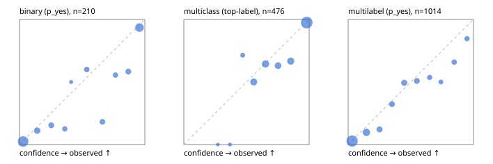

# Evaluation report

- model `Qwen/Qwen3-Reranker-0.6B` @ `e61197ed45`, adapter `runs/lora_pilot/adapter`, prompt `task-v1` (f7b8d8022dfb)
- data data/hf.jsonl, data/eval.jsonl; splits ['calibration']; n=859; calibration `None`
- mps / float32; 2026-09-23T00:30:06-0700; wall 98.8s

## Overall

question accuracy 71.1%

**binary**: n 210, positives 71, accuracy 0.843, precision 0.716, recall 0.887, f1 0.792, auroc 0.932, brier 0.111, log_loss 0.343, ece 0.079

**multiclass**: n 476, accuracy 0.790, macro_f1 0.706, log_loss 0.515, brier 0.289, ece_top_label 0.056

**multilabel**: n 173, labels 1014, exact_match 0.335, micro_f1 0.595, macro_f1 0.434, label_auroc 0.877, brier 0.114, log_loss 0.360, ece 0.047

## By family

| family | n | question acc % | details |
|---|---|---|---|
| eval_adversarial | 19 | 63.2 | bin acc 64.3 F1 66.7 AUROC 0.816 ECE 0.253; mc acc 33.3 mF1 20.0 ECE 0.283; ml EM 100.0 µF1 100.0 ECE 0.093 |
| eval_agent_output | 9 | 22.2 | bin acc 40.0 F1 57.1 AUROC 0.667 ECE 0.463; mc acc 0.0 mF1 0.0 ECE 0.632; ml EM 0.0 µF1 0.0 ECE 0.389 |
| eval_evidence | 19 | 73.7 | bin acc 87.5 F1 83.3 AUROC 0.964 ECE 0.187; ml EM 0.0 µF1 57.1 ECE 0.312 |
| eval_multilabel | 12 | 25.0 | bin acc 100.0 F1 100.0 AUROC — ECE 0.315; mc acc 50.0 mF1 33.3 ECE 0.206; ml EM 0.0 µF1 59.5 ECE 0.243 |
| eval_policy | 16 | 50.0 | bin acc 62.5 F1 57.1 AUROC 0.733 ECE 0.303; mc acc 25.0 mF1 14.3 ECE 0.323; ml EM 50.0 µF1 44.4 ECE 0.383 |
| eval_routing | 15 | 86.7 | bin acc 100.0 F1 100.0 AUROC 1.000 ECE 0.152; mc acc 71.4 mF1 50.0 ECE 0.176; ml EM 100.0 µF1 100.0 ECE 0.101 |
| eval_urgency_sentiment | 19 | 57.9 | bin acc 62.5 F1 40.0 AUROC 0.667 ECE 0.358; mc acc 75.0 mF1 63.0 ECE 0.222; ml EM 0.0 µF1 71.4 ECE 0.180 |
| hf_emotions_multilabel | 150 | 35.3 | ml EM 35.3 µF1 59.7 ECE 0.044 |
| hf_intent_banking77 | 150 | 92.0 | mc acc 92.0 mF1 86.3 ECE 0.038 |
| hf_nli | 150 | 88.7 | bin acc 88.7 F1 83.5 AUROC 0.964 ECE 0.095 |
| hf_sentiment_tweets | 150 | 66.7 | mc acc 66.7 mF1 63.3 ECE 0.093 |
| hf_topic_agnews | 150 | 82.7 | mc acc 82.7 mF1 82.6 ECE 0.073 |

## by hard case

| slice | n | question acc % |
|---|---|---|
| (none) | 624 | 73.9 |
| contradiction | 58 | 84.5 |
| distractor | 25 | 48.0 |
| double_negation | 3 | 33.3 |
| evidence_end | 11 | 72.7 |
| evidence_middle | 6 | 50.0 |
| evidence_start | 7 | 42.9 |
| exception | 4 | 25.0 |
| hypothetical | 7 | 85.7 |
| injection | 6 | 66.7 |
| lexical_overlap | 16 | 56.2 |
| long_state | 42 | 54.8 |
| missing_evidence | 62 | 85.5 |
| multi_positive | 42 | 16.7 |
| multi_turn | 12 | 58.3 |
| negation | 12 | 58.3 |
| new_label_names | 5 | 80.0 |
| nota | 4 | 50.0 |
| numeric_reasoning | 15 | 33.3 |
| paraphrase | 10 | 30.0 |
| role_reversal | 13 | 30.8 |
| sarcasm | 1 | 0.0 |
| temporal_reasoning | 14 | 57.1 |
| zero_positive | 4 | 25.0 |

## by state tokens

| slice | n | question acc % |
|---|---|---|
| 00000-00127 | 780 | 72.3 |
| 00128-00511 | 37 | 64.9 |
| 00512-02047 | 42 | 54.8 |

## by candidates

| slice | n | question acc % |
|---|---|---|
| 01 | 210 | 84.3 |
| 03 | 158 | 66.5 |
| 04 | 168 | 79.8 |
| 05 | 15 | 26.7 |
| 06 | 157 | 33.8 |
| 07 | 1 | 0.0 |
| 08 | 150 | 92.0 |

## Paraphrase groups

5 groups; same prediction 60.0%; all correct 20.0%

## Multiclass abstention (coverage vs error on accepted)

| abstain_below | coverage % | error % |
|---|---|---|
| 0.0 | 100.0 | 21.0 |
| 0.4 | 98.7 | 20.0 |
| 0.5 | 95.8 | 19.7 |
| 0.6 | 84.5 | 15.7 |
| 0.7 | 72.1 | 12.2 |
| 0.8 | 62.4 | 8.4 |
| 0.9 | 50.4 | 2.5 |

## Reliability: binary

| bin | n | mean confidence | observed frequency |
|---|---|---|---|
| [0.0,0.1) | 81 | 0.029 | 0.025 |
| [0.1,0.2) | 18 | 0.141 | 0.111 |
| [0.2,0.3) | 13 | 0.254 | 0.154 |
| [0.3,0.4) | 8 | 0.362 | 0.125 |
| [0.4,0.5) | 2 | 0.412 | 0.500 |
| [0.5,0.6) | 10 | 0.537 | 0.600 |
| [0.6,0.7) | 11 | 0.662 | 0.182 |
| [0.7,0.8) | 9 | 0.766 | 0.556 |
| [0.8,0.9) | 12 | 0.868 | 0.583 |
| [0.9,1.0] | 46 | 0.957 | 0.935 |

## Reliability: multiclass

| bin | n | mean confidence | observed frequency |
|---|---|---|---|
| [0.2,0.3) | 2 | 0.272 | 0.000 |
| [0.3,0.4) | 4 | 0.368 | 0.000 |
| [0.4,0.5) | 14 | 0.469 | 0.714 |
| [0.5,0.6) | 54 | 0.558 | 0.500 |
| [0.6,0.7) | 59 | 0.652 | 0.644 |
| [0.7,0.8) | 46 | 0.752 | 0.630 |
| [0.8,0.9) | 57 | 0.853 | 0.667 |
| [0.9,1.0] | 240 | 0.981 | 0.975 |

## Reliability: multilabel

| bin | n | mean confidence | observed frequency |
|---|---|---|---|
| [0.0,0.1) | 466 | 0.032 | 0.028 |
| [0.1,0.2) | 134 | 0.146 | 0.097 |
| [0.2,0.3) | 66 | 0.251 | 0.121 |
| [0.3,0.4) | 62 | 0.350 | 0.323 |
| [0.4,0.5) | 75 | 0.447 | 0.493 |
| [0.5,0.6) | 59 | 0.548 | 0.508 |
| [0.6,0.7) | 41 | 0.650 | 0.537 |
| [0.7,0.8) | 28 | 0.740 | 0.500 |
| [0.8,0.9) | 44 | 0.846 | 0.659 |
| [0.9,1.0] | 39 | 0.948 | 0.846 |
