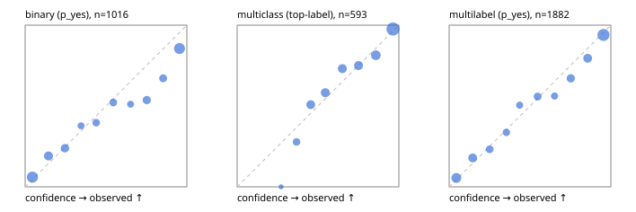

# Evaluation report

- model `Qwen/Qwen3-Reranker-0.6B` @ `e61197ed45` (stock reranker pairs), adapter/checkpoint `runs/lora_pilot/adapter`, prompt `task-v1` (f7b8d8022dfb)
- data data/eval2.jsonl; splits ['test']; n=1991; calibration `None`
- cuda / bfloat16; 2026-09-24T07:23:53+0000; wall 557.1s

## Overall

question accuracy 68.8%

**binary**: n 1016, positives 435, accuracy 0.757, precision 0.694, recall 0.772, f1 0.731, auroc 0.844, brier 0.169, log_loss 0.513, ece 0.072

**multiclass**: n 593, accuracy 0.757, macro_f1 0.631, log_loss 0.700, brier 0.346, ece_top_label 0.037

**multilabel**: n 382, labels 1882, exact_match 0.398, micro_f1 0.820, macro_f1 0.702, label_auroc 0.884, brier 0.139, log_loss 0.428, ece 0.033

## By family

| family | n | question acc % | details |
|---|---|---|---|
| e2_hard | 673 | 64.6 | bin acc 73.3 F1 66.9 AUROC 0.800 ECE 0.106; mc acc 68.9 mF1 55.0 ECE 0.059; ml EM 35.6 µF1 80.2 ECE 0.068 |
| e2_simple | 664 | 80.1 | bin acc 83.1 F1 84.6 AUROC 0.920 ECE 0.048; mc acc 89.0 mF1 80.6 ECE 0.087; ml EM 56.7 µF1 88.9 ECE 0.043 |
| e2_very_hard | 654 | 61.6 | bin acc 70.4 F1 63.4 AUROC 0.785 ECE 0.118; mc acc 69.0 mF1 54.1 ECE 0.054; ml EM 28.5 µF1 77.1 ECE 0.046 |

## by hard case

| slice | n | question acc % |
|---|---|---|
| (none) | 569 | 81.5 |
| contradiction | 172 | 64.0 |
| distractor | 474 | 62.9 |
| double_negation | 126 | 54.0 |
| evidence_end | 57 | 56.1 |
| evidence_middle | 114 | 69.3 |
| evidence_start | 17 | 52.9 |
| exception | 213 | 66.2 |
| hypothetical | 128 | 70.3 |
| injection | 151 | 58.9 |
| lexical_overlap | 201 | 70.1 |
| long_state | 191 | 59.2 |
| missing_evidence | 141 | 70.9 |
| multi_positive | 322 | 44.1 |
| multi_turn | 149 | 67.8 |
| negation | 257 | 67.7 |
| nota | 118 | 58.5 |
| numeric_reasoning | 224 | 54.9 |
| paraphrase | 218 | 67.4 |
| role_reversal | 187 | 59.4 |
| sarcasm | 149 | 55.0 |
| temporal_reasoning | 203 | 53.7 |
| zero_positive | 73 | 65.8 |
| zero_positive_distractor | 1 | 100.0 |

## by state tokens

| slice | n | question acc % |
|---|---|---|
| 00000-00127 | 662 | 70.2 |
| 00128-00511 | 477 | 63.7 |
| 00512-02047 | 484 | 74.4 |
| 02048-08191 | 329 | 66.3 |
| 08192+ | 39 | 59.0 |

## by candidates

| slice | n | question acc % |
|---|---|---|
| 01 | 1016 | 75.7 |
| 03 | 128 | 67.2 |
| 04 | 515 | 72.4 |
| 05 | 224 | 46.9 |
| 06 | 86 | 38.4 |
| 07 | 18 | 22.2 |
| 08 | 4 | 0.0 |

## Paraphrase groups

76 groups; same prediction 64.5%; all correct 51.3%

## Multiclass abstention (coverage vs error on accepted)

| abstain_below | coverage % | error % |
|---|---|---|
| 0.0 | 100.0 | 24.3 |
| 0.4 | 93.1 | 20.5 |
| 0.5 | 82.8 | 16.9 |
| 0.6 | 71.5 | 13.0 |
| 0.7 | 60.2 | 10.4 |
| 0.8 | 49.4 | 7.2 |
| 0.9 | 34.9 | 2.4 |

## Reliability: binary

| bin | n | mean confidence | observed frequency |
|---|---|---|---|
| [0.0,0.1) | 217 | 0.045 | 0.060 |
| [0.1,0.2) | 115 | 0.144 | 0.191 |
| [0.2,0.3) | 92 | 0.246 | 0.239 |
| [0.3,0.4) | 45 | 0.346 | 0.378 |
| [0.4,0.5) | 63 | 0.439 | 0.397 |
| [0.5,0.6) | 69 | 0.545 | 0.522 |
| [0.6,0.7) | 45 | 0.652 | 0.511 |
| [0.7,0.8) | 82 | 0.752 | 0.537 |
| [0.8,0.9) | 73 | 0.854 | 0.671 |
| [0.9,1.0] | 215 | 0.954 | 0.856 |

## Reliability: multiclass

| bin | n | mean confidence | observed frequency |
|---|---|---|---|
| [0.2,0.3) | 5 | 0.272 | 0.000 |
| [0.3,0.4) | 36 | 0.367 | 0.278 |
| [0.4,0.5) | 61 | 0.455 | 0.508 |
| [0.5,0.6) | 67 | 0.545 | 0.582 |
| [0.6,0.7) | 67 | 0.650 | 0.731 |
| [0.7,0.8) | 64 | 0.751 | 0.750 |
| [0.8,0.9) | 86 | 0.858 | 0.814 |
| [0.9,1.0] | 207 | 0.964 | 0.976 |

## Reliability: multilabel

| bin | n | mean confidence | observed frequency |
|---|---|---|---|
| [0.0,0.1) | 290 | 0.045 | 0.055 |
| [0.1,0.2) | 190 | 0.146 | 0.179 |
| [0.2,0.3) | 125 | 0.250 | 0.232 |
| [0.3,0.4) | 98 | 0.354 | 0.337 |
| [0.4,0.5) | 97 | 0.436 | 0.505 |
| [0.5,0.6) | 129 | 0.547 | 0.558 |
| [0.6,0.7) | 89 | 0.651 | 0.562 |
| [0.7,0.8) | 152 | 0.752 | 0.671 |
| [0.8,0.9) | 200 | 0.856 | 0.795 |
| [0.9,1.0] | 512 | 0.955 | 0.939 |
