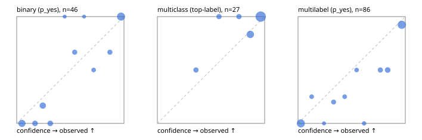

# Evaluation report

- model `Qwen/Qwen3-Reranker-0.6B` @ `e61197ed45`, adapter `runs/lora_pilot/adapter`, prompt `task-v1` (f7b8d8022dfb)
- data data/synthetic.jsonl; splits ['test']; n=96; calibration `None`
- mps / float32; 2026-09-23T00:43:24-0700; wall 20.6s

## Overall

question accuracy 79.2%

**binary**: n 46, positives 21, accuracy 0.891, precision 0.864, recall 0.905, f1 0.884, auroc 0.954, brier 0.087, log_loss 0.288, ece 0.120

**multiclass**: n 27, accuracy 0.926, macro_f1 0.852, log_loss 0.323, brier 0.142, ece_top_label 0.087

**multilabel**: n 23, labels 86, exact_match 0.435, micro_f1 0.795, macro_f1 0.660, label_auroc 0.934, brier 0.131, log_loss 0.385, ece 0.122

## By family

| family | n | question acc % | details |
|---|---|---|---|
| syn_adversarial | 13 | 92.3 | bin acc 100.0 F1 100.0 AUROC 1.000 ECE 0.163; mc acc 100.0 mF1 100.0 ECE 0.028; ml EM 66.7 µF1 93.3 ECE 0.125 |
| syn_evidence | 23 | 82.6 | bin acc 84.6 F1 85.7 AUROC 1.000 ECE 0.162; mc acc 100.0 mF1 100.0 ECE 0.138; ml EM 50.0 µF1 77.8 ECE 0.225 |
| syn_multilabel | 8 | 75.0 | bin acc 100.0 F1 100.0 AUROC — ECE 0.108; mc acc 100.0 mF1 100.0 ECE 0.191; ml EM 66.7 µF1 90.9 ECE 0.163 |
| syn_policy | 19 | 63.2 | bin acc 87.5 F1 80.0 AUROC 1.000 ECE 0.239; mc acc 71.4 mF1 55.6 ECE 0.259; ml EM 0.0 µF1 57.1 ECE 0.333 |
| syn_routing | 12 | 91.7 | bin acc 100.0 F1 100.0 AUROC 1.000 ECE 0.027; mc acc 100.0 mF1 100.0 ECE 0.033; ml EM 66.7 µF1 66.7 ECE 0.071 |
| syn_urgency_sentiment | 21 | 76.2 | bin acc 81.8 F1 83.3 AUROC 0.800 ECE 0.282; mc acc 100.0 mF1 100.0 ECE 0.163; ml EM 0.0 µF1 72.7 ECE 0.242 |

## by hard case

| slice | n | question acc % |
|---|---|---|
| (none) | 9 | 88.9 |
| contradiction | 8 | 87.5 |
| distractor | 18 | 66.7 |
| double_negation | 2 | 100.0 |
| evidence_end | 4 | 75.0 |
| evidence_middle | 2 | 100.0 |
| evidence_start | 4 | 75.0 |
| exception | 20 | 75.0 |
| hypothetical | 2 | 0.0 |
| injection | 6 | 83.3 |
| lexical_overlap | 17 | 94.1 |
| long_state | 18 | 77.8 |
| missing_evidence | 5 | 80.0 |
| multi_positive | 13 | 46.2 |
| multi_turn | 4 | 75.0 |
| negation | 16 | 75.0 |
| nota | 2 | 100.0 |
| numeric_reasoning | 16 | 81.2 |
| paraphrase | 1 | 100.0 |
| role_reversal | 10 | 80.0 |
| sarcasm | 3 | 66.7 |
| temporal_reasoning | 10 | 70.0 |
| zero_positive | 3 | 66.7 |

## by state tokens

| slice | n | question acc % |
|---|---|---|
| 00000-00127 | 48 | 81.2 |
| 00128-00511 | 29 | 75.9 |
| 00512-02047 | 19 | 78.9 |

## by candidates

| slice | n | question acc % |
|---|---|---|
| 01 | 46 | 89.1 |
| 03 | 8 | 50.0 |
| 04 | 38 | 71.1 |
| 05 | 4 | 100.0 |

## Paraphrase groups

0 groups; same prediction —%; all correct —%

## Multiclass abstention (coverage vs error on accepted)

| abstain_below | coverage % | error % |
|---|---|---|
| 0.0 | 100.0 | 7.4 |
| 0.4 | 92.6 | 4.0 |
| 0.5 | 92.6 | 4.0 |
| 0.6 | 85.2 | 4.3 |
| 0.7 | 85.2 | 4.3 |
| 0.8 | 77.8 | 4.8 |
| 0.9 | 55.6 | 0.0 |

## Reliability: binary

| bin | n | mean confidence | observed frequency |
|---|---|---|---|
| [0.0,0.1) | 9 | 0.049 | 0.000 |
| [0.1,0.2) | 4 | 0.171 | 0.000 |
| [0.2,0.3) | 6 | 0.243 | 0.167 |
| [0.3,0.4) | 4 | 0.313 | 0.000 |
| [0.4,0.5) | 1 | 0.447 | 1.000 |
| [0.5,0.6) | 3 | 0.540 | 0.667 |
| [0.6,0.7) | 1 | 0.628 | 1.000 |
| [0.7,0.8) | 2 | 0.717 | 0.500 |
| [0.8,0.9) | 3 | 0.869 | 0.667 |
| [0.9,1.0] | 13 | 0.973 | 1.000 |

## Reliability: multiclass

| bin | n | mean confidence | observed frequency |
|---|---|---|---|
| [0.3,0.4) | 2 | 0.360 | 0.500 |
| [0.5,0.6) | 2 | 0.575 | 1.000 |
| [0.7,0.8) | 2 | 0.761 | 1.000 |
| [0.8,0.9) | 6 | 0.867 | 0.833 |
| [0.9,1.0] | 15 | 0.963 | 1.000 |

## Reliability: multilabel

| bin | n | mean confidence | observed frequency |
|---|---|---|---|
| [0.0,0.1) | 24 | 0.026 | 0.000 |
| [0.1,0.2) | 4 | 0.127 | 0.250 |
| [0.2,0.3) | 2 | 0.242 | 0.000 |
| [0.3,0.4) | 5 | 0.332 | 0.200 |
| [0.4,0.5) | 4 | 0.435 | 0.250 |
| [0.5,0.6) | 4 | 0.546 | 0.500 |
| [0.6,0.7) | 3 | 0.616 | 0.000 |
| [0.7,0.8) | 6 | 0.767 | 0.500 |
| [0.8,0.9) | 8 | 0.836 | 0.500 |
| [0.9,1.0] | 26 | 0.967 | 0.923 |
