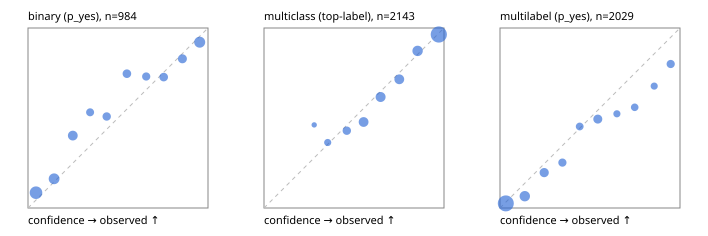

# Evaluation report

- model `Qwen/Qwen3-Reranker-0.6B` @ `e61197ed45`, adapter `runs/lora_pilot/adapter`, prompt `task-v1` (f7b8d8022dfb)
- data data/hf.jsonl, data/eval.jsonl; splits ['test']; n=3471; calibration `None`
- mps / bfloat16; 2026-09-23T01:54:07-0700; wall 185.2s

## Overall

question accuracy 73.7%

**binary**: n 984, positives 475, accuracy 0.785, precision 0.822, recall 0.707, f1 0.760, auroc 0.863, brier 0.155, log_loss 0.481, ece 0.067

**multiclass**: n 2143, accuracy 0.783, macro_f1 0.824, log_loss 0.600, brier 0.301, ece_top_label 0.024

**multilabel**: n 344, labels 2029, exact_match 0.317, micro_f1 0.636, macro_f1 0.548, label_auroc 0.882, brier 0.113, log_loss 0.358, ece 0.052

## By family

| family | n | question acc % | details |
|---|---|---|---|
| eval_adversarial | 27 | 63.0 | bin acc 66.7 F1 66.7 AUROC 0.796 ECE 0.272; mc acc 85.7 mF1 77.8 ECE 0.129; ml EM 20.0 µF1 72.7 ECE 0.252 |
| eval_agent_output | 26 | 46.2 | bin acc 57.1 F1 57.1 AUROC 0.582 ECE 0.311; mc acc 57.1 mF1 38.1 ECE 0.301; ml EM 0.0 µF1 66.7 ECE 0.187 |
| eval_evidence | 17 | 82.4 | bin acc 93.3 F1 90.9 AUROC 0.980 ECE 0.081; ml EM 0.0 µF1 40.0 ECE 0.437 |
| eval_multilabel | 32 | 34.4 | bin acc 57.1 F1 57.1 AUROC 0.708 ECE 0.346; mc acc 0.0 mF1 0.0 ECE 0.493; ml EM 29.2 µF1 75.9 ECE 0.134 |
| eval_policy | 22 | 40.9 | bin acc 46.2 F1 46.2 AUROC 0.429 ECE 0.500; mc acc 40.0 mF1 23.8 ECE 0.439; ml EM 25.0 µF1 66.7 ECE 0.358 |
| eval_routing | 25 | 76.0 | bin acc 80.0 F1 75.0 AUROC 0.875 ECE 0.192; mc acc 76.9 mF1 66.7 ECE 0.239; ml EM 50.0 µF1 85.7 ECE 0.107 |
| eval_urgency_sentiment | 22 | 54.5 | bin acc 80.0 F1 80.0 AUROC 0.938 ECE 0.208; mc acc 40.0 mF1 23.0 ECE 0.252; ml EM 0.0 µF1 83.3 ECE 0.161 |
| heldout_boolq | 300 | 71.0 | bin acc 71.0 F1 74.6 AUROC 0.766 ECE 0.118 |
| heldout_emotion_multiclass | 300 | 55.7 | mc acc 55.7 mF1 46.7 ECE 0.064 |
| heldout_intent_clinc | 300 | 89.3 | mc acc 89.3 mF1 90.8 ECE 0.033 |
| heldout_question_type_trec | 300 | 68.3 | mc acc 68.3 mF1 68.4 ECE 0.065 |
| heldout_sentiment_sst2 | 300 | 77.7 | bin acc 77.7 F1 71.5 AUROC 0.935 ECE 0.194 |
| heldout_topic_dbpedia | 300 | 91.7 | mc acc 91.7 mF1 91.5 ECE 0.042 |
| hf_emotions_multilabel | 300 | 33.0 | ml EM 33.0 µF1 60.9 ECE 0.040 |
| hf_intent_banking77 | 300 | 93.0 | mc acc 93.0 mF1 90.6 ECE 0.024 |
| hf_nli | 300 | 89.3 | bin acc 89.3 F1 86.0 AUROC 0.946 ECE 0.040 |
| hf_sentiment_tweets | 300 | 66.0 | mc acc 66.0 mF1 65.7 ECE 0.045 |
| hf_topic_agnews | 300 | 86.7 | mc acc 86.7 mF1 86.8 ECE 0.059 |

## by hard case

| slice | n | question acc % |
|---|---|---|
| (none) | 3042 | 74.4 |
| contradiction | 107 | 90.7 |
| distractor | 33 | 45.5 |
| double_negation | 6 | 33.3 |
| evidence_end | 13 | 46.2 |
| evidence_middle | 11 | 54.5 |
| evidence_start | 9 | 77.8 |
| exception | 7 | 0.0 |
| hypothetical | 7 | 42.9 |
| injection | 10 | 50.0 |
| lexical_overlap | 20 | 55.0 |
| long_state | 50 | 46.0 |
| missing_evidence | 104 | 81.7 |
| multi_positive | 81 | 19.8 |
| multi_turn | 9 | 88.9 |
| negation | 30 | 53.3 |
| new_label_names | 3 | 100.0 |
| nota | 46 | 89.1 |
| numeric_reasoning | 16 | 37.5 |
| paraphrase | 22 | 50.0 |
| role_reversal | 15 | 46.7 |
| sarcasm | 12 | 33.3 |
| temporal_reasoning | 29 | 41.4 |
| zero_positive | 6 | 33.3 |

## by state tokens

| slice | n | question acc % |
|---|---|---|
| 00000-00127 | 3211 | 74.7 |
| 00128-00511 | 208 | 64.4 |
| 00512-02047 | 52 | 48.1 |

## by candidates

| slice | n | question acc % |
|---|---|---|
| 01 | 984 | 78.5 |
| 03 | 310 | 66.1 |
| 04 | 333 | 83.5 |
| 05 | 22 | 27.3 |
| 06 | 1218 | 61.5 |
| 07 | 49 | 87.8 |
| 08 | 555 | 91.2 |

## Paraphrase groups

11 groups; same prediction 45.5%; all correct 36.4%

## Multiclass abstention (coverage vs error on accepted)

| abstain_below | coverage % | error % |
|---|---|---|
| 0.0 | 100.0 | 21.7 |
| 0.4 | 96.3 | 20.2 |
| 0.5 | 90.3 | 17.7 |
| 0.6 | 79.8 | 13.2 |
| 0.7 | 68.6 | 9.0 |
| 0.8 | 58.3 | 5.6 |
| 0.9 | 45.5 | 3.6 |

## Reliability: binary

| bin | n | mean confidence | observed frequency |
|---|---|---|---|
| [0.0,0.1) | 223 | 0.044 | 0.085 |
| [0.1,0.2) | 142 | 0.145 | 0.162 |
| [0.2,0.3) | 102 | 0.249 | 0.402 |
| [0.3,0.4) | 47 | 0.345 | 0.532 |
| [0.4,0.5) | 61 | 0.437 | 0.508 |
| [0.5,0.6) | 63 | 0.549 | 0.746 |
| [0.6,0.7) | 52 | 0.656 | 0.731 |
| [0.7,0.8) | 66 | 0.754 | 0.727 |
| [0.8,0.9) | 76 | 0.858 | 0.829 |
| [0.9,1.0] | 152 | 0.954 | 0.921 |

## Reliability: multiclass

| bin | n | mean confidence | observed frequency |
|---|---|---|---|
| [0.2,0.3) | 13 | 0.279 | 0.462 |
| [0.3,0.4) | 66 | 0.354 | 0.364 |
| [0.4,0.5) | 128 | 0.460 | 0.430 |
| [0.5,0.6) | 226 | 0.554 | 0.478 |
| [0.6,0.7) | 240 | 0.648 | 0.617 |
| [0.7,0.8) | 221 | 0.752 | 0.715 |
| [0.8,0.9) | 275 | 0.854 | 0.873 |
| [0.9,1.0] | 974 | 0.971 | 0.964 |

## Reliability: multilabel

| bin | n | mean confidence | observed frequency |
|---|---|---|---|
| [0.0,0.1) | 903 | 0.032 | 0.025 |
| [0.1,0.2) | 259 | 0.138 | 0.066 |
| [0.2,0.3) | 173 | 0.246 | 0.197 |
| [0.3,0.4) | 111 | 0.347 | 0.252 |
| [0.4,0.5) | 95 | 0.443 | 0.453 |
| [0.5,0.6) | 162 | 0.543 | 0.494 |
| [0.6,0.7) | 65 | 0.650 | 0.523 |
| [0.7,0.8) | 84 | 0.748 | 0.560 |
| [0.8,0.9) | 62 | 0.857 | 0.677 |
| [0.9,1.0] | 115 | 0.948 | 0.800 |
