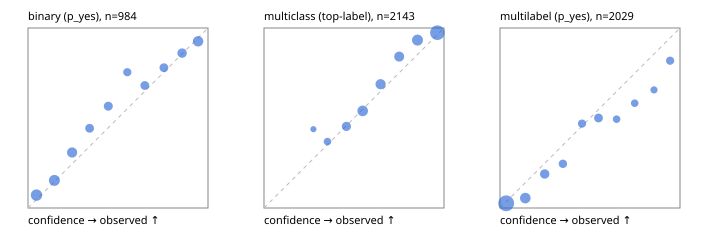

# Evaluation report

- model `Qwen/Qwen3-Reranker-0.6B` @ `e61197ed45`, adapter `runs/lora_pilot/adapter`, prompt `task-v1` (f7b8d8022dfb)
- data data/hf.jsonl, data/eval.jsonl; splits ['test']; n=3471; calibration `{'method': 'temperature scaling per output type, grid search on NLL', 'min_n': 30, 'model': 'Qwen/Qwen3-Reranker-0.6B', 'revision': 'e61197ed45024b0ed8a2d74b80b4d909f1255473', 'adapter': 'runs/lora_pilot/adapter', 'adapter_sha256': 'd739304ed42fd79d59837090033dcff6c6aafb6eb94a3071a8c67ce54bcfc1b6', 'prompt_sha': 'f7b8d8022dfb', 'fit_report': 'reports/lora_pilot/calibration/report.json', 'fit_report_sha256': 'a961e6e3d29532923709eac89f1e031dbd14e176e81196e5f790f2b68bc49368', 'fit_data': [{'path': 'data/hf.jsonl', 'sha256': 'fe29b29286d5a372271e925825e8b9794f3f64be9a9fc04cad458b4b94ada510'}, {'path': 'data/eval.jsonl', 'sha256': 'be888eb38dcca063823924430e03985ddf2186b874e792d5734936ba93ba6910'}], 'created': '2026-09-23T00:36:23-0700', 'n': {'binary': 210, 'multiclass': 476, 'multilabel': 1014}, 'nll_before': {'binary': 0.34272462531615444, 'multiclass': 0.5154533303055262, 'multilabel': 0.3598448417068156}, 'nll_after': {'binary': 0.33937213378099473, 'multiclass': 0.5022097599027645, 'multilabel': 0.3595975123014675}, 'skipped': {}, 'threshold_report': 'reports/lora_pilot/validation/report.json', 'threshold_report_sha256': '7c9118ba545b9d5a7a765ebac7c9bd22cc4efac20c36967f53d3ad1dc3d4c0ca', 'threshold_rule': 'max F1 on validation after temperature scaling', 'file': 'calib/lora_pilot.json', 'file_sha256': 'b3461c2f273355093c9a86fb1c38942563964bb45eb342d5543af0fcc0ecff42'}`
- mps / float32; 2026-09-23T00:42:37-0700; wall 370.2s

## Overall

question accuracy 73.7%

**binary**: n 984, positives 475, accuracy 0.778, precision 0.825, recall 0.686, f1 0.749, auroc 0.863, brier 0.153, log_loss 0.473, ece 0.047

**multiclass**: n 2143, accuracy 0.783, macro_f1 0.823, log_loss 0.598, brier 0.303, ece_top_label 0.035

**multilabel**: n 344, labels 2029, exact_match 0.326, micro_f1 0.655, macro_f1 0.551, label_auroc 0.882, brier 0.113, log_loss 0.358, ece 0.056

## By family

| family | n | question acc % | details |
|---|---|---|---|
| eval_adversarial | 27 | 63.0 | bin acc 66.7 F1 66.7 AUROC 0.796 ECE 0.250; mc acc 85.7 mF1 77.8 ECE 0.224; ml EM 20.0 µF1 72.7 ECE 0.235 |
| eval_agent_output | 26 | 46.2 | bin acc 57.1 F1 57.1 AUROC 0.592 ECE 0.354; mc acc 57.1 mF1 38.1 ECE 0.303; ml EM 0.0 µF1 57.1 ECE 0.170 |
| eval_evidence | 17 | 82.4 | bin acc 93.3 F1 90.9 AUROC 0.980 ECE 0.168; ml EM 0.0 µF1 40.0 ECE 0.437 |
| eval_multilabel | 32 | 34.4 | bin acc 57.1 F1 57.1 AUROC 0.750 ECE 0.341; mc acc 0.0 mF1 0.0 ECE 0.430; ml EM 29.2 µF1 76.7 ECE 0.137 |
| eval_policy | 22 | 36.4 | bin acc 38.5 F1 33.3 AUROC 0.429 ECE 0.482; mc acc 40.0 mF1 23.8 ECE 0.389; ml EM 25.0 µF1 66.7 ECE 0.333 |
| eval_routing | 25 | 76.0 | bin acc 80.0 F1 75.0 AUROC 0.917 ECE 0.195; mc acc 76.9 mF1 66.7 ECE 0.178; ml EM 50.0 µF1 85.7 ECE 0.118 |
| eval_urgency_sentiment | 22 | 54.5 | bin acc 80.0 F1 80.0 AUROC 0.917 ECE 0.220; mc acc 40.0 mF1 23.0 ECE 0.248; ml EM 0.0 µF1 83.3 ECE 0.161 |
| heldout_boolq | 300 | 71.3 | bin acc 71.3 F1 74.4 AUROC 0.768 ECE 0.093 |
| heldout_emotion_multiclass | 300 | 56.0 | mc acc 56.0 mF1 47.3 ECE 0.053 |
| heldout_intent_clinc | 300 | 89.3 | mc acc 89.3 mF1 90.8 ECE 0.083 |
| heldout_question_type_trec | 300 | 68.0 | mc acc 68.0 mF1 68.1 ECE 0.073 |
| heldout_sentiment_sst2 | 300 | 76.0 | bin acc 76.0 F1 68.7 AUROC 0.935 ECE 0.181 |
| heldout_topic_dbpedia | 300 | 91.7 | mc acc 91.7 mF1 91.5 ECE 0.078 |
| hf_emotions_multilabel | 300 | 34.0 | ml EM 34.0 µF1 63.7 ECE 0.044 |
| hf_intent_banking77 | 300 | 92.7 | mc acc 92.7 mF1 90.3 ECE 0.031 |
| hf_nli | 300 | 89.0 | bin acc 89.0 F1 85.5 AUROC 0.946 ECE 0.050 |
| hf_sentiment_tweets | 300 | 66.7 | mc acc 66.7 mF1 66.6 ECE 0.062 |
| hf_topic_agnews | 300 | 86.7 | mc acc 86.7 mF1 86.8 ECE 0.036 |

## by hard case

| slice | n | question acc % |
|---|---|---|
| (none) | 3042 | 74.4 |
| contradiction | 107 | 90.7 |
| distractor | 33 | 45.5 |
| double_negation | 6 | 33.3 |
| evidence_end | 13 | 46.2 |
| evidence_middle | 11 | 54.5 |
| evidence_start | 9 | 77.8 |
| exception | 7 | 0.0 |
| hypothetical | 7 | 42.9 |
| injection | 10 | 50.0 |
| lexical_overlap | 20 | 55.0 |
| long_state | 50 | 46.0 |
| missing_evidence | 104 | 81.7 |
| multi_positive | 81 | 21.0 |
| multi_turn | 9 | 88.9 |
| negation | 30 | 53.3 |
| new_label_names | 3 | 100.0 |
| nota | 46 | 89.1 |
| numeric_reasoning | 16 | 31.2 |
| paraphrase | 22 | 50.0 |
| role_reversal | 15 | 46.7 |
| sarcasm | 12 | 33.3 |
| temporal_reasoning | 29 | 41.4 |
| zero_positive | 6 | 33.3 |

## by state tokens

| slice | n | question acc % |
|---|---|---|
| 00000-00127 | 3211 | 74.7 |
| 00128-00511 | 208 | 63.9 |
| 00512-02047 | 52 | 48.1 |

## by candidates

| slice | n | question acc % |
|---|---|---|
| 01 | 984 | 77.8 |
| 03 | 310 | 66.8 |
| 04 | 333 | 83.5 |
| 05 | 22 | 27.3 |
| 06 | 1218 | 61.7 |
| 07 | 49 | 87.8 |
| 08 | 555 | 91.0 |

## Paraphrase groups

11 groups; same prediction 45.5%; all correct 36.4%

## Multiclass abstention (coverage vs error on accepted)

| abstain_below | coverage % | error % |
|---|---|---|
| 0.0 | 100.0 | 21.7 |
| 0.4 | 94.6 | 19.4 |
| 0.5 | 86.0 | 15.9 |
| 0.6 | 72.4 | 10.2 |
| 0.7 | 60.6 | 6.1 |
| 0.8 | 49.4 | 3.9 |
| 0.9 | 34.1 | 2.6 |

## Reliability: binary

| bin | n | mean confidence | observed frequency |
|---|---|---|---|
| [0.0,0.1) | 167 | 0.047 | 0.072 |
| [0.1,0.2) | 150 | 0.147 | 0.153 |
| [0.2,0.3) | 120 | 0.245 | 0.308 |
| [0.3,0.4) | 70 | 0.342 | 0.443 |
| [0.4,0.5) | 76 | 0.446 | 0.566 |
| [0.5,0.6) | 53 | 0.552 | 0.755 |
| [0.6,0.7) | 72 | 0.649 | 0.681 |
| [0.7,0.8) | 68 | 0.755 | 0.779 |
| [0.8,0.9) | 86 | 0.856 | 0.860 |
| [0.9,1.0] | 122 | 0.945 | 0.926 |

## Reliability: multiclass

| bin | n | mean confidence | observed frequency |
|---|---|---|---|
| [0.2,0.3) | 32 | 0.274 | 0.438 |
| [0.3,0.4) | 84 | 0.353 | 0.369 |
| [0.4,0.5) | 183 | 0.458 | 0.454 |
| [0.5,0.6) | 293 | 0.548 | 0.539 |
| [0.6,0.7) | 253 | 0.648 | 0.688 |
| [0.7,0.8) | 239 | 0.751 | 0.841 |
| [0.8,0.9) | 328 | 0.853 | 0.933 |
| [0.9,1.0] | 731 | 0.964 | 0.974 |

## Reliability: multilabel

| bin | n | mean confidence | observed frequency |
|---|---|---|---|
| [0.0,0.1) | 876 | 0.034 | 0.026 |
| [0.1,0.2) | 272 | 0.141 | 0.055 |
| [0.2,0.3) | 180 | 0.248 | 0.189 |
| [0.3,0.4) | 118 | 0.349 | 0.246 |
| [0.4,0.5) | 113 | 0.456 | 0.469 |
| [0.5,0.6) | 140 | 0.547 | 0.500 |
| [0.6,0.7) | 77 | 0.648 | 0.494 |
| [0.7,0.8) | 79 | 0.749 | 0.582 |
| [0.8,0.9) | 64 | 0.856 | 0.656 |
| [0.9,1.0] | 110 | 0.945 | 0.818 |
