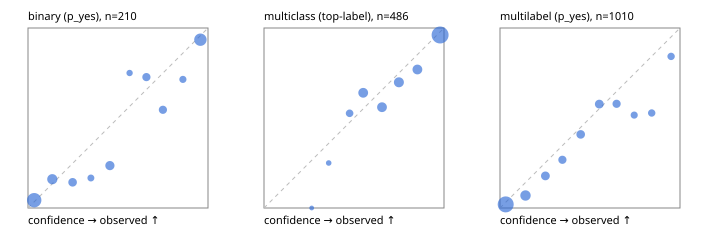

# Evaluation report

- model `Qwen/Qwen3-Reranker-0.6B` @ `e61197ed45`, adapter `runs/lora_pilot/adapter`, prompt `task-v1` (f7b8d8022dfb)
- data data/hf.jsonl, data/eval.jsonl; splits ['validation']; n=868; calibration `None`
- mps / float32; 2026-09-23T00:28:24-0700; wall 96.6s

## Overall

question accuracy 73.4%

**binary**: n 210, positives 79, accuracy 0.867, precision 0.823, recall 0.823, f1 0.823, auroc 0.910, brier 0.114, log_loss 0.370, ece 0.064

**multiclass**: n 486, accuracy 0.813, macro_f1 0.722, log_loss 0.522, brier 0.276, ece_top_label 0.046

**multilabel**: n 172, labels 1010, exact_match 0.349, micro_f1 0.631, macro_f1 0.435, label_auroc 0.876, brier 0.116, log_loss 0.363, ece 0.055

## By family

| family | n | question acc % | details |
|---|---|---|---|
| eval_adversarial | 14 | 78.6 | bin acc 85.7 F1 88.9 AUROC 0.800 ECE 0.311; mc acc 80.0 mF1 66.7 ECE 0.194; ml EM 50.0 µF1 80.0 ECE 0.087 |
| eval_agent_output | 20 | 35.0 | bin acc 50.0 F1 50.0 AUROC 0.639 ECE 0.315; mc acc 0.0 mF1 0.0 ECE 0.580; ml EM 33.3 µF1 0.0 ECE 0.282 |
| eval_evidence | 17 | 70.6 | bin acc 85.7 F1 80.0 AUROC 0.867 ECE 0.212; ml EM 0.0 µF1 46.2 ECE 0.387 |
| eval_multilabel | 12 | 25.0 | bin acc 0.0 F1 0.0 AUROC — ECE 0.853; mc acc 100.0 mF1 100.0 ECE 0.109; ml EM 11.1 µF1 73.7 ECE 0.213 |
| eval_policy | 24 | 37.5 | bin acc 50.0 F1 50.0 AUROC 0.514 ECE 0.417; mc acc 27.3 mF1 15.8 ECE 0.388; ml EM 0.0 µF1 0.0 ECE 0.347 |
| eval_routing | 16 | 75.0 | bin acc 71.4 F1 80.0 AUROC 0.700 ECE 0.290; mc acc 87.5 mF1 88.9 ECE 0.148; ml EM 0.0 µF1 0.0 ECE 0.254 |
| eval_urgency_sentiment | 15 | 73.3 | bin acc 85.7 F1 85.7 AUROC 0.833 ECE 0.333; mc acc 80.0 mF1 66.7 ECE 0.241; ml EM 33.3 µF1 40.0 ECE 0.205 |
| hf_emotions_multilabel | 150 | 37.3 | ml EM 37.3 µF1 63.5 ECE 0.050 |
| hf_intent_banking77 | 150 | 93.3 | mc acc 93.3 mF1 92.5 ECE 0.014 |
| hf_nli | 150 | 94.0 | bin acc 94.0 F1 90.7 AUROC 0.977 ECE 0.090 |
| hf_sentiment_tweets | 150 | 69.3 | mc acc 69.3 mF1 62.8 ECE 0.073 |
| hf_topic_agnews | 150 | 87.3 | mc acc 87.3 mF1 87.6 ECE 0.063 |

## by hard case

| slice | n | question acc % |
|---|---|---|
| (none) | 634 | 75.7 |
| contradiction | 63 | 92.1 |
| distractor | 20 | 50.0 |
| double_negation | 3 | 100.0 |
| evidence_end | 4 | 25.0 |
| evidence_middle | 7 | 85.7 |
| evidence_start | 3 | 33.3 |
| exception | 7 | 57.1 |
| hypothetical | 6 | 50.0 |
| injection | 16 | 68.8 |
| lexical_overlap | 13 | 69.2 |
| long_state | 26 | 50.0 |
| missing_evidence | 59 | 91.5 |
| multi_positive | 40 | 12.5 |
| multi_turn | 21 | 52.4 |
| negation | 9 | 44.4 |
| new_label_names | 5 | 20.0 |
| nota | 4 | 50.0 |
| numeric_reasoning | 13 | 30.8 |
| paraphrase | 10 | 40.0 |
| role_reversal | 7 | 14.3 |
| sarcasm | 5 | 0.0 |
| temporal_reasoning | 15 | 40.0 |
| zero_positive | 7 | 42.9 |

## by state tokens

| slice | n | question acc % |
|---|---|---|
| 00000-00127 | 796 | 75.0 |
| 00128-00511 | 46 | 58.7 |
| 00512-02047 | 26 | 50.0 |

## by candidates

| slice | n | question acc % |
|---|---|---|
| 01 | 210 | 86.7 |
| 03 | 162 | 68.5 |
| 04 | 174 | 82.8 |
| 05 | 13 | 30.8 |
| 06 | 159 | 35.2 |
| 08 | 150 | 93.3 |

## Paraphrase groups

5 groups; same prediction 60.0%; all correct 40.0%

## Multiclass abstention (coverage vs error on accepted)

| abstain_below | coverage % | error % |
|---|---|---|
| 0.0 | 100.0 | 18.7 |
| 0.4 | 99.0 | 18.1 |
| 0.5 | 95.1 | 16.9 |
| 0.6 | 84.8 | 14.6 |
| 0.7 | 74.5 | 10.5 |
| 0.8 | 63.6 | 7.1 |
| 0.9 | 52.9 | 3.9 |

## Reliability: binary

| bin | n | mean confidence | observed frequency |
|---|---|---|---|
| [0.0,0.1) | 69 | 0.035 | 0.043 |
| [0.1,0.2) | 25 | 0.135 | 0.160 |
| [0.2,0.3) | 14 | 0.248 | 0.143 |
| [0.3,0.4) | 6 | 0.350 | 0.167 |
| [0.4,0.5) | 17 | 0.455 | 0.235 |
| [0.5,0.6) | 4 | 0.565 | 0.750 |
| [0.6,0.7) | 11 | 0.658 | 0.727 |
| [0.7,0.8) | 11 | 0.749 | 0.545 |
| [0.8,0.9) | 7 | 0.860 | 0.714 |
| [0.9,1.0] | 46 | 0.958 | 0.935 |

## Reliability: multiclass

| bin | n | mean confidence | observed frequency |
|---|---|---|---|
| [0.2,0.3) | 1 | 0.265 | 0.000 |
| [0.3,0.4) | 4 | 0.359 | 0.250 |
| [0.4,0.5) | 19 | 0.476 | 0.526 |
| [0.5,0.6) | 50 | 0.551 | 0.640 |
| [0.6,0.7) | 50 | 0.656 | 0.560 |
| [0.7,0.8) | 53 | 0.749 | 0.698 |
| [0.8,0.9) | 52 | 0.852 | 0.769 |
| [0.9,1.0] | 257 | 0.979 | 0.961 |

## Reliability: multilabel

| bin | n | mean confidence | observed frequency |
|---|---|---|---|
| [0.0,0.1) | 452 | 0.032 | 0.020 |
| [0.1,0.2) | 130 | 0.142 | 0.069 |
| [0.2,0.3) | 73 | 0.252 | 0.178 |
| [0.3,0.4) | 56 | 0.347 | 0.268 |
| [0.4,0.5) | 66 | 0.448 | 0.409 |
| [0.5,0.6) | 71 | 0.552 | 0.577 |
| [0.6,0.7) | 57 | 0.648 | 0.579 |
| [0.7,0.8) | 31 | 0.745 | 0.516 |
| [0.8,0.9) | 36 | 0.843 | 0.528 |
| [0.9,1.0] | 38 | 0.951 | 0.842 |
