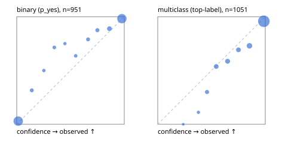

# Evaluation report

- model `selfjev-vis-q8_0` @ `307babdfc8` (one request per candidate on Ollama (prefix cache shares the state), readout logprob(yes) - logprob(no)), adapter/checkpoint `merged into the GGUF`, prompt `challenger-state-first-v1` (6c9d8459ac44)
- data data/ova/eval_images_v1.jsonl; splits ['test']; n=2002; calibration `None`
- ollama / Q8_0; 2026-10-01T08:18:23+0000; wall 1061.9s

## Overall

question accuracy 89.4%

**binary**: n 951, positives 508, accuracy 0.935, precision 0.953, recall 0.923, f1 0.938, auroc 0.984, brier 0.048, log_loss 0.169, ece 0.030

**multiclass**: n 1051, accuracy 0.857, macro_f1 0.926, log_loss 0.369, brier 0.200, ece_top_label 0.044

## By family

| family | n | question acc % | details |
|---|---|---|---|
| img_beans | 204 | 97.1 | bin acc 96.1 F1 96.2 AUROC 0.998 ECE 0.038; mc acc 98.0 mF1 98.0 ECE 0.041 |
| img_eurosat | 200 | 86.0 | bin acc 90.0 F1 90.2 AUROC 0.958 ECE 0.051; mc acc 82.0 mF1 81.9 ECE 0.057 |
| img_fashion | 200 | 85.5 | bin acc 96.0 F1 96.1 AUROC 0.984 ECE 0.041; mc acc 75.0 mF1 74.7 ECE 0.109 |
| img_hurricane | 100 | 58.0 | mc acc 58.0 mF1 57.2 ECE 0.285 |
| img_indoor | 268 | 95.5 | bin acc 95.5 F1 95.4 AUROC 0.997 ECE 0.040; mc acc 95.5 mF1 95.3 ECE 0.018 |
| img_painting | 204 | 71.1 | bin acc 79.4 F1 77.4 AUROC 0.925 ECE 0.158; mc acc 62.7 mF1 59.4 ECE 0.153 |
| img_pets | 222 | 98.2 | bin acc 99.1 F1 99.3 AUROC 0.999 ECE 0.028; mc acc 97.3 mF1 97.3 ECE 0.027 |
| img_rice | 200 | 92.5 | bin acc 91.0 F1 90.9 AUROC 0.974 ECE 0.067; mc acc 94.0 mF1 94.0 ECE 0.027 |
| img_snacks | 200 | 95.5 | bin acc 95.0 F1 95.7 AUROC 0.996 ECE 0.072; mc acc 96.0 mF1 96.0 ECE 0.057 |
| img_trash | 204 | 96.1 | bin acc 98.0 F1 98.1 AUROC 0.999 ECE 0.055; mc acc 94.1 mF1 94.1 ECE 0.022 |

## by hard case

| slice | n | question acc % |
|---|---|---|
| (none) | 2002 | 89.4 |

## by state tokens

| slice | n | question acc % |
|---|---|---|
| 00000-00127 | 2002 | 89.4 |

## by candidates

| slice | n | question acc % |
|---|---|---|
| 01 | 951 | 93.5 |
| 02 | 100 | 58.0 |
| 03 | 102 | 98.0 |
| 05 | 100 | 94.0 |
| 06 | 102 | 94.1 |
| 10 | 200 | 78.5 |
| 12 | 447 | 88.6 |

## Paraphrase groups

0 groups; same prediction —%; all correct —%

## Multiclass abstention (coverage vs error on accepted)

| abstain_below | coverage % | error % |
|---|---|---|
| 0.0 | 100.0 | 14.3 |
| 0.4 | 99.0 | 13.5 |
| 0.5 | 96.2 | 11.9 |
| 0.6 | 91.1 | 9.9 |
| 0.7 | 85.5 | 7.9 |
| 0.8 | 80.6 | 6.5 |
| 0.9 | 72.5 | 4.2 |

## Reliability: binary

| bin | n | mean confidence | observed frequency |
|---|---|---|---|
| [0.0,0.1) | 408 | 0.014 | 0.029 |
| [0.1,0.2) | 19 | 0.140 | 0.316 |
| [0.2,0.3) | 10 | 0.252 | 0.500 |
| [0.3,0.4) | 14 | 0.349 | 0.714 |
| [0.4,0.5) | 8 | 0.448 | 0.750 |
| [0.5,0.6) | 11 | 0.548 | 0.636 |
| [0.6,0.7) | 19 | 0.663 | 0.789 |
| [0.7,0.8) | 24 | 0.750 | 0.875 |
| [0.8,0.9) | 45 | 0.862 | 0.889 |
| [0.9,1.0] | 393 | 0.978 | 0.982 |

## Reliability: multiclass

| bin | n | mean confidence | observed frequency |
|---|---|---|---|
| [0.2,0.3) | 1 | 0.237 | 0.000 |
| [0.3,0.4) | 9 | 0.378 | 0.111 |
| [0.4,0.5) | 30 | 0.458 | 0.300 |
| [0.5,0.6) | 54 | 0.544 | 0.537 |
| [0.6,0.7) | 58 | 0.650 | 0.586 |
| [0.7,0.8) | 52 | 0.750 | 0.692 |
| [0.8,0.9) | 85 | 0.853 | 0.729 |
| [0.9,1.0] | 762 | 0.987 | 0.958 |
