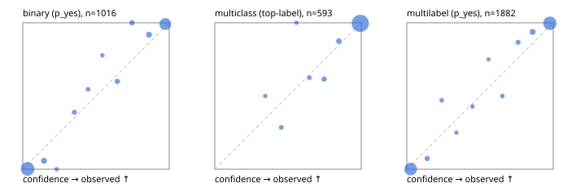

# Evaluation report

- model `selfjev-q4_k_m` @ `e0143e5924` (one request per candidate on Ollama (prefix cache shares the state), readout logprob(yes) - logprob(no)), adapter/checkpoint `merged into the GGUF`, prompt `challenger-state-first-v1` (6c9d8459ac44)
- data data/ova/eval2.jsonl; splits ['test']; n=1991; calibration `None`
- ollama / Q4_K_M; 2026-10-01T07:49:42+0000; wall 1493.4s

## Overall

question accuracy 95.7%

**binary**: n 1016, positives 435, accuracy 0.969, precision 0.963, recall 0.963, f1 0.963, auroc 0.996, brier 0.025, log_loss 0.103, ece 0.039

**multiclass**: n 593, accuracy 0.968, macro_f1 0.943, log_loss 0.092, brier 0.047, ece_top_label 0.012

**multilabel**: n 382, labels 1882, exact_match 0.908, micro_f1 0.979, macro_f1 0.959, label_auroc 0.998, brier 0.018, log_loss 0.076, ece 0.031

## By family

| family | n | question acc % | details |
|---|---|---|---|
| e2_hard | 673 | 93.3 | bin acc 95.4 F1 93.5 AUROC 0.995 ECE 0.056; mc acc 94.3 mF1 88.6 ECE 0.025; ml EM 86.4 µF1 96.0 ECE 0.032 |
| e2_simple | 664 | 98.3 | bin acc 98.0 F1 98.1 AUROC 0.996 ECE 0.025; mc acc 99.5 mF1 98.9 ECE 0.008; ml EM 97.5 µF1 99.6 ECE 0.025 |
| e2_very_hard | 654 | 95.4 | bin acc 97.2 F1 96.4 AUROC 0.997 ECE 0.053; mc acc 96.5 mF1 95.5 ECE 0.022; ml EM 89.2 µF1 98.0 ECE 0.036 |

## by hard case

| slice | n | question acc % |
|---|---|---|
| (none) | 569 | 98.2 |
| contradiction | 172 | 97.7 |
| distractor | 474 | 94.7 |
| double_negation | 126 | 97.6 |
| evidence_end | 57 | 98.2 |
| evidence_middle | 114 | 99.1 |
| evidence_start | 17 | 100.0 |
| exception | 213 | 96.7 |
| hypothetical | 128 | 94.5 |
| injection | 151 | 97.4 |
| lexical_overlap | 201 | 98.0 |
| long_state | 191 | 98.4 |
| missing_evidence | 141 | 97.2 |
| multi_positive | 322 | 90.7 |
| multi_turn | 149 | 92.6 |
| negation | 257 | 98.1 |
| nota | 118 | 94.1 |
| numeric_reasoning | 224 | 88.4 |
| paraphrase | 218 | 93.1 |
| role_reversal | 187 | 95.7 |
| sarcasm | 149 | 95.3 |
| temporal_reasoning | 203 | 86.7 |
| zero_positive | 73 | 97.3 |
| zero_positive_distractor | 1 | 100.0 |

## by state tokens

| slice | n | question acc % |
|---|---|---|
| 00000-00127 | 666 | 94.1 |
| 00128-00511 | 469 | 93.8 |
| 00512-02047 | 488 | 97.5 |
| 02048-08191 | 329 | 98.5 |
| 08192+ | 39 | 97.4 |

## by candidates

| slice | n | question acc % |
|---|---|---|
| 01 | 1016 | 96.9 |
| 03 | 128 | 96.9 |
| 04 | 515 | 95.1 |
| 05 | 224 | 92.0 |
| 06 | 86 | 94.2 |
| 07 | 18 | 94.4 |
| 08 | 4 | 75.0 |

## Paraphrase groups

76 groups; same prediction 81.6%; all correct 88.2%

## Multiclass abstention (coverage vs error on accepted)

| abstain_below | coverage % | error % |
|---|---|---|
| 0.0 | 100.0 | 3.2 |
| 0.4 | 99.3 | 2.9 |
| 0.5 | 98.1 | 2.1 |
| 0.6 | 97.5 | 2.1 |
| 0.7 | 96.1 | 1.6 |
| 0.8 | 93.9 | 0.7 |
| 0.9 | 91.2 | 0.4 |

## Reliability: binary

| bin | n | mean confidence | observed frequency |
|---|---|---|---|
| [0.0,0.1) | 509 | 0.033 | 0.002 |
| [0.1,0.2) | 35 | 0.145 | 0.057 |
| [0.2,0.3) | 8 | 0.231 | 0.000 |
| [0.3,0.4) | 18 | 0.352 | 0.389 |
| [0.4,0.5) | 11 | 0.446 | 0.545 |
| [0.5,0.6) | 9 | 0.544 | 0.778 |
| [0.6,0.7) | 20 | 0.646 | 0.600 |
| [0.7,0.8) | 22 | 0.746 | 1.000 |
| [0.8,0.9) | 37 | 0.862 | 0.919 |
| [0.9,1.0] | 347 | 0.973 | 0.991 |

## Reliability: multiclass

| bin | n | mean confidence | observed frequency |
|---|---|---|---|
| [0.3,0.4) | 4 | 0.345 | 0.500 |
| [0.4,0.5) | 7 | 0.454 | 0.286 |
| [0.5,0.6) | 4 | 0.557 | 1.000 |
| [0.6,0.7) | 8 | 0.646 | 0.625 |
| [0.7,0.8) | 13 | 0.747 | 0.615 |
| [0.8,0.9) | 16 | 0.848 | 0.875 |
| [0.9,1.0] | 541 | 0.994 | 0.996 |

## Reliability: multilabel

| bin | n | mean confidence | observed frequency |
|---|---|---|---|
| [0.0,0.1) | 772 | 0.027 | 0.001 |
| [0.1,0.2) | 41 | 0.140 | 0.073 |
| [0.2,0.3) | 17 | 0.238 | 0.471 |
| [0.3,0.4) | 12 | 0.339 | 0.250 |
| [0.4,0.5) | 14 | 0.448 | 0.429 |
| [0.5,0.6) | 8 | 0.559 | 0.750 |
| [0.6,0.7) | 18 | 0.653 | 0.500 |
| [0.7,0.8) | 30 | 0.760 | 0.867 |
| [0.8,0.9) | 64 | 0.860 | 0.938 |
| [0.9,1.0] | 906 | 0.977 | 0.997 |
