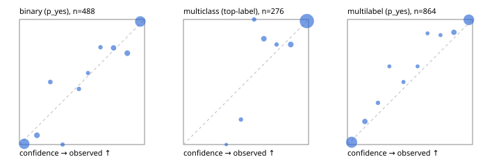

# Evaluation report

- model `selfjev-q4_k_m` @ `e0143e5924` (one request per candidate on Ollama (prefix cache shares the state), readout logprob(yes) - logprob(no)), adapter/checkpoint `merged into the GGUF`, prompt `challenger-state-first-v1` (6c9d8459ac44)
- data data/ova/eval_llm.jsonl; splits ['test']; n=946; calibration `None`
- ollama / Q4_K_M; 2026-10-01T08:00:19+0000; wall 625.4s

## Overall

question accuracy 91.9%

**binary**: n 488, positives 245, accuracy 0.932, precision 0.921, recall 0.947, f1 0.934, auroc 0.981, brier 0.052, log_loss 0.185, ece 0.045

**multiclass**: n 276, accuracy 0.949, macro_f1 0.916, log_loss 0.163, brier 0.083, ece_top_label 0.028

**multilabel**: n 182, labels 864, exact_match 0.835, micro_f1 0.953, macro_f1 0.914, label_auroc 0.991, brier 0.035, log_loss 0.132, ece 0.031

## By family

| family | n | question acc % | details |
|---|---|---|---|
| tllm_guardrail_hard | 60 | 90.0 | bin acc 90.6 F1 90.3 AUROC 1.000 ECE 0.128; mc acc 94.1 mF1 87.5 ECE 0.046; ml EM 81.8 µF1 95.0 ECE 0.075 |
| tllm_guardrail_simple | 67 | 97.0 | bin acc 100.0 F1 100.0 AUROC 1.000 ECE 0.029; mc acc 100.0 mF1 100.0 ECE 0.024; ml EM 85.7 µF1 96.9 ECE 0.052 |
| tllm_guardrail_very_hard | 43 | 97.7 | bin acc 100.0 F1 100.0 AUROC 1.000 ECE 0.120; mc acc 92.9 mF1 83.3 ECE 0.073; ml EM 100.0 µF1 100.0 ECE 0.053 |
| tllm_jailbreak_hard | 59 | 98.3 | bin acc 96.3 F1 96.6 AUROC 1.000 ECE 0.071; mc acc 100.0 mF1 100.0 ECE 0.064; ml EM 100.0 µF1 100.0 ECE 0.053 |
| tllm_jailbreak_simple | 70 | 98.6 | bin acc 100.0 F1 100.0 AUROC 1.000 ECE 0.036; mc acc 100.0 mF1 100.0 ECE 0.042; ml EM 90.9 µF1 98.6 ECE 0.038 |
| tllm_jailbreak_very_hard | 60 | 86.7 | bin acc 84.4 F1 81.5 AUROC 0.968 ECE 0.101; mc acc 94.4 mF1 91.7 ECE 0.052; ml EM 80.0 µF1 96.3 ECE 0.054 |
| tllm_judge_hard | 86 | 94.2 | bin acc 95.0 F1 93.3 AUROC 0.965 ECE 0.076; mc acc 96.0 mF1 90.9 ECE 0.045; ml EM 90.5 µF1 94.1 ECE 0.045 |
| tllm_judge_simple | 72 | 94.4 | bin acc 97.4 F1 97.9 AUROC 1.000 ECE 0.067; mc acc 100.0 mF1 100.0 ECE 0.039; ml EM 78.6 µF1 96.4 ECE 0.070 |
| tllm_judge_very_hard | 64 | 90.6 | bin acc 96.9 F1 97.3 AUROC 0.996 ECE 0.084; mc acc 95.2 mF1 96.7 ECE 0.049; ml EM 63.6 µF1 92.8 ECE 0.090 |
| tllm_score_hard | 62 | 93.5 | bin acc 97.1 F1 97.0 AUROC 1.000 ECE 0.126; mc acc 100.0 mF1 100.0 ECE 0.081; ml EM 75.0 µF1 94.1 ECE 0.066 |
| tllm_score_simple | 62 | 98.4 | bin acc 97.1 F1 98.0 AUROC 0.971 ECE 0.057; mc acc 100.0 mF1 100.0 ECE 0.040; ml EM 100.0 µF1 100.0 ECE 0.045 |
| tllm_score_very_hard | 76 | 84.2 | bin acc 86.8 F1 78.3 AUROC 0.970 ECE 0.107; mc acc 86.4 mF1 75.0 ECE 0.098; ml EM 75.0 µF1 90.9 ECE 0.058 |
| tllm_verify_hard | 50 | 78.0 | bin acc 84.6 F1 83.3 AUROC 0.873 ECE 0.201; mc acc 75.0 mF1 61.1 ECE 0.222; ml EM 62.5 µF1 75.9 ECE 0.128 |
| tllm_verify_simple | 60 | 93.3 | bin acc 90.9 F1 92.7 AUROC 0.984 ECE 0.121; mc acc 100.0 mF1 100.0 ECE 0.005; ml EM 91.7 µF1 98.5 ECE 0.043 |
| tllm_verify_very_hard | 55 | 80.0 | bin acc 80.6 F1 75.0 AUROC 0.889 ECE 0.221; mc acc 86.7 mF1 82.2 ECE 0.116; ml EM 66.7 µF1 84.6 ECE 0.113 |

## by hard case

| slice | n | question acc % |
|---|---|---|
| (none) | 265 | 97.4 |
| answer_trace_mismatch | 45 | 88.9 |
| benign_lookalike | 88 | 87.5 |
| confident_wrong | 39 | 79.5 |
| contradiction | 22 | 95.5 |
| distractor | 117 | 92.3 |
| double_negation | 3 | 100.0 |
| evidence_end | 11 | 90.9 |
| evidence_middle | 20 | 70.0 |
| evidence_start | 2 | 50.0 |
| exception | 20 | 95.0 |
| fake_authority | 1 | 100.0 |
| flawed_step | 44 | 65.9 |
| format_near_miss | 46 | 82.6 |
| gradual_escalation | 1 | 100.0 |
| hypothetical | 7 | 100.0 |
| indirect_injection | 25 | 96.0 |
| injection | 22 | 100.0 |
| judge_injection | 112 | 88.4 |
| length_bias | 7 | 100.0 |
| lexical_overlap | 103 | 90.3 |
| long_state | 74 | 91.9 |
| missing_evidence | 35 | 94.3 |
| multi_positive | 124 | 81.5 |
| multi_turn | 44 | 86.4 |
| negation | 62 | 96.8 |
| nota | 55 | 89.1 |
| numeric_reasoning | 109 | 79.8 |
| obfuscation | 1 | 0.0 |
| over_refusal | 50 | 90.0 |
| paraphrase | 73 | 90.4 |
| partial_compliance | 31 | 74.2 |
| role_reversal | 6 | 66.7 |
| sarcasm | 8 | 87.5 |
| speaker_confusion | 58 | 91.4 |
| subtle_violation | 16 | 100.0 |
| sycophancy | 13 | 92.3 |
| temporal_reasoning | 20 | 95.0 |
| tool_misuse | 6 | 100.0 |
| unsupported_claim | 96 | 89.6 |
| zero_positive | 55 | 94.5 |
| zero_positive_partial | 1 | 100.0 |

## by state tokens

| slice | n | question acc % |
|---|---|---|
| 00000-00127 | 308 | 89.9 |
| 00128-00511 | 284 | 96.1 |
| 00512-02047 | 222 | 92.3 |
| 02048-08191 | 125 | 86.4 |
| 08192+ | 7 | 85.7 |

## by candidates

| slice | n | question acc % |
|---|---|---|
| 01 | 488 | 93.2 |
| 03 | 82 | 95.1 |
| 04 | 239 | 92.5 |
| 05 | 98 | 83.7 |
| 06 | 33 | 87.9 |
| 07 | 3 | 66.7 |
| 08 | 3 | 66.7 |

## Paraphrase groups

29 groups; same prediction 89.7%; all correct 82.8%

## Multiclass abstention (coverage vs error on accepted)

| abstain_below | coverage % | error % |
|---|---|---|
| 0.0 | 100.0 | 5.1 |
| 0.4 | 99.6 | 4.7 |
| 0.5 | 97.8 | 3.3 |
| 0.6 | 96.0 | 3.4 |
| 0.7 | 91.3 | 2.8 |
| 0.8 | 89.5 | 2.4 |
| 0.9 | 84.1 | 1.3 |

## Reliability: binary

| bin | n | mean confidence | observed frequency |
|---|---|---|---|
| [0.0,0.1) | 181 | 0.038 | 0.006 |
| [0.1,0.2) | 27 | 0.140 | 0.074 |
| [0.2,0.3) | 12 | 0.247 | 0.500 |
| [0.3,0.4) | 7 | 0.345 | 0.000 |
| [0.4,0.5) | 9 | 0.476 | 0.444 |
| [0.5,0.6) | 7 | 0.548 | 0.571 |
| [0.6,0.7) | 9 | 0.648 | 0.778 |
| [0.7,0.8) | 22 | 0.752 | 0.773 |
| [0.8,0.9) | 26 | 0.862 | 0.731 |
| [0.9,1.0] | 188 | 0.966 | 0.984 |

## Reliability: multiclass

| bin | n | mean confidence | observed frequency |
|---|---|---|---|
| [0.3,0.4) | 1 | 0.342 | 0.000 |
| [0.4,0.5) | 5 | 0.459 | 0.200 |
| [0.5,0.6) | 5 | 0.565 | 1.000 |
| [0.6,0.7) | 13 | 0.643 | 0.846 |
| [0.7,0.8) | 5 | 0.744 | 0.800 |
| [0.8,0.9) | 15 | 0.858 | 0.800 |
| [0.9,1.0] | 232 | 0.987 | 0.987 |

## Reliability: multilabel

| bin | n | mean confidence | observed frequency |
|---|---|---|---|
| [0.0,0.1) | 384 | 0.034 | 0.018 |
| [0.1,0.2) | 38 | 0.139 | 0.184 |
| [0.2,0.3) | 15 | 0.244 | 0.333 |
| [0.3,0.4) | 8 | 0.335 | 0.625 |
| [0.4,0.5) | 10 | 0.448 | 0.500 |
| [0.5,0.6) | 8 | 0.561 | 0.625 |
| [0.6,0.7) | 9 | 0.640 | 0.889 |
| [0.7,0.8) | 8 | 0.744 | 0.875 |
| [0.8,0.9) | 39 | 0.851 | 0.897 |
| [0.9,1.0] | 345 | 0.971 | 0.997 |
