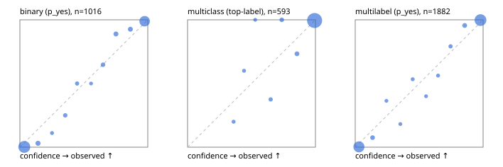

# Evaluation report

- model `selfjev-q8_0` @ `307babdfc8` (one request per candidate on Ollama (prefix cache shares the state), readout logprob(yes) - logprob(no)), adapter/checkpoint `merged into the GGUF`, prompt `challenger-state-first-v1` (6c9d8459ac44)
- data data/ova/eval2.jsonl; splits ['test']; n=1991; calibration `None`
- ollama / Q8_0; 2026-10-01T07:50:08+0000; wall 1519.4s

## Overall

question accuracy 95.7%

**binary**: n 1016, positives 435, accuracy 0.969, precision 0.959, recall 0.970, f1 0.965, auroc 0.996, brier 0.024, log_loss 0.100, ece 0.034

**multiclass**: n 593, accuracy 0.970, macro_f1 0.944, log_loss 0.089, brier 0.045, ece_top_label 0.018

**multilabel**: n 382, labels 1882, exact_match 0.906, micro_f1 0.980, macro_f1 0.962, label_auroc 0.998, brier 0.016, log_loss 0.069, ece 0.028

## By family

| family | n | question acc % | details |
|---|---|---|---|
| e2_hard | 673 | 94.7 | bin acc 96.8 F1 95.7 AUROC 0.996 ECE 0.051; mc acc 95.9 mF1 91.2 ECE 0.023; ml EM 87.1 µF1 96.7 ECE 0.032 |
| e2_simple | 664 | 98.0 | bin acc 97.7 F1 97.9 AUROC 0.997 ECE 0.028; mc acc 99.5 mF1 98.9 ECE 0.007; ml EM 96.7 µF1 99.4 ECE 0.028 |
| e2_very_hard | 654 | 94.5 | bin acc 96.3 F1 95.2 AUROC 0.995 ECE 0.044; mc acc 95.5 mF1 93.5 ECE 0.035; ml EM 88.5 µF1 97.9 ECE 0.030 |

## by hard case

| slice | n | question acc % |
|---|---|---|
| (none) | 569 | 97.9 |
| contradiction | 172 | 97.1 |
| distractor | 474 | 94.7 |
| double_negation | 126 | 96.8 |
| evidence_end | 57 | 98.2 |
| evidence_middle | 114 | 98.2 |
| evidence_start | 17 | 100.0 |
| exception | 213 | 96.7 |
| hypothetical | 128 | 96.1 |
| injection | 151 | 95.4 |
| lexical_overlap | 201 | 98.0 |
| long_state | 191 | 98.4 |
| missing_evidence | 141 | 98.6 |
| multi_positive | 322 | 90.7 |
| multi_turn | 149 | 91.9 |
| negation | 257 | 98.1 |
| nota | 118 | 94.9 |
| numeric_reasoning | 224 | 88.4 |
| paraphrase | 218 | 93.6 |
| role_reversal | 187 | 94.7 |
| sarcasm | 149 | 97.3 |
| temporal_reasoning | 203 | 87.7 |
| zero_positive | 73 | 95.9 |
| zero_positive_distractor | 1 | 100.0 |

## by state tokens

| slice | n | question acc % |
|---|---|---|
| 00000-00127 | 666 | 94.1 |
| 00128-00511 | 469 | 94.5 |
| 00512-02047 | 488 | 97.1 |
| 02048-08191 | 329 | 98.2 |
| 08192+ | 39 | 100.0 |

## by candidates

| slice | n | question acc % |
|---|---|---|
| 01 | 1016 | 96.9 |
| 03 | 128 | 96.1 |
| 04 | 515 | 95.5 |
| 05 | 224 | 91.5 |
| 06 | 86 | 94.2 |
| 07 | 18 | 94.4 |
| 08 | 4 | 75.0 |

## Paraphrase groups

76 groups; same prediction 82.9%; all correct 88.2%

## Multiclass abstention (coverage vs error on accepted)

| abstain_below | coverage % | error % |
|---|---|---|
| 0.0 | 100.0 | 3.0 |
| 0.4 | 99.2 | 2.4 |
| 0.5 | 98.3 | 2.1 |
| 0.6 | 97.6 | 2.1 |
| 0.7 | 96.3 | 1.2 |
| 0.8 | 94.6 | 1.2 |
| 0.9 | 92.1 | 0.5 |

## Reliability: binary

| bin | n | mean confidence | observed frequency |
|---|---|---|---|
| [0.0,0.1) | 506 | 0.035 | 0.002 |
| [0.1,0.2) | 33 | 0.142 | 0.030 |
| [0.2,0.3) | 9 | 0.251 | 0.111 |
| [0.3,0.4) | 16 | 0.354 | 0.250 |
| [0.4,0.5) | 12 | 0.447 | 0.500 |
| [0.5,0.6) | 6 | 0.557 | 0.500 |
| [0.6,0.7) | 17 | 0.650 | 0.647 |
| [0.7,0.8) | 27 | 0.751 | 0.889 |
| [0.8,0.9) | 27 | 0.864 | 0.926 |
| [0.9,1.0] | 363 | 0.976 | 0.989 |

## Reliability: multiclass

| bin | n | mean confidence | observed frequency |
|---|---|---|---|
| [0.3,0.4) | 5 | 0.360 | 0.200 |
| [0.4,0.5) | 5 | 0.442 | 0.600 |
| [0.5,0.6) | 4 | 0.529 | 1.000 |
| [0.6,0.7) | 8 | 0.650 | 0.375 |
| [0.7,0.8) | 10 | 0.737 | 1.000 |
| [0.8,0.9) | 15 | 0.856 | 0.733 |
| [0.9,1.0] | 546 | 0.994 | 0.995 |

## Reliability: multilabel

| bin | n | mean confidence | observed frequency |
|---|---|---|---|
| [0.0,0.1) | 777 | 0.029 | 0.003 |
| [0.1,0.2) | 40 | 0.136 | 0.075 |
| [0.2,0.3) | 11 | 0.244 | 0.364 |
| [0.3,0.4) | 11 | 0.353 | 0.182 |
| [0.4,0.5) | 15 | 0.449 | 0.533 |
| [0.5,0.6) | 10 | 0.554 | 0.400 |
| [0.6,0.7) | 16 | 0.648 | 0.562 |
| [0.7,0.8) | 24 | 0.745 | 0.792 |
| [0.8,0.9) | 45 | 0.856 | 0.956 |
| [0.9,1.0] | 933 | 0.979 | 0.998 |
