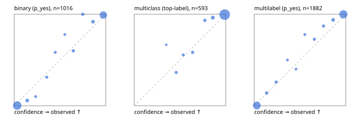

# Evaluation report

- model `selfjev-q4_k_m` @ `e0143e5924` (one request per candidate on Ollama (prefix cache shares the state), readout logprob(yes) - logprob(no)), adapter/checkpoint `merged into the GGUF`, prompt `challenger-state-first-v1` (6c9d8459ac44)
- data data/eval2.jsonl; splits ['test']; n=1991; calibration `None`
- ollama / Q4_K_M; 2026-10-01T06:44:33+0000; wall 1403.5s

## Overall

question accuracy 95.2%

**binary**: n 1016, positives 435, accuracy 0.969, precision 0.963, recall 0.963, f1 0.963, auroc 0.996, brier 0.025, log_loss 0.102, ece 0.038

**multiclass**: n 593, accuracy 0.965, macro_f1 0.934, log_loss 0.110, brier 0.052, ece_top_label 0.020

**multilabel**: n 382, labels 1882, exact_match 0.890, micro_f1 0.975, macro_f1 0.951, label_auroc 0.997, brier 0.022, log_loss 0.090, ece 0.031

## By family

| family | n | question acc % | details |
|---|---|---|---|
| e2_hard | 673 | 93.2 | bin acc 95.4 F1 93.5 AUROC 0.995 ECE 0.051; mc acc 94.8 mF1 89.3 ECE 0.037; ml EM 84.8 µF1 95.7 ECE 0.032 |
| e2_simple | 664 | 98.3 | bin acc 98.0 F1 98.1 AUROC 0.996 ECE 0.025; mc acc 99.5 mF1 98.9 ECE 0.013; ml EM 97.5 µF1 99.4 ECE 0.038 |
| e2_very_hard | 654 | 94.2 | bin acc 97.2 F1 96.4 AUROC 0.997 ECE 0.052; mc acc 95.0 mF1 92.3 ECE 0.024; ml EM 85.4 µF1 97.1 ECE 0.036 |

## by hard case

| slice | n | question acc % |
|---|---|---|
| (none) | 569 | 98.1 |
| contradiction | 172 | 96.5 |
| distractor | 474 | 93.5 |
| double_negation | 126 | 96.8 |
| evidence_end | 57 | 98.2 |
| evidence_middle | 114 | 99.1 |
| evidence_start | 17 | 94.1 |
| exception | 213 | 95.3 |
| hypothetical | 128 | 94.5 |
| injection | 151 | 96.0 |
| lexical_overlap | 201 | 98.0 |
| long_state | 191 | 97.4 |
| missing_evidence | 141 | 97.9 |
| multi_positive | 322 | 88.8 |
| multi_turn | 149 | 91.3 |
| negation | 257 | 96.9 |
| nota | 118 | 93.2 |
| numeric_reasoning | 224 | 86.6 |
| paraphrase | 218 | 91.7 |
| role_reversal | 187 | 95.2 |
| sarcasm | 149 | 94.6 |
| temporal_reasoning | 203 | 86.2 |
| zero_positive | 73 | 95.9 |
| zero_positive_distractor | 1 | 100.0 |

## by state tokens

| slice | n | question acc % |
|---|---|---|
| 00000-00127 | 666 | 93.2 |
| 00128-00511 | 469 | 93.4 |
| 00512-02047 | 488 | 97.7 |
| 02048-08191 | 329 | 97.9 |
| 08192+ | 39 | 97.4 |

## by candidates

| slice | n | question acc % |
|---|---|---|
| 01 | 1016 | 96.9 |
| 03 | 128 | 96.9 |
| 04 | 515 | 95.1 |
| 05 | 224 | 88.8 |
| 06 | 86 | 90.7 |
| 07 | 18 | 100.0 |
| 08 | 4 | 75.0 |

## Paraphrase groups

76 groups; same prediction 78.9%; all correct 86.8%

## Multiclass abstention (coverage vs error on accepted)

| abstain_below | coverage % | error % |
|---|---|---|
| 0.0 | 100.0 | 3.5 |
| 0.4 | 99.5 | 3.4 |
| 0.5 | 97.6 | 2.2 |
| 0.6 | 96.1 | 1.6 |
| 0.7 | 94.1 | 0.7 |
| 0.8 | 91.6 | 0.6 |
| 0.9 | 87.0 | 0.4 |

## Reliability: binary

| bin | n | mean confidence | observed frequency |
|---|---|---|---|
| [0.0,0.1) | 508 | 0.032 | 0.002 |
| [0.1,0.2) | 35 | 0.142 | 0.057 |
| [0.2,0.3) | 10 | 0.233 | 0.100 |
| [0.3,0.4) | 16 | 0.355 | 0.312 |
| [0.4,0.5) | 12 | 0.448 | 0.583 |
| [0.5,0.6) | 9 | 0.552 | 0.778 |
| [0.6,0.7) | 20 | 0.646 | 0.600 |
| [0.7,0.8) | 21 | 0.749 | 1.000 |
| [0.8,0.9) | 37 | 0.861 | 0.919 |
| [0.9,1.0] | 348 | 0.973 | 0.991 |

## Reliability: multiclass

| bin | n | mean confidence | observed frequency |
|---|---|---|---|
| [0.3,0.4) | 3 | 0.350 | 0.667 |
| [0.4,0.5) | 11 | 0.459 | 0.364 |
| [0.5,0.6) | 9 | 0.536 | 0.556 |
| [0.6,0.7) | 12 | 0.638 | 0.583 |
| [0.7,0.8) | 15 | 0.772 | 0.933 |
| [0.8,0.9) | 27 | 0.859 | 0.963 |
| [0.9,1.0] | 516 | 0.988 | 0.996 |

## Reliability: multilabel

| bin | n | mean confidence | observed frequency |
|---|---|---|---|
| [0.0,0.1) | 760 | 0.028 | 0.003 |
| [0.1,0.2) | 43 | 0.136 | 0.140 |
| [0.2,0.3) | 31 | 0.239 | 0.258 |
| [0.3,0.4) | 16 | 0.363 | 0.500 |
| [0.4,0.5) | 15 | 0.456 | 0.400 |
| [0.5,0.6) | 18 | 0.553 | 0.778 |
| [0.6,0.7) | 33 | 0.657 | 0.727 |
| [0.7,0.8) | 31 | 0.757 | 0.871 |
| [0.8,0.9) | 65 | 0.862 | 0.938 |
| [0.9,1.0] | 870 | 0.974 | 0.999 |
