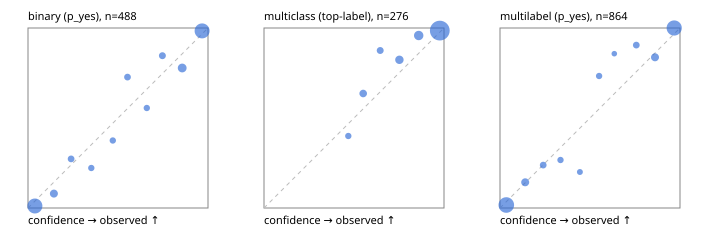

# Evaluation report

- model `selfjev-q4_k_m` @ `e0143e5924` (one request per candidate on Ollama (prefix cache shares the state), readout logprob(yes) - logprob(no)), adapter/checkpoint `merged into the GGUF`, prompt `challenger-state-first-v1` (6c9d8459ac44)
- data data/eval_llm.jsonl; splits ['test']; n=946; calibration `None`
- ollama / Q4_K_M; 2026-10-01T06:54:34+0000; wall 591.8s

## Overall

question accuracy 91.9%

**binary**: n 488, positives 245, accuracy 0.934, precision 0.921, recall 0.951, f1 0.936, auroc 0.981, brier 0.052, log_loss 0.185, ece 0.039

**multiclass**: n 276, accuracy 0.946, macro_f1 0.904, log_loss 0.194, brier 0.093, ece_top_label 0.031

**multilabel**: n 182, labels 864, exact_match 0.835, micro_f1 0.956, macro_f1 0.917, label_auroc 0.989, brier 0.038, log_loss 0.145, ece 0.034

## By family

| family | n | question acc % | details |
|---|---|---|---|
| tllm_guardrail_hard | 60 | 93.3 | bin acc 90.6 F1 90.3 AUROC 1.000 ECE 0.129; mc acc 100.0 mF1 100.0 ECE 0.052; ml EM 90.9 µF1 97.6 ECE 0.088 |
| tllm_guardrail_simple | 67 | 97.0 | bin acc 100.0 F1 100.0 AUROC 1.000 ECE 0.030; mc acc 100.0 mF1 100.0 ECE 0.034; ml EM 85.7 µF1 96.9 ECE 0.055 |
| tllm_guardrail_very_hard | 43 | 95.3 | bin acc 100.0 F1 100.0 AUROC 1.000 ECE 0.118; mc acc 92.9 mF1 83.3 ECE 0.096; ml EM 88.9 µF1 98.0 ECE 0.072 |
| tllm_jailbreak_hard | 59 | 98.3 | bin acc 96.3 F1 96.6 AUROC 1.000 ECE 0.072; mc acc 100.0 mF1 100.0 ECE 0.098; ml EM 100.0 µF1 100.0 ECE 0.073 |
| tllm_jailbreak_simple | 70 | 98.6 | bin acc 100.0 F1 100.0 AUROC 1.000 ECE 0.037; mc acc 100.0 mF1 100.0 ECE 0.043; ml EM 90.9 µF1 98.6 ECE 0.042 |
| tllm_jailbreak_very_hard | 60 | 83.3 | bin acc 84.4 F1 81.5 AUROC 0.972 ECE 0.101; mc acc 94.4 mF1 91.7 ECE 0.088; ml EM 60.0 µF1 92.9 ECE 0.109 |
| tllm_judge_hard | 86 | 94.2 | bin acc 95.0 F1 93.3 AUROC 0.963 ECE 0.064; mc acc 96.0 mF1 90.9 ECE 0.035; ml EM 90.5 µF1 94.3 ECE 0.042 |
| tllm_judge_simple | 72 | 97.2 | bin acc 97.4 F1 97.9 AUROC 1.000 ECE 0.067; mc acc 100.0 mF1 100.0 ECE 0.065; ml EM 92.9 µF1 98.8 ECE 0.058 |
| tllm_judge_very_hard | 64 | 92.2 | bin acc 96.9 F1 97.3 AUROC 0.996 ECE 0.084; mc acc 95.2 mF1 96.7 ECE 0.081; ml EM 72.7 µF1 95.8 ECE 0.096 |
| tllm_score_hard | 62 | 93.5 | bin acc 97.1 F1 97.0 AUROC 1.000 ECE 0.121; mc acc 93.8 mF1 85.7 ECE 0.074; ml EM 83.3 µF1 96.0 ECE 0.101 |
| tllm_score_simple | 62 | 98.4 | bin acc 97.1 F1 98.0 AUROC 0.971 ECE 0.056; mc acc 100.0 mF1 100.0 ECE 0.057; ml EM 100.0 µF1 100.0 ECE 0.036 |
| tllm_score_very_hard | 76 | 82.9 | bin acc 89.5 F1 83.3 AUROC 0.973 ECE 0.125; mc acc 81.8 mF1 68.0 ECE 0.115; ml EM 68.8 µF1 89.6 ECE 0.058 |
| tllm_verify_hard | 50 | 78.0 | bin acc 84.6 F1 83.3 AUROC 0.861 ECE 0.219; mc acc 81.2 mF1 70.6 ECE 0.246; ml EM 50.0 µF1 77.4 ECE 0.107 |
| tllm_verify_simple | 60 | 93.3 | bin acc 90.9 F1 92.7 AUROC 0.984 ECE 0.121; mc acc 100.0 mF1 100.0 ECE 0.012; ml EM 91.7 µF1 98.5 ECE 0.044 |
| tllm_verify_very_hard | 55 | 78.2 | bin acc 80.6 F1 75.0 AUROC 0.889 ECE 0.176; mc acc 80.0 mF1 70.8 ECE 0.094; ml EM 66.7 µF1 84.6 ECE 0.106 |

## by hard case

| slice | n | question acc % |
|---|---|---|
| (none) | 265 | 97.7 |
| answer_trace_mismatch | 45 | 86.7 |
| benign_lookalike | 88 | 85.2 |
| confident_wrong | 39 | 76.9 |
| contradiction | 22 | 95.5 |
| distractor | 117 | 92.3 |
| double_negation | 3 | 100.0 |
| evidence_end | 11 | 90.9 |
| evidence_middle | 20 | 80.0 |
| evidence_start | 2 | 50.0 |
| exception | 20 | 95.0 |
| fake_authority | 1 | 100.0 |
| flawed_step | 44 | 65.9 |
| format_near_miss | 46 | 84.8 |
| gradual_escalation | 1 | 100.0 |
| hypothetical | 7 | 100.0 |
| indirect_injection | 25 | 96.0 |
| injection | 22 | 100.0 |
| judge_injection | 112 | 89.3 |
| length_bias | 7 | 100.0 |
| lexical_overlap | 103 | 88.3 |
| long_state | 74 | 90.5 |
| missing_evidence | 35 | 94.3 |
| multi_positive | 124 | 83.1 |
| multi_turn | 44 | 79.5 |
| negation | 62 | 95.2 |
| nota | 55 | 87.3 |
| numeric_reasoning | 109 | 78.9 |
| obfuscation | 1 | 0.0 |
| over_refusal | 50 | 92.0 |
| paraphrase | 73 | 89.0 |
| partial_compliance | 31 | 74.2 |
| role_reversal | 6 | 66.7 |
| sarcasm | 8 | 87.5 |
| speaker_confusion | 58 | 91.4 |
| subtle_violation | 16 | 100.0 |
| sycophancy | 13 | 92.3 |
| temporal_reasoning | 20 | 95.0 |
| tool_misuse | 6 | 100.0 |
| unsupported_claim | 96 | 87.5 |
| zero_positive | 55 | 92.7 |
| zero_positive_partial | 1 | 100.0 |

## by state tokens

| slice | n | question acc % |
|---|---|---|
| 00000-00127 | 308 | 90.3 |
| 00128-00511 | 284 | 94.7 |
| 00512-02047 | 222 | 92.8 |
| 02048-08191 | 125 | 88.0 |
| 08192+ | 7 | 85.7 |

## by candidates

| slice | n | question acc % |
|---|---|---|
| 01 | 488 | 93.4 |
| 03 | 82 | 95.1 |
| 04 | 239 | 92.5 |
| 05 | 98 | 82.7 |
| 06 | 33 | 87.9 |
| 07 | 3 | 66.7 |
| 08 | 3 | 66.7 |

## Paraphrase groups

29 groups; same prediction 89.7%; all correct 82.8%

## Multiclass abstention (coverage vs error on accepted)

| abstain_below | coverage % | error % |
|---|---|---|
| 0.0 | 100.0 | 5.4 |
| 0.4 | 100.0 | 5.4 |
| 0.5 | 98.2 | 4.4 |
| 0.6 | 94.2 | 3.1 |
| 0.7 | 91.3 | 2.8 |
| 0.8 | 85.1 | 1.7 |
| 0.9 | 76.4 | 1.4 |

## Reliability: binary

| bin | n | mean confidence | observed frequency |
|---|---|---|---|
| [0.0,0.1) | 182 | 0.039 | 0.011 |
| [0.1,0.2) | 25 | 0.144 | 0.080 |
| [0.2,0.3) | 11 | 0.239 | 0.273 |
| [0.3,0.4) | 9 | 0.352 | 0.222 |
| [0.4,0.5) | 8 | 0.471 | 0.375 |
| [0.5,0.6) | 11 | 0.553 | 0.727 |
| [0.6,0.7) | 9 | 0.660 | 0.556 |
| [0.7,0.8) | 13 | 0.747 | 0.846 |
| [0.8,0.9) | 36 | 0.857 | 0.778 |
| [0.9,1.0] | 184 | 0.967 | 0.984 |

## Reliability: multiclass

| bin | n | mean confidence | observed frequency |
|---|---|---|---|
| [0.4,0.5) | 5 | 0.468 | 0.400 |
| [0.5,0.6) | 11 | 0.551 | 0.636 |
| [0.6,0.7) | 8 | 0.646 | 0.875 |
| [0.7,0.8) | 17 | 0.752 | 0.824 |
| [0.8,0.9) | 24 | 0.860 | 0.958 |
| [0.9,1.0] | 211 | 0.977 | 0.986 |

## Reliability: multilabel

| bin | n | mean confidence | observed frequency |
|---|---|---|---|
| [0.0,0.1) | 357 | 0.035 | 0.017 |
| [0.1,0.2) | 42 | 0.140 | 0.143 |
| [0.2,0.3) | 21 | 0.240 | 0.238 |
| [0.3,0.4) | 15 | 0.336 | 0.267 |
| [0.4,0.5) | 10 | 0.444 | 0.200 |
| [0.5,0.6) | 15 | 0.550 | 0.733 |
| [0.6,0.7) | 7 | 0.635 | 0.857 |
| [0.7,0.8) | 21 | 0.757 | 0.905 |
| [0.8,0.9) | 43 | 0.861 | 0.837 |
| [0.9,1.0] | 333 | 0.968 | 1.000 |
