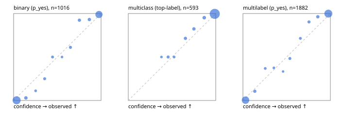

# Evaluation report

- model `selfjev-q8_0` @ `307babdfc8` (one request per candidate on Ollama (prefix cache shares the state), readout logprob(yes) - logprob(no)), adapter/checkpoint `merged into the GGUF`, prompt `challenger-state-first-v1` (6c9d8459ac44)
- data data/eval2.jsonl; splits ['test']; n=1991; calibration `None`
- ollama / Q8_0; 2026-10-01T06:42:35+0000; wall 1285.9s

## Overall

question accuracy 95.3%

**binary**: n 1016, positives 435, accuracy 0.969, precision 0.959, recall 0.970, f1 0.965, auroc 0.996, brier 0.024, log_loss 0.100, ece 0.035

**multiclass**: n 593, accuracy 0.966, macro_f1 0.937, log_loss 0.107, brier 0.052, ece_top_label 0.015

**multilabel**: n 382, labels 1882, exact_match 0.890, micro_f1 0.975, macro_f1 0.952, label_auroc 0.997, brier 0.020, log_loss 0.084, ece 0.031

## By family

| family | n | question acc % | details |
|---|---|---|---|
| e2_hard | 673 | 94.4 | bin acc 96.8 F1 95.7 AUROC 0.996 ECE 0.051; mc acc 95.3 mF1 90.4 ECE 0.017; ml EM 86.4 µF1 96.2 ECE 0.032 |
| e2_simple | 664 | 97.6 | bin acc 97.7 F1 97.9 AUROC 0.997 ECE 0.028; mc acc 99.5 mF1 98.9 ECE 0.019; ml EM 94.2 µF1 98.8 ECE 0.033 |
| e2_very_hard | 654 | 94.0 | bin acc 96.3 F1 95.2 AUROC 0.995 ECE 0.044; mc acc 95.0 mF1 91.9 ECE 0.013; ml EM 86.9 µF1 97.5 ECE 0.038 |

## by hard case

| slice | n | question acc % |
|---|---|---|
| (none) | 569 | 97.2 |
| contradiction | 172 | 95.9 |
| distractor | 474 | 94.1 |
| double_negation | 126 | 96.8 |
| evidence_end | 57 | 98.2 |
| evidence_middle | 114 | 98.2 |
| evidence_start | 17 | 94.1 |
| exception | 213 | 95.3 |
| hypothetical | 128 | 97.7 |
| injection | 151 | 96.7 |
| lexical_overlap | 201 | 97.5 |
| long_state | 191 | 97.9 |
| missing_evidence | 141 | 98.6 |
| multi_positive | 322 | 89.8 |
| multi_turn | 149 | 91.3 |
| negation | 257 | 98.1 |
| nota | 118 | 94.1 |
| numeric_reasoning | 224 | 87.1 |
| paraphrase | 218 | 93.6 |
| role_reversal | 187 | 94.1 |
| sarcasm | 149 | 95.3 |
| temporal_reasoning | 203 | 86.7 |
| zero_positive | 73 | 94.5 |
| zero_positive_distractor | 1 | 100.0 |

## by state tokens

| slice | n | question acc % |
|---|---|---|
| 00000-00127 | 666 | 93.5 |
| 00128-00511 | 469 | 94.0 |
| 00512-02047 | 488 | 97.5 |
| 02048-08191 | 329 | 97.0 |
| 08192+ | 39 | 100.0 |

## by candidates

| slice | n | question acc % |
|---|---|---|
| 01 | 1016 | 96.9 |
| 03 | 128 | 96.1 |
| 04 | 515 | 95.5 |
| 05 | 224 | 89.7 |
| 06 | 86 | 90.7 |
| 07 | 18 | 88.9 |
| 08 | 4 | 75.0 |

## Paraphrase groups

76 groups; same prediction 82.9%; all correct 89.5%

## Multiclass abstention (coverage vs error on accepted)

| abstain_below | coverage % | error % |
|---|---|---|
| 0.0 | 100.0 | 3.4 |
| 0.4 | 99.3 | 3.1 |
| 0.5 | 97.6 | 2.2 |
| 0.6 | 96.6 | 1.7 |
| 0.7 | 94.3 | 1.1 |
| 0.8 | 91.4 | 0.6 |
| 0.9 | 87.9 | 0.4 |

## Reliability: binary

| bin | n | mean confidence | observed frequency |
|---|---|---|---|
| [0.0,0.1) | 505 | 0.034 | 0.002 |
| [0.1,0.2) | 34 | 0.140 | 0.029 |
| [0.2,0.3) | 9 | 0.251 | 0.111 |
| [0.3,0.4) | 16 | 0.355 | 0.250 |
| [0.4,0.5) | 12 | 0.445 | 0.500 |
| [0.5,0.6) | 6 | 0.553 | 0.500 |
| [0.6,0.7) | 18 | 0.650 | 0.611 |
| [0.7,0.8) | 26 | 0.752 | 0.923 |
| [0.8,0.9) | 29 | 0.866 | 0.931 |
| [0.9,1.0] | 361 | 0.976 | 0.989 |

## Reliability: multiclass

| bin | n | mean confidence | observed frequency |
|---|---|---|---|
| [0.3,0.4) | 4 | 0.379 | 0.500 |
| [0.4,0.5) | 10 | 0.455 | 0.500 |
| [0.5,0.6) | 6 | 0.524 | 0.500 |
| [0.6,0.7) | 14 | 0.654 | 0.714 |
| [0.7,0.8) | 17 | 0.750 | 0.824 |
| [0.8,0.9) | 21 | 0.869 | 0.952 |
| [0.9,1.0] | 521 | 0.989 | 0.996 |

## Reliability: multilabel

| bin | n | mean confidence | observed frequency |
|---|---|---|---|
| [0.0,0.1) | 763 | 0.030 | 0.004 |
| [0.1,0.2) | 47 | 0.136 | 0.106 |
| [0.2,0.3) | 19 | 0.255 | 0.368 |
| [0.3,0.4) | 16 | 0.354 | 0.375 |
| [0.4,0.5) | 9 | 0.459 | 0.333 |
| [0.5,0.6) | 29 | 0.537 | 0.483 |
| [0.6,0.7) | 21 | 0.657 | 0.714 |
| [0.7,0.8) | 31 | 0.755 | 0.903 |
| [0.8,0.9) | 54 | 0.856 | 0.963 |
| [0.9,1.0] | 893 | 0.977 | 0.999 |
