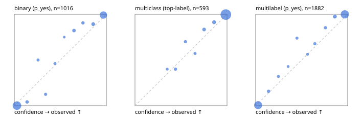

# Evaluation report

- model `Qwen/Qwen3.5-4B` @ `851bf6e806` (shared-prefix tree, forward only: text once per request, each question once, then each candidate), adapter/checkpoint `weights/selfjev_4b_vision`, prompt `challenger-state-first-v1` (6c9d8459ac44)
- data data/eval2.jsonl; splits ['test']; n=1991; calibration `None`
- cuda / bfloat16; 2026-10-01T06:33:42+0000; wall 767.1s

## Overall

question accuracy 94.7%

**binary**: n 1016, positives 435, accuracy 0.969, precision 0.965, recall 0.963, f1 0.964, auroc 0.995, brier 0.026, log_loss 0.105, ece 0.040

**multiclass**: n 593, accuracy 0.963, macro_f1 0.928, log_loss 0.113, brier 0.054, ece_top_label 0.017

**multilabel**: n 382, labels 1882, exact_match 0.861, micro_f1 0.968, macro_f1 0.938, label_auroc 0.996, brier 0.024, log_loss 0.097, ece 0.034

## By family

| family | n | question acc % | details |
|---|---|---|---|
| e2_hard | 673 | 94.7 | bin acc 97.1 F1 96.0 AUROC 0.995 ECE 0.057; mc acc 95.9 mF1 91.0 ECE 0.031; ml EM 86.4 µF1 96.0 ECE 0.036 |
| e2_simple | 664 | 97.6 | bin acc 98.0 F1 98.1 AUROC 0.997 ECE 0.032; mc acc 99.0 mF1 97.8 ECE 0.019; ml EM 94.2 µF1 98.8 ECE 0.037 |
| e2_very_hard | 654 | 91.7 | bin acc 95.7 F1 94.4 AUROC 0.994 ECE 0.047; mc acc 94.0 mF1 89.9 ECE 0.036; ml EM 78.5 µF1 95.4 ECE 0.035 |

## by hard case

| slice | n | question acc % |
|---|---|---|
| (none) | 569 | 97.4 |
| contradiction | 172 | 95.3 |
| distractor | 474 | 93.2 |
| double_negation | 126 | 96.8 |
| evidence_end | 57 | 98.2 |
| evidence_middle | 114 | 97.4 |
| evidence_start | 17 | 94.1 |
| exception | 213 | 91.5 |
| hypothetical | 128 | 95.3 |
| injection | 151 | 93.4 |
| lexical_overlap | 201 | 97.0 |
| long_state | 191 | 96.3 |
| missing_evidence | 141 | 97.9 |
| multi_positive | 322 | 84.8 |
| multi_turn | 149 | 90.6 |
| negation | 257 | 96.1 |
| nota | 118 | 93.2 |
| numeric_reasoning | 224 | 84.4 |
| paraphrase | 218 | 92.2 |
| role_reversal | 187 | 94.7 |
| sarcasm | 149 | 94.0 |
| temporal_reasoning | 203 | 86.2 |
| zero_positive | 73 | 94.5 |
| zero_positive_distractor | 1 | 100.0 |

## by state tokens

| slice | n | question acc % |
|---|---|---|
| 00000-00127 | 666 | 92.5 |
| 00128-00511 | 469 | 93.6 |
| 00512-02047 | 488 | 96.7 |
| 02048-08191 | 329 | 97.3 |
| 08192+ | 39 | 97.4 |

## by candidates

| slice | n | question acc % |
|---|---|---|
| 01 | 1016 | 96.9 |
| 03 | 128 | 95.3 |
| 04 | 515 | 95.0 |
| 05 | 224 | 87.5 |
| 06 | 86 | 86.0 |
| 07 | 18 | 88.9 |
| 08 | 4 | 75.0 |

## Paraphrase groups

76 groups; same prediction 76.3%; all correct 85.5%

## Multiclass abstention (coverage vs error on accepted)

| abstain_below | coverage % | error % |
|---|---|---|
| 0.0 | 100.0 | 3.7 |
| 0.4 | 99.2 | 3.2 |
| 0.5 | 97.5 | 2.2 |
| 0.6 | 95.8 | 1.8 |
| 0.7 | 94.6 | 1.2 |
| 0.8 | 91.6 | 0.7 |
| 0.9 | 87.7 | 0.4 |

## Reliability: binary

| bin | n | mean confidence | observed frequency |
|---|---|---|---|
| [0.0,0.1) | 517 | 0.028 | 0.002 |
| [0.1,0.2) | 24 | 0.139 | 0.042 |
| [0.2,0.3) | 12 | 0.258 | 0.500 |
| [0.3,0.4) | 16 | 0.340 | 0.125 |
| [0.4,0.5) | 13 | 0.441 | 0.462 |
| [0.5,0.6) | 4 | 0.543 | 0.750 |
| [0.6,0.7) | 28 | 0.649 | 0.821 |
| [0.7,0.8) | 21 | 0.746 | 0.905 |
| [0.8,0.9) | 37 | 0.857 | 0.892 |
| [0.9,1.0] | 344 | 0.968 | 0.991 |

## Reliability: multiclass

| bin | n | mean confidence | observed frequency |
|---|---|---|---|
| [0.3,0.4) | 5 | 0.350 | 0.400 |
| [0.4,0.5) | 10 | 0.440 | 0.400 |
| [0.5,0.6) | 10 | 0.549 | 0.700 |
| [0.6,0.7) | 7 | 0.653 | 0.571 |
| [0.7,0.8) | 18 | 0.751 | 0.833 |
| [0.8,0.9) | 23 | 0.859 | 0.913 |
| [0.9,1.0] | 520 | 0.987 | 0.996 |

## Reliability: multilabel

| bin | n | mean confidence | observed frequency |
|---|---|---|---|
| [0.0,0.1) | 775 | 0.027 | 0.006 |
| [0.1,0.2) | 38 | 0.140 | 0.158 |
| [0.2,0.3) | 25 | 0.247 | 0.320 |
| [0.3,0.4) | 14 | 0.353 | 0.429 |
| [0.4,0.5) | 23 | 0.449 | 0.739 |
| [0.5,0.6) | 16 | 0.563 | 0.562 |
| [0.6,0.7) | 28 | 0.643 | 0.679 |
| [0.7,0.8) | 34 | 0.758 | 0.853 |
| [0.8,0.9) | 78 | 0.861 | 0.974 |
| [0.9,1.0] | 851 | 0.969 | 0.999 |
