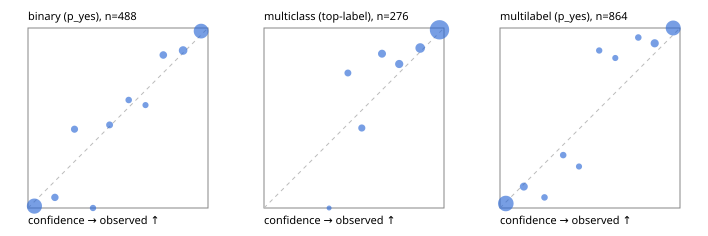

# Evaluation report

- model `Qwen/Qwen3.5-4B` @ `851bf6e806` (shared-prefix tree, forward only: text once per request, each question once, then each candidate), adapter/checkpoint `weights/selfjev_4b_vision`, prompt `challenger-state-first-v1` (6c9d8459ac44)
- data data/eval_llm.jsonl; splits ['test']; n=946; calibration `None`
- cuda / bfloat16; 2026-10-01T06:20:30+0000; wall 340.4s

## Overall

question accuracy 92.0%

**binary**: n 488, positives 245, accuracy 0.932, precision 0.931, recall 0.935, f1 0.933, auroc 0.982, brier 0.051, log_loss 0.181, ece 0.040

**multiclass**: n 276, accuracy 0.935, macro_f1 0.877, log_loss 0.223, brier 0.113, ece_top_label 0.039

**multilabel**: n 182, labels 864, exact_match 0.863, micro_f1 0.962, macro_f1 0.928, label_auroc 0.990, brier 0.037, log_loss 0.144, ece 0.041

## By family

| family | n | question acc % | details |
|---|---|---|---|
| tllm_guardrail_hard | 60 | 95.0 | bin acc 93.8 F1 93.3 AUROC 1.000 ECE 0.138; mc acc 100.0 mF1 100.0 ECE 0.095; ml EM 90.9 µF1 97.6 ECE 0.099 |
| tllm_guardrail_simple | 67 | 97.0 | bin acc 100.0 F1 100.0 AUROC 1.000 ECE 0.028; mc acc 100.0 mF1 100.0 ECE 0.036; ml EM 85.7 µF1 96.9 ECE 0.062 |
| tllm_guardrail_very_hard | 43 | 93.0 | bin acc 95.0 F1 95.7 AUROC 1.000 ECE 0.128; mc acc 92.9 mF1 83.3 ECE 0.048; ml EM 88.9 µF1 97.9 ECE 0.076 |
| tllm_jailbreak_hard | 59 | 98.3 | bin acc 96.3 F1 96.6 AUROC 1.000 ECE 0.081; mc acc 100.0 mF1 100.0 ECE 0.124; ml EM 100.0 µF1 100.0 ECE 0.087 |
| tllm_jailbreak_simple | 70 | 97.1 | bin acc 100.0 F1 100.0 AUROC 1.000 ECE 0.041; mc acc 95.5 mF1 87.5 ECE 0.032; ml EM 90.9 µF1 98.6 ECE 0.042 |
| tllm_jailbreak_very_hard | 60 | 85.0 | bin acc 84.4 F1 81.5 AUROC 0.964 ECE 0.120; mc acc 94.4 mF1 91.7 ECE 0.068; ml EM 70.0 µF1 94.5 ECE 0.099 |
| tllm_judge_hard | 86 | 95.3 | bin acc 95.0 F1 93.3 AUROC 0.971 ECE 0.095; mc acc 96.0 mF1 90.9 ECE 0.056; ml EM 95.2 µF1 96.2 ECE 0.038 |
| tllm_judge_simple | 72 | 95.8 | bin acc 97.4 F1 97.9 AUROC 0.997 ECE 0.069; mc acc 95.0 mF1 92.5 ECE 0.061; ml EM 92.9 µF1 98.8 ECE 0.060 |
| tllm_judge_very_hard | 64 | 93.8 | bin acc 96.9 F1 97.3 AUROC 0.996 ECE 0.043; mc acc 95.2 mF1 96.7 ECE 0.061; ml EM 81.8 µF1 97.2 ECE 0.075 |
| tllm_score_hard | 62 | 93.5 | bin acc 97.1 F1 97.0 AUROC 1.000 ECE 0.122; mc acc 87.5 mF1 73.3 ECE 0.135; ml EM 91.7 µF1 98.0 ECE 0.108 |
| tllm_score_simple | 62 | 96.8 | bin acc 94.1 F1 95.8 AUROC 0.996 ECE 0.103; mc acc 100.0 mF1 100.0 ECE 0.075; ml EM 100.0 µF1 100.0 ECE 0.039 |
| tllm_score_very_hard | 76 | 80.3 | bin acc 86.8 F1 78.3 AUROC 0.963 ECE 0.099; mc acc 81.8 mF1 68.0 ECE 0.186; ml EM 62.5 µF1 87.5 ECE 0.077 |
| tllm_verify_hard | 50 | 80.0 | bin acc 84.6 F1 81.8 AUROC 0.903 ECE 0.201; mc acc 87.5 mF1 76.5 ECE 0.234; ml EM 50.0 µF1 75.9 ECE 0.118 |
| tllm_verify_simple | 60 | 98.3 | bin acc 97.0 F1 97.6 AUROC 0.996 ECE 0.071; mc acc 100.0 mF1 100.0 ECE 0.018; ml EM 100.0 µF1 100.0 ECE 0.058 |
| tllm_verify_very_hard | 55 | 76.4 | bin acc 77.4 F1 69.6 AUROC 0.863 ECE 0.176; mc acc 73.3 mF1 59.3 ECE 0.138; ml EM 77.8 µF1 88.9 ECE 0.107 |

## by hard case

| slice | n | question acc % |
|---|---|---|
| (none) | 265 | 97.4 |
| answer_trace_mismatch | 45 | 84.4 |
| benign_lookalike | 88 | 86.4 |
| confident_wrong | 39 | 71.8 |
| contradiction | 22 | 95.5 |
| distractor | 117 | 88.9 |
| double_negation | 3 | 100.0 |
| evidence_end | 11 | 90.9 |
| evidence_middle | 20 | 75.0 |
| evidence_start | 2 | 50.0 |
| exception | 20 | 90.0 |
| fake_authority | 1 | 100.0 |
| flawed_step | 44 | 65.9 |
| format_near_miss | 46 | 87.0 |
| gradual_escalation | 1 | 100.0 |
| hypothetical | 7 | 100.0 |
| indirect_injection | 25 | 96.0 |
| injection | 22 | 100.0 |
| judge_injection | 112 | 89.3 |
| length_bias | 7 | 100.0 |
| lexical_overlap | 103 | 90.3 |
| long_state | 74 | 90.5 |
| missing_evidence | 35 | 97.1 |
| multi_positive | 124 | 84.7 |
| multi_turn | 44 | 79.5 |
| negation | 62 | 93.5 |
| nota | 55 | 87.3 |
| numeric_reasoning | 109 | 79.8 |
| obfuscation | 1 | 0.0 |
| over_refusal | 50 | 94.0 |
| paraphrase | 73 | 90.4 |
| partial_compliance | 31 | 74.2 |
| role_reversal | 6 | 66.7 |
| sarcasm | 8 | 87.5 |
| speaker_confusion | 58 | 94.8 |
| subtle_violation | 16 | 100.0 |
| sycophancy | 13 | 92.3 |
| temporal_reasoning | 20 | 90.0 |
| tool_misuse | 6 | 83.3 |
| unsupported_claim | 96 | 88.5 |
| zero_positive | 55 | 94.5 |
| zero_positive_partial | 1 | 100.0 |

## by state tokens

| slice | n | question acc % |
|---|---|---|
| 00000-00127 | 308 | 89.9 |
| 00128-00511 | 284 | 94.0 |
| 00512-02047 | 222 | 94.6 |
| 02048-08191 | 125 | 88.0 |
| 08192+ | 7 | 85.7 |

## by candidates

| slice | n | question acc % |
|---|---|---|
| 01 | 488 | 93.2 |
| 03 | 82 | 95.1 |
| 04 | 239 | 92.1 |
| 05 | 98 | 86.7 |
| 06 | 33 | 87.9 |
| 07 | 3 | 33.3 |
| 08 | 3 | 66.7 |

## Paraphrase groups

29 groups; same prediction 93.1%; all correct 86.2%

## Multiclass abstention (coverage vs error on accepted)

| abstain_below | coverage % | error % |
|---|---|---|
| 0.0 | 100.0 | 6.5 |
| 0.4 | 99.6 | 6.2 |
| 0.5 | 96.7 | 5.6 |
| 0.6 | 93.5 | 3.9 |
| 0.7 | 88.4 | 3.3 |
| 0.8 | 83.0 | 2.2 |
| 0.9 | 73.2 | 1.0 |

## Reliability: binary

| bin | n | mean confidence | observed frequency |
|---|---|---|---|
| [0.0,0.1) | 188 | 0.036 | 0.011 |
| [0.1,0.2) | 17 | 0.149 | 0.059 |
| [0.2,0.3) | 16 | 0.258 | 0.438 |
| [0.3,0.4) | 8 | 0.361 | 0.000 |
| [0.4,0.5) | 13 | 0.453 | 0.462 |
| [0.5,0.6) | 10 | 0.559 | 0.600 |
| [0.6,0.7) | 7 | 0.653 | 0.571 |
| [0.7,0.8) | 20 | 0.752 | 0.850 |
| [0.8,0.9) | 32 | 0.861 | 0.875 |
| [0.9,1.0] | 177 | 0.961 | 0.983 |

## Reliability: multiclass

| bin | n | mean confidence | observed frequency |
|---|---|---|---|
| [0.3,0.4) | 1 | 0.362 | 0.000 |
| [0.4,0.5) | 8 | 0.466 | 0.750 |
| [0.5,0.6) | 9 | 0.543 | 0.444 |
| [0.6,0.7) | 14 | 0.656 | 0.857 |
| [0.7,0.8) | 15 | 0.751 | 0.800 |
| [0.8,0.9) | 27 | 0.868 | 0.889 |
| [0.9,1.0] | 202 | 0.975 | 0.990 |

## Reliability: multilabel

| bin | n | mean confidence | observed frequency |
|---|---|---|---|
| [0.0,0.1) | 361 | 0.032 | 0.025 |
| [0.1,0.2) | 42 | 0.132 | 0.119 |
| [0.2,0.3) | 17 | 0.247 | 0.059 |
| [0.3,0.4) | 17 | 0.351 | 0.294 |
| [0.4,0.5) | 13 | 0.439 | 0.231 |
| [0.5,0.6) | 16 | 0.551 | 0.875 |
| [0.6,0.7) | 12 | 0.641 | 0.833 |
| [0.7,0.8) | 19 | 0.768 | 0.947 |
| [0.8,0.9) | 47 | 0.860 | 0.915 |
| [0.9,1.0] | 320 | 0.962 | 1.000 |
