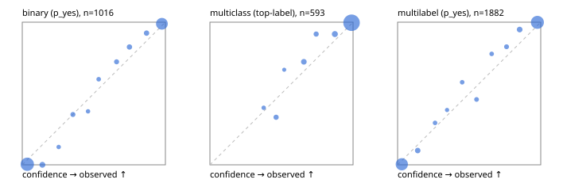

# Evaluation report

- model `Qwen/Qwen3.5-4B` @ `851bf6e806` (shared-prefix tree, forward only: text once per request, each question once, then each candidate), adapter/checkpoint `weights/selfjev_4b_vision`, prompt `challenger-state-first-v1` (6c9d8459ac44)
- data data/eval2.jsonl; splits ['test']; n=1991; calibration `None`
- cuda / bfloat16; 2026-10-01T07:22:27+0000; wall 924.6s

## Overall

question accuracy 95.2%

**binary**: n 1016, positives 435, accuracy 0.969, precision 0.957, recall 0.972, f1 0.965, auroc 0.996, brier 0.025, log_loss 0.102, ece 0.032

**multiclass**: n 593, accuracy 0.963, macro_f1 0.932, log_loss 0.108, brier 0.052, ece_top_label 0.017

**multilabel**: n 382, labels 1882, exact_match 0.887, micro_f1 0.973, macro_f1 0.948, label_auroc 0.997, brier 0.020, log_loss 0.085, ece 0.030

## By family

| family | n | question acc % | details |
|---|---|---|---|
| e2_hard | 673 | 94.7 | bin acc 96.8 F1 95.7 AUROC 0.995 ECE 0.046; mc acc 95.9 mF1 91.0 ECE 0.026; ml EM 87.1 µF1 96.0 ECE 0.030 |
| e2_simple | 664 | 97.9 | bin acc 98.0 F1 98.1 AUROC 0.997 ECE 0.032; mc acc 99.0 mF1 97.8 ECE 0.015; ml EM 95.8 µF1 99.1 ECE 0.031 |
| e2_very_hard | 654 | 93.0 | bin acc 96.0 F1 94.7 AUROC 0.994 ECE 0.041; mc acc 94.0 mF1 91.0 ECE 0.016; ml EM 83.8 µF1 96.7 ECE 0.039 |

## by hard case

| slice | n | question acc % |
|---|---|---|
| (none) | 569 | 97.7 |
| contradiction | 172 | 96.5 |
| distractor | 474 | 93.7 |
| double_negation | 126 | 97.6 |
| evidence_end | 57 | 98.2 |
| evidence_middle | 114 | 98.2 |
| evidence_start | 17 | 94.1 |
| exception | 213 | 94.4 |
| hypothetical | 128 | 96.9 |
| injection | 151 | 96.0 |
| lexical_overlap | 201 | 96.5 |
| long_state | 191 | 96.9 |
| missing_evidence | 141 | 97.2 |
| multi_positive | 322 | 88.5 |
| multi_turn | 149 | 91.3 |
| negation | 257 | 96.9 |
| nota | 118 | 94.9 |
| numeric_reasoning | 224 | 86.6 |
| paraphrase | 218 | 92.7 |
| role_reversal | 187 | 93.6 |
| sarcasm | 149 | 94.6 |
| temporal_reasoning | 203 | 86.2 |
| zero_positive | 73 | 95.9 |
| zero_positive_distractor | 1 | 100.0 |

## by state tokens

| slice | n | question acc % |
|---|---|---|
| 00000-00127 | 666 | 94.1 |
| 00128-00511 | 469 | 93.6 |
| 00512-02047 | 488 | 96.9 |
| 02048-08191 | 329 | 96.7 |
| 08192+ | 39 | 97.4 |

## by candidates

| slice | n | question acc % |
|---|---|---|
| 01 | 1016 | 96.9 |
| 03 | 128 | 96.9 |
| 04 | 515 | 95.5 |
| 05 | 224 | 89.3 |
| 06 | 86 | 87.2 |
| 07 | 18 | 88.9 |
| 08 | 4 | 75.0 |

## Paraphrase groups

76 groups; same prediction 81.6%; all correct 88.2%

## Multiclass abstention (coverage vs error on accepted)

| abstain_below | coverage % | error % |
|---|---|---|
| 0.0 | 100.0 | 3.7 |
| 0.4 | 99.2 | 3.2 |
| 0.5 | 97.1 | 1.9 |
| 0.6 | 96.6 | 1.7 |
| 0.7 | 93.6 | 0.9 |
| 0.8 | 91.6 | 0.7 |
| 0.9 | 87.5 | 0.4 |

## Reliability: binary

| bin | n | mean confidence | observed frequency |
|---|---|---|---|
| [0.0,0.1) | 506 | 0.035 | 0.004 |
| [0.1,0.2) | 35 | 0.140 | 0.000 |
| [0.2,0.3) | 8 | 0.255 | 0.125 |
| [0.3,0.4) | 17 | 0.354 | 0.353 |
| [0.4,0.5) | 8 | 0.459 | 0.375 |
| [0.5,0.6) | 10 | 0.534 | 0.600 |
| [0.6,0.7) | 18 | 0.659 | 0.722 |
| [0.7,0.8) | 23 | 0.749 | 0.826 |
| [0.8,0.9) | 26 | 0.868 | 0.923 |
| [0.9,1.0] | 365 | 0.975 | 0.989 |

## Reliability: multiclass

| bin | n | mean confidence | observed frequency |
|---|---|---|---|
| [0.3,0.4) | 5 | 0.376 | 0.400 |
| [0.4,0.5) | 12 | 0.462 | 0.333 |
| [0.5,0.6) | 3 | 0.519 | 0.667 |
| [0.6,0.7) | 18 | 0.656 | 0.722 |
| [0.7,0.8) | 12 | 0.742 | 0.917 |
| [0.8,0.9) | 24 | 0.873 | 0.917 |
| [0.9,1.0] | 519 | 0.990 | 0.996 |

## Reliability: multilabel

| bin | n | mean confidence | observed frequency |
|---|---|---|---|
| [0.0,0.1) | 761 | 0.030 | 0.004 |
| [0.1,0.2) | 50 | 0.141 | 0.100 |
| [0.2,0.3) | 17 | 0.261 | 0.294 |
| [0.3,0.4) | 13 | 0.345 | 0.385 |
| [0.4,0.5) | 19 | 0.451 | 0.579 |
| [0.5,0.6) | 24 | 0.551 | 0.458 |
| [0.6,0.7) | 18 | 0.657 | 0.778 |
| [0.7,0.8) | 29 | 0.761 | 0.828 |
| [0.8,0.9) | 58 | 0.853 | 0.948 |
| [0.9,1.0] | 893 | 0.977 | 0.999 |
