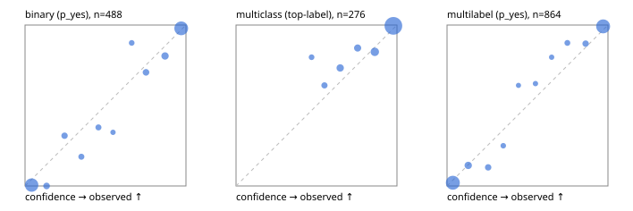

# Evaluation report

- model `Qwen/Qwen3.5-4B` @ `851bf6e806` (shared-prefix tree, forward only: text once per request, each question once, then each candidate), adapter/checkpoint `weights/selfjev_4b_vision`, prompt `challenger-state-first-v1` (6c9d8459ac44)
- data data/eval_llm.jsonl; splits ['test']; n=946; calibration `None`
- cuda / bfloat16; 2026-10-01T06:48:11+0000; wall 313.7s

## Overall

question accuracy 92.0%

**binary**: n 488, positives 245, accuracy 0.936, precision 0.925, recall 0.951, f1 0.938, auroc 0.983, brier 0.049, log_loss 0.177, ece 0.041

**multiclass**: n 276, accuracy 0.946, macro_f1 0.912, log_loss 0.188, brier 0.095, ece_top_label 0.034

**multilabel**: n 182, labels 864, exact_match 0.835, micro_f1 0.955, macro_f1 0.916, label_auroc 0.989, brier 0.037, log_loss 0.141, ece 0.029

## By family

| family | n | question acc % | details |
|---|---|---|---|
| tllm_guardrail_hard | 60 | 91.7 | bin acc 90.6 F1 90.3 AUROC 1.000 ECE 0.137; mc acc 100.0 mF1 100.0 ECE 0.081; ml EM 81.8 µF1 95.2 ECE 0.085 |
| tllm_guardrail_simple | 67 | 97.0 | bin acc 100.0 F1 100.0 AUROC 1.000 ECE 0.027; mc acc 100.0 mF1 100.0 ECE 0.039; ml EM 85.7 µF1 97.0 ECE 0.049 |
| tllm_guardrail_very_hard | 43 | 97.7 | bin acc 100.0 F1 100.0 AUROC 1.000 ECE 0.091; mc acc 92.9 mF1 83.3 ECE 0.087; ml EM 100.0 µF1 100.0 ECE 0.064 |
| tllm_jailbreak_hard | 59 | 100.0 | bin acc 100.0 F1 100.0 AUROC 1.000 ECE 0.065; mc acc 100.0 mF1 100.0 ECE 0.101; ml EM 100.0 µF1 100.0 ECE 0.072 |
| tllm_jailbreak_simple | 70 | 98.6 | bin acc 100.0 F1 100.0 AUROC 1.000 ECE 0.036; mc acc 100.0 mF1 100.0 ECE 0.051; ml EM 90.9 µF1 98.6 ECE 0.039 |
| tllm_jailbreak_very_hard | 60 | 85.0 | bin acc 87.5 F1 85.7 AUROC 0.968 ECE 0.113; mc acc 94.4 mF1 91.7 ECE 0.088; ml EM 60.0 µF1 92.9 ECE 0.085 |
| tllm_judge_hard | 86 | 95.3 | bin acc 95.0 F1 93.3 AUROC 0.968 ECE 0.083; mc acc 96.0 mF1 90.9 ECE 0.055; ml EM 95.2 µF1 96.2 ECE 0.038 |
| tllm_judge_simple | 72 | 97.2 | bin acc 97.4 F1 97.9 AUROC 0.997 ECE 0.069; mc acc 95.0 mF1 92.5 ECE 0.062; ml EM 100.0 µF1 100.0 ECE 0.046 |
| tllm_judge_very_hard | 64 | 90.6 | bin acc 96.9 F1 97.3 AUROC 0.996 ECE 0.074; mc acc 95.2 mF1 96.7 ECE 0.064; ml EM 63.6 µF1 94.3 ECE 0.067 |
| tllm_score_hard | 62 | 93.5 | bin acc 97.1 F1 97.0 AUROC 1.000 ECE 0.110; mc acc 93.8 mF1 85.7 ECE 0.106; ml EM 83.3 µF1 96.0 ECE 0.100 |
| tllm_score_simple | 62 | 95.2 | bin acc 94.1 F1 95.8 AUROC 0.983 ECE 0.083; mc acc 100.0 mF1 100.0 ECE 0.067; ml EM 91.7 µF1 98.5 ECE 0.044 |
| tllm_score_very_hard | 76 | 80.3 | bin acc 84.2 F1 75.0 AUROC 0.970 ECE 0.152; mc acc 86.4 mF1 75.0 ECE 0.106; ml EM 62.5 µF1 86.2 ECE 0.056 |
| tllm_verify_hard | 50 | 74.0 | bin acc 84.6 F1 81.8 AUROC 0.879 ECE 0.251; mc acc 75.0 mF1 61.1 ECE 0.138; ml EM 37.5 µF1 73.3 ECE 0.134 |
| tllm_verify_simple | 60 | 98.3 | bin acc 97.0 F1 97.6 AUROC 1.000 ECE 0.069; mc acc 100.0 mF1 100.0 ECE 0.010; ml EM 100.0 µF1 100.0 ECE 0.045 |
| tllm_verify_very_hard | 55 | 81.8 | bin acc 80.6 F1 75.0 AUROC 0.863 ECE 0.139; mc acc 86.7 mF1 82.2 ECE 0.207; ml EM 77.8 µF1 88.9 ECE 0.120 |

## by hard case

| slice | n | question acc % |
|---|---|---|
| (none) | 265 | 97.4 |
| answer_trace_mismatch | 45 | 88.9 |
| benign_lookalike | 88 | 86.4 |
| confident_wrong | 39 | 74.4 |
| contradiction | 22 | 95.5 |
| distractor | 117 | 90.6 |
| double_negation | 3 | 100.0 |
| evidence_end | 11 | 90.9 |
| evidence_middle | 20 | 75.0 |
| evidence_start | 2 | 50.0 |
| exception | 20 | 95.0 |
| fake_authority | 1 | 100.0 |
| flawed_step | 44 | 61.4 |
| format_near_miss | 46 | 84.8 |
| gradual_escalation | 1 | 100.0 |
| hypothetical | 7 | 100.0 |
| indirect_injection | 25 | 96.0 |
| injection | 22 | 100.0 |
| judge_injection | 112 | 90.2 |
| length_bias | 7 | 100.0 |
| lexical_overlap | 103 | 91.3 |
| long_state | 74 | 89.2 |
| missing_evidence | 35 | 94.3 |
| multi_positive | 124 | 82.3 |
| multi_turn | 44 | 84.1 |
| negation | 62 | 95.2 |
| nota | 55 | 89.1 |
| numeric_reasoning | 109 | 78.9 |
| obfuscation | 1 | 100.0 |
| over_refusal | 50 | 90.0 |
| paraphrase | 73 | 93.2 |
| partial_compliance | 31 | 77.4 |
| role_reversal | 6 | 66.7 |
| sarcasm | 8 | 87.5 |
| speaker_confusion | 58 | 91.4 |
| subtle_violation | 16 | 93.8 |
| sycophancy | 13 | 92.3 |
| temporal_reasoning | 20 | 95.0 |
| tool_misuse | 6 | 100.0 |
| unsupported_claim | 96 | 86.5 |
| zero_positive | 55 | 94.5 |
| zero_positive_partial | 1 | 100.0 |

## by state tokens

| slice | n | question acc % |
|---|---|---|
| 00000-00127 | 308 | 89.6 |
| 00128-00511 | 284 | 96.1 |
| 00512-02047 | 222 | 92.8 |
| 02048-08191 | 125 | 87.2 |
| 08192+ | 7 | 85.7 |

## by candidates

| slice | n | question acc % |
|---|---|---|
| 01 | 488 | 93.6 |
| 03 | 82 | 95.1 |
| 04 | 239 | 92.9 |
| 05 | 98 | 84.7 |
| 06 | 33 | 78.8 |
| 07 | 3 | 66.7 |
| 08 | 3 | 66.7 |

## Paraphrase groups

29 groups; same prediction 93.1%; all correct 86.2%

## Multiclass abstention (coverage vs error on accepted)

| abstain_below | coverage % | error % |
|---|---|---|
| 0.0 | 100.0 | 5.4 |
| 0.4 | 100.0 | 5.4 |
| 0.5 | 98.2 | 5.2 |
| 0.6 | 95.3 | 4.2 |
| 0.7 | 89.9 | 2.8 |
| 0.8 | 84.8 | 2.1 |
| 0.9 | 76.1 | 0.5 |

## Reliability: binary

| bin | n | mean confidence | observed frequency |
|---|---|---|---|
| [0.0,0.1) | 181 | 0.041 | 0.006 |
| [0.1,0.2) | 17 | 0.134 | 0.000 |
| [0.2,0.3) | 16 | 0.245 | 0.312 |
| [0.3,0.4) | 11 | 0.350 | 0.182 |
| [0.4,0.5) | 11 | 0.456 | 0.364 |
| [0.5,0.6) | 6 | 0.546 | 0.333 |
| [0.6,0.7) | 9 | 0.663 | 0.889 |
| [0.7,0.8) | 17 | 0.752 | 0.706 |
| [0.8,0.9) | 26 | 0.870 | 0.808 |
| [0.9,1.0] | 194 | 0.971 | 0.979 |

## Reliability: multiclass

| bin | n | mean confidence | observed frequency |
|---|---|---|---|
| [0.4,0.5) | 5 | 0.469 | 0.800 |
| [0.5,0.6) | 8 | 0.549 | 0.625 |
| [0.6,0.7) | 15 | 0.647 | 0.733 |
| [0.7,0.8) | 14 | 0.756 | 0.857 |
| [0.8,0.9) | 24 | 0.862 | 0.833 |
| [0.9,1.0] | 210 | 0.978 | 0.995 |

## Reliability: multilabel

| bin | n | mean confidence | observed frequency |
|---|---|---|---|
| [0.0,0.1) | 353 | 0.036 | 0.020 |
| [0.1,0.2) | 47 | 0.132 | 0.128 |
| [0.2,0.3) | 26 | 0.256 | 0.115 |
| [0.3,0.4) | 12 | 0.349 | 0.250 |
| [0.4,0.5) | 8 | 0.444 | 0.625 |
| [0.5,0.6) | 11 | 0.550 | 0.636 |
| [0.6,0.7) | 10 | 0.650 | 0.800 |
| [0.7,0.8) | 18 | 0.748 | 0.889 |
| [0.8,0.9) | 26 | 0.861 | 0.885 |
| [0.9,1.0] | 353 | 0.970 | 0.992 |
