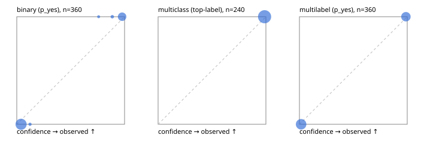

# Evaluation report

- model `Qwen/Qwen3.5-4B` @ `851bf6e806` (shared-prefix tree, forward only: text once per request, each question once, then each candidate), adapter/checkpoint `weights/selfjev_4b_vision`, prompt `challenger-state-first-v1` (6c9d8459ac44)
- data data/compact_challenge_v1.jsonl; splits ['test']; n=720; calibration `None`
- cuda / bfloat16; 2026-10-01T07:24:20+0000; wall 39.6s

## Overall

question accuracy 100.0%

**binary**: n 360, positives 122, accuracy 1.000, precision 1.000, recall 1.000, f1 1.000, auroc 1.000, brier 0.002, log_loss 0.037, ece 0.036

**multiclass**: n 240, accuracy 1.000, macro_f1 1.000, log_loss 0.013, brier 0.001, ece_top_label 0.012

**multilabel**: n 120, labels 360, exact_match 1.000, micro_f1 1.000, macro_f1 1.000, label_auroc 1.000, brier 0.000, log_loss 0.014, ece 0.014

## By family

| family | n | question acc % | details |
|---|---|---|---|
| compact_fresh_rules | 720 | 100.0 | bin acc 100.0 F1 100.0 AUROC 1.000 ECE 0.036; mc acc 100.0 mF1 100.0 ECE 0.012; ml EM 100.0 µF1 100.0 ECE 0.014 |

## by hard case

| slice | n | question acc % |
|---|---|---|
| (none) | 240 | 100.0 |
| conditional_policy | 120 | 100.0 |
| missing_evidence | 120 | 100.0 |
| negation | 120 | 100.0 |
| none_of_the_above | 120 | 100.0 |

## by state tokens

| slice | n | question acc % |
|---|---|---|
| 00000-00127 | 720 | 100.0 |

## by candidates

| slice | n | question acc % |
|---|---|---|
| 01 | 360 | 100.0 |
| 03 | 360 | 100.0 |

## Paraphrase groups

0 groups; same prediction —%; all correct —%

## Multiclass abstention (coverage vs error on accepted)

| abstain_below | coverage % | error % |
|---|---|---|
| 0.0 | 100.0 | 0.0 |
| 0.4 | 100.0 | 0.0 |
| 0.5 | 100.0 | 0.0 |
| 0.6 | 100.0 | 0.0 |
| 0.7 | 100.0 | 0.0 |
| 0.8 | 100.0 | 0.0 |
| 0.9 | 100.0 | 0.0 |

## Reliability: binary

| bin | n | mean confidence | observed frequency |
|---|---|---|---|
| [0.0,0.1) | 236 | 0.040 | 0.000 |
| [0.1,0.2) | 2 | 0.123 | 0.000 |
| [0.7,0.8) | 1 | 0.760 | 1.000 |
| [0.8,0.9) | 4 | 0.886 | 1.000 |
| [0.9,1.0] | 117 | 0.977 | 1.000 |

## Reliability: multiclass

| bin | n | mean confidence | observed frequency |
|---|---|---|---|
| [0.9,1.0] | 240 | 0.988 | 1.000 |

## Reliability: multilabel

| bin | n | mean confidence | observed frequency |
|---|---|---|---|
| [0.0,0.1) | 203 | 0.015 | 0.000 |
| [0.9,1.0] | 157 | 0.988 | 1.000 |
