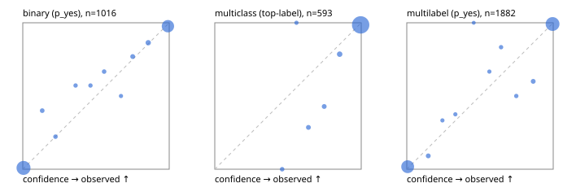

# Evaluation report

- model `Qwen/Qwen3.5-4B` @ `851bf6e806` (shared document / forked native cache branches), adapter/checkpoint `runs/qwen35_4b_combo/adapter`, prompt `challenger-state-first-v1` (6c9d8459ac44)
- data data/ova/eval2.jsonl; splits ['test']; n=1991; calibration `None`
- cuda / bfloat16; 2026-09-25T13:36:03+0000; wall 174.0s

## Overall

question accuracy 94.5%

**binary**: n 1016, positives 435, accuracy 0.962, precision 0.954, recall 0.956, f1 0.955, auroc 0.993, brier 0.029, log_loss 0.106, ece 0.014

**multiclass**: n 593, accuracy 0.958, macro_f1 0.921, log_loss 0.120, brier 0.060, ece_top_label 0.026

**multilabel**: n 382, labels 1882, exact_match 0.882, micro_f1 0.974, macro_f1 0.951, label_auroc 0.996, brier 0.023, log_loss 0.087, ece 0.016

## By family

| family | n | question acc % | details |
|---|---|---|---|
| e2_hard | 673 | 93.6 | bin acc 95.7 F1 94.0 AUROC 0.993 ECE 0.015; mc acc 94.8 mF1 89.9 ECE 0.031; ml EM 86.4 µF1 96.7 ECE 0.027 |
| e2_simple | 664 | 98.0 | bin acc 97.4 F1 97.6 AUROC 0.992 ECE 0.018; mc acc 99.5 mF1 98.9 ECE 0.006; ml EM 97.5 µF1 99.6 ECE 0.006 |
| e2_very_hard | 654 | 91.9 | bin acc 95.4 F1 93.9 AUROC 0.992 ECE 0.023; mc acc 93.0 mF1 87.8 ECE 0.045; ml EM 81.5 µF1 95.8 ECE 0.026 |

## by hard case

| slice | n | question acc % |
|---|---|---|
| (none) | 569 | 98.6 |
| contradiction | 172 | 95.9 |
| distractor | 474 | 92.0 |
| double_negation | 126 | 93.7 |
| evidence_end | 57 | 94.7 |
| evidence_middle | 114 | 99.1 |
| evidence_start | 17 | 94.1 |
| exception | 213 | 89.7 |
| hypothetical | 128 | 93.0 |
| injection | 151 | 94.7 |
| lexical_overlap | 201 | 96.5 |
| long_state | 191 | 95.3 |
| missing_evidence | 141 | 100.0 |
| multi_positive | 322 | 88.5 |
| multi_turn | 149 | 90.6 |
| negation | 257 | 97.3 |
| nota | 118 | 92.4 |
| numeric_reasoning | 224 | 86.2 |
| paraphrase | 218 | 93.1 |
| role_reversal | 187 | 92.5 |
| sarcasm | 149 | 94.0 |
| temporal_reasoning | 203 | 80.3 |
| zero_positive | 73 | 91.8 |
| zero_positive_distractor | 1 | 100.0 |

## by state tokens

| slice | n | question acc % |
|---|---|---|
| 00000-00127 | 666 | 95.0 |
| 00128-00511 | 469 | 91.3 |
| 00512-02047 | 488 | 95.5 |
| 02048-08191 | 329 | 96.7 |
| 08192+ | 39 | 94.9 |

## by candidates

| slice | n | question acc % |
|---|---|---|
| 01 | 1016 | 96.2 |
| 03 | 128 | 94.5 |
| 04 | 515 | 95.0 |
| 05 | 224 | 88.8 |
| 06 | 86 | 87.2 |
| 07 | 18 | 100.0 |
| 08 | 4 | 75.0 |

## Paraphrase groups

76 groups; same prediction 81.6%; all correct 86.8%

## Multiclass abstention (coverage vs error on accepted)

| abstain_below | coverage % | error % |
|---|---|---|
| 0.0 | 100.0 | 4.2 |
| 0.4 | 100.0 | 4.2 |
| 0.5 | 99.2 | 3.4 |
| 0.6 | 98.7 | 3.4 |
| 0.7 | 97.5 | 2.6 |
| 0.8 | 96.3 | 1.9 |
| 0.9 | 93.9 | 1.4 |

## Reliability: binary

| bin | n | mean confidence | observed frequency |
|---|---|---|---|
| [0.0,0.1) | 547 | 0.005 | 0.009 |
| [0.1,0.2) | 10 | 0.133 | 0.400 |
| [0.2,0.3) | 9 | 0.223 | 0.222 |
| [0.3,0.4) | 7 | 0.361 | 0.571 |
| [0.4,0.5) | 7 | 0.462 | 0.571 |
| [0.5,0.6) | 9 | 0.556 | 0.667 |
| [0.6,0.7) | 4 | 0.671 | 0.500 |
| [0.7,0.8) | 13 | 0.750 | 0.769 |
| [0.8,0.9) | 22 | 0.857 | 0.864 |
| [0.9,1.0] | 388 | 0.991 | 0.977 |

## Reliability: multiclass

| bin | n | mean confidence | observed frequency |
|---|---|---|---|
| [0.4,0.5) | 5 | 0.460 | 0.000 |
| [0.5,0.6) | 3 | 0.558 | 1.000 |
| [0.6,0.7) | 7 | 0.639 | 0.286 |
| [0.7,0.8) | 7 | 0.747 | 0.429 |
| [0.8,0.9) | 14 | 0.853 | 0.786 |
| [0.9,1.0] | 557 | 0.996 | 0.986 |

## Reliability: multilabel

| bin | n | mean confidence | observed frequency |
|---|---|---|---|
| [0.0,0.1) | 811 | 0.006 | 0.017 |
| [0.1,0.2) | 22 | 0.147 | 0.091 |
| [0.2,0.3) | 9 | 0.243 | 0.333 |
| [0.3,0.4) | 8 | 0.332 | 0.375 |
| [0.4,0.5) | 3 | 0.457 | 1.000 |
| [0.5,0.6) | 9 | 0.564 | 0.667 |
| [0.6,0.7) | 12 | 0.644 | 0.833 |
| [0.7,0.8) | 12 | 0.748 | 0.500 |
| [0.8,0.9) | 25 | 0.863 | 0.600 |
| [0.9,1.0] | 971 | 0.996 | 0.992 |
