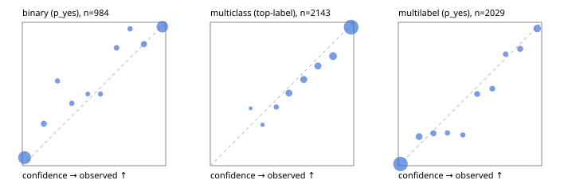

# Evaluation report

- model `Qwen/Qwen3.5-4B` @ `851bf6e806` (shared document / forked native cache branches), adapter/checkpoint `runs/qwen35_4b_combo/adapter`, prompt `challenger-state-first-v1` (6c9d8459ac44)
- data data/ova/hf.jsonl, data/ova/eval.jsonl; splits ['test']; n=3471; calibration `None`
- cuda / bfloat16; 2026-09-25T13:45:06+0000; wall 543.1s

## Overall

question accuracy 84.3%

**binary**: n 984, positives 475, accuracy 0.900, precision 0.927, recall 0.861, f1 0.893, auroc 0.963, brier 0.077, log_loss 0.270, ece 0.047

**multiclass**: n 2143, accuracy 0.853, macro_f1 0.922, log_loss 0.440, brier 0.217, ece_top_label 0.032

**multilabel**: n 344, labels 2029, exact_match 0.622, micro_f1 0.796, macro_f1 0.767, label_auroc 0.959, brier 0.066, log_loss 0.217, ece 0.023

## By family

| family | n | question acc % | details |
|---|---|---|---|
| eval_adversarial | 27 | 92.6 | bin acc 93.3 F1 90.9 AUROC 0.981 ECE 0.069; mc acc 100.0 mF1 100.0 ECE 0.001; ml EM 80.0 µF1 82.4 ECE 0.107 |
| eval_agent_output | 26 | 65.4 | bin acc 85.7 F1 85.7 AUROC 0.878 ECE 0.180; mc acc 57.1 mF1 52.8 ECE 0.384; ml EM 20.0 µF1 66.7 ECE 0.174 |
| eval_evidence | 17 | 88.2 | bin acc 100.0 F1 100.0 AUROC 1.000 ECE 0.009; ml EM 0.0 µF1 50.0 ECE 0.328 |
| eval_multilabel | 32 | 93.8 | bin acc 100.0 F1 100.0 AUROC 1.000 ECE 0.032; mc acc 100.0 mF1 100.0 ECE 0.423; ml EM 91.7 µF1 97.0 ECE 0.023 |
| eval_policy | 22 | 54.5 | bin acc 61.5 F1 66.7 AUROC 0.786 ECE 0.326; mc acc 60.0 mF1 42.9 ECE 0.359; ml EM 25.0 µF1 84.2 ECE 0.176 |
| eval_routing | 25 | 96.0 | bin acc 100.0 F1 100.0 AUROC 1.000 ECE 0.012; mc acc 100.0 mF1 100.0 ECE 0.035; ml EM 50.0 µF1 66.7 ECE 0.179 |
| eval_urgency_sentiment | 22 | 95.5 | bin acc 90.0 F1 92.3 AUROC 0.958 ECE 0.118; mc acc 100.0 mF1 100.0 ECE 0.011; ml EM 100.0 µF1 100.0 ECE 0.006 |
| heldout_boolq | 300 | 85.7 | bin acc 85.7 F1 87.3 AUROC 0.948 ECE 0.097 |
| heldout_emotion_multiclass | 300 | 58.7 | mc acc 58.7 mF1 51.2 ECE 0.161 |
| heldout_intent_clinc | 300 | 95.7 | mc acc 95.7 mF1 96.6 ECE 0.027 |
| heldout_question_type_trec | 300 | 89.3 | mc acc 89.3 mF1 89.9 ECE 0.046 |
| heldout_sentiment_sst2 | 300 | 89.0 | bin acc 89.0 F1 88.3 AUROC 0.971 ECE 0.074 |
| heldout_topic_dbpedia | 300 | 96.7 | mc acc 96.7 mF1 96.4 ECE 0.012 |
| hf_emotions_multilabel | 300 | 61.0 | ml EM 61.0 µF1 77.4 ECE 0.025 |
| hf_intent_banking77 | 300 | 95.7 | mc acc 95.7 mF1 94.1 ECE 0.022 |
| hf_nli | 300 | 95.7 | bin acc 95.7 F1 94.0 AUROC 0.985 ECE 0.033 |
| hf_sentiment_tweets | 300 | 69.0 | mc acc 69.0 mF1 69.7 ECE 0.075 |
| hf_topic_agnews | 300 | 91.3 | mc acc 91.3 mF1 91.4 ECE 0.035 |

## by hard case

| slice | n | question acc % |
|---|---|---|
| (none) | 3042 | 84.1 |
| contradiction | 107 | 100.0 |
| distractor | 33 | 66.7 |
| double_negation | 6 | 83.3 |
| evidence_end | 13 | 92.3 |
| evidence_middle | 11 | 81.8 |
| evidence_start | 9 | 100.0 |
| exception | 7 | 57.1 |
| hypothetical | 7 | 100.0 |
| injection | 10 | 90.0 |
| lexical_overlap | 20 | 100.0 |
| long_state | 50 | 86.0 |
| missing_evidence | 104 | 93.3 |
| multi_positive | 81 | 49.4 |
| multi_turn | 9 | 88.9 |
| negation | 30 | 93.3 |
| new_label_names | 3 | 66.7 |
| nota | 46 | 100.0 |
| numeric_reasoning | 16 | 81.2 |
| paraphrase | 22 | 81.8 |
| role_reversal | 15 | 86.7 |
| sarcasm | 12 | 100.0 |
| temporal_reasoning | 29 | 62.1 |
| zero_positive | 6 | 83.3 |

## by state tokens

| slice | n | question acc % |
|---|---|---|
| 00000-00127 | 3213 | 84.4 |
| 00128-00511 | 206 | 82.0 |
| 00512-02047 | 52 | 86.5 |

## by candidates

| slice | n | question acc % |
|---|---|---|
| 01 | 984 | 90.0 |
| 03 | 310 | 70.0 |
| 04 | 333 | 89.5 |
| 05 | 22 | 72.7 |
| 06 | 1218 | 76.5 |
| 07 | 49 | 100.0 |
| 08 | 555 | 95.3 |

## Paraphrase groups

11 groups; same prediction 63.6%; all correct 72.7%

## Multiclass abstention (coverage vs error on accepted)

| abstain_below | coverage % | error % |
|---|---|---|
| 0.0 | 100.0 | 14.7 |
| 0.4 | 99.1 | 14.3 |
| 0.5 | 97.1 | 13.3 |
| 0.6 | 90.2 | 10.6 |
| 0.7 | 83.3 | 8.2 |
| 0.8 | 76.3 | 6.1 |
| 0.9 | 66.0 | 3.4 |

## Reliability: binary

| bin | n | mean confidence | observed frequency |
|---|---|---|---|
| [0.0,0.1) | 445 | 0.016 | 0.056 |
| [0.1,0.2) | 41 | 0.150 | 0.293 |
| [0.2,0.3) | 22 | 0.245 | 0.591 |
| [0.3,0.4) | 23 | 0.346 | 0.435 |
| [0.4,0.5) | 12 | 0.456 | 0.500 |
| [0.5,0.6) | 18 | 0.545 | 0.500 |
| [0.6,0.7) | 28 | 0.657 | 0.821 |
| [0.7,0.8) | 22 | 0.751 | 0.955 |
| [0.8,0.9) | 46 | 0.848 | 0.848 |
| [0.9,1.0] | 327 | 0.977 | 0.969 |

## Reliability: multiclass

| bin | n | mean confidence | observed frequency |
|---|---|---|---|
| [0.2,0.3) | 5 | 0.281 | 0.400 |
| [0.3,0.4) | 14 | 0.364 | 0.286 |
| [0.4,0.5) | 44 | 0.460 | 0.409 |
| [0.5,0.6) | 146 | 0.548 | 0.507 |
| [0.6,0.7) | 148 | 0.652 | 0.601 |
| [0.7,0.8) | 151 | 0.751 | 0.695 |
| [0.8,0.9) | 220 | 0.856 | 0.764 |
| [0.9,1.0] | 1415 | 0.982 | 0.966 |

## Reliability: multilabel

| bin | n | mean confidence | observed frequency |
|---|---|---|---|
| [0.0,0.1) | 1257 | 0.015 | 0.012 |
| [0.1,0.2) | 138 | 0.145 | 0.203 |
| [0.2,0.3) | 84 | 0.245 | 0.226 |
| [0.3,0.4) | 48 | 0.343 | 0.229 |
| [0.4,0.5) | 42 | 0.450 | 0.214 |
| [0.5,0.6) | 72 | 0.550 | 0.500 |
| [0.6,0.7) | 67 | 0.656 | 0.537 |
| [0.7,0.8) | 54 | 0.749 | 0.778 |
| [0.8,0.9) | 81 | 0.850 | 0.815 |
| [0.9,1.0] | 186 | 0.969 | 0.957 |
