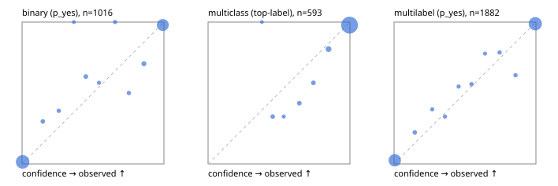

# Evaluation report

- model `Qwen/Qwen3.5-4B` @ `851bf6e806` (shared document / forked native cache branches), adapter/checkpoint `runs/qwen35_4b_r2x64/adapter`, prompt `challenger-state-first-v1` (6c9d8459ac44)
- data data/eval2.jsonl; splits ['test']; n=1991; calibration `None`
- cuda / bfloat16; 2026-09-24T22:46:32+0000; wall 304.5s

## Overall

question accuracy 93.7%

**binary**: n 1016, positives 435, accuracy 0.956, precision 0.953, recall 0.943, f1 0.948, auroc 0.993, brier 0.033, log_loss 0.116, ece 0.024

**multiclass**: n 593, accuracy 0.951, macro_f1 0.911, log_loss 0.173, brier 0.077, ece_top_label 0.027

**multilabel**: n 382, labels 1882, exact_match 0.866, micro_f1 0.966, macro_f1 0.937, label_auroc 0.994, brier 0.029, log_loss 0.110, ece 0.018

## By family

| family | n | question acc % | details |
|---|---|---|---|
| e2_hard | 673 | 92.3 | bin acc 95.1 F1 93.2 AUROC 0.993 ECE 0.017; mc acc 94.8 mF1 89.9 ECE 0.031; ml EM 81.1 µF1 94.4 ECE 0.034 |
| e2_simple | 664 | 97.7 | bin acc 98.0 F1 98.1 AUROC 0.997 ECE 0.017; mc acc 98.5 mF1 96.8 ECE 0.010; ml EM 95.8 µF1 99.3 ECE 0.006 |
| e2_very_hard | 654 | 91.1 | bin acc 93.5 F1 91.2 AUROC 0.987 ECE 0.045; mc acc 92.0 mF1 86.7 ECE 0.056; ml EM 83.8 µF1 96.1 ECE 0.031 |

## by hard case

| slice | n | question acc % |
|---|---|---|
| (none) | 569 | 97.7 |
| contradiction | 172 | 94.2 |
| distractor | 474 | 91.8 |
| double_negation | 126 | 91.3 |
| evidence_end | 57 | 98.2 |
| evidence_middle | 114 | 97.4 |
| evidence_start | 17 | 88.2 |
| exception | 213 | 92.0 |
| hypothetical | 128 | 96.9 |
| injection | 151 | 89.4 |
| lexical_overlap | 201 | 96.5 |
| long_state | 191 | 95.3 |
| missing_evidence | 141 | 95.0 |
| multi_positive | 322 | 88.2 |
| multi_turn | 149 | 93.3 |
| negation | 257 | 96.9 |
| nota | 118 | 91.5 |
| numeric_reasoning | 224 | 80.4 |
| paraphrase | 218 | 89.4 |
| role_reversal | 187 | 94.7 |
| sarcasm | 149 | 92.6 |
| temporal_reasoning | 203 | 82.8 |
| zero_positive | 73 | 93.2 |
| zero_positive_distractor | 1 | 100.0 |

## by state tokens

| slice | n | question acc % |
|---|---|---|
| 00000-00127 | 666 | 92.6 |
| 00128-00511 | 469 | 89.8 |
| 00512-02047 | 488 | 96.1 |
| 02048-08191 | 329 | 97.9 |
| 08192+ | 39 | 94.9 |

## by candidates

| slice | n | question acc % |
|---|---|---|
| 01 | 1016 | 95.6 |
| 03 | 128 | 94.5 |
| 04 | 515 | 93.4 |
| 05 | 224 | 86.6 |
| 06 | 86 | 93.0 |
| 07 | 18 | 88.9 |
| 08 | 4 | 75.0 |

## Paraphrase groups

76 groups; same prediction 80.3%; all correct 82.9%

## Multiclass abstention (coverage vs error on accepted)

| abstain_below | coverage % | error % |
|---|---|---|
| 0.0 | 100.0 | 4.9 |
| 0.4 | 99.8 | 4.9 |
| 0.5 | 98.8 | 4.3 |
| 0.6 | 98.3 | 3.9 |
| 0.7 | 97.1 | 3.3 |
| 0.8 | 96.0 | 2.8 |
| 0.9 | 92.4 | 2.2 |

## Reliability: binary

| bin | n | mean confidence | observed frequency |
|---|---|---|---|
| [0.0,0.1) | 552 | 0.004 | 0.014 |
| [0.1,0.2) | 10 | 0.146 | 0.300 |
| [0.2,0.3) | 8 | 0.259 | 0.375 |
| [0.3,0.4) | 3 | 0.365 | 1.000 |
| [0.4,0.5) | 13 | 0.450 | 0.615 |
| [0.5,0.6) | 7 | 0.542 | 0.571 |
| [0.6,0.7) | 6 | 0.656 | 1.000 |
| [0.7,0.8) | 8 | 0.753 | 0.500 |
| [0.8,0.9) | 17 | 0.859 | 0.706 |
| [0.9,1.0] | 392 | 0.992 | 0.980 |

## Reliability: multiclass

| bin | n | mean confidence | observed frequency |
|---|---|---|---|
| [0.3,0.4) | 1 | 0.380 | 1.000 |
| [0.4,0.5) | 6 | 0.455 | 0.333 |
| [0.5,0.6) | 3 | 0.533 | 0.333 |
| [0.6,0.7) | 7 | 0.643 | 0.429 |
| [0.7,0.8) | 7 | 0.742 | 0.571 |
| [0.8,0.9) | 21 | 0.849 | 0.810 |
| [0.9,1.0] | 548 | 0.997 | 0.978 |

## Reliability: multilabel

| bin | n | mean confidence | observed frequency |
|---|---|---|---|
| [0.0,0.1) | 814 | 0.005 | 0.026 |
| [0.1,0.2) | 18 | 0.146 | 0.222 |
| [0.2,0.3) | 13 | 0.269 | 0.385 |
| [0.3,0.4) | 12 | 0.359 | 0.333 |
| [0.4,0.5) | 11 | 0.455 | 0.545 |
| [0.5,0.6) | 16 | 0.546 | 0.562 |
| [0.6,0.7) | 9 | 0.641 | 0.778 |
| [0.7,0.8) | 14 | 0.744 | 0.786 |
| [0.8,0.9) | 16 | 0.856 | 0.625 |
| [0.9,1.0] | 959 | 0.996 | 0.989 |
