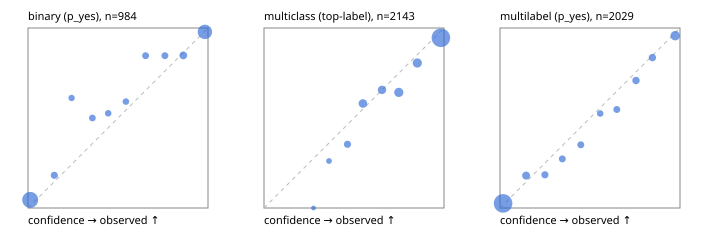

# Evaluation report

- model `Qwen/Qwen3.5-4B` @ `851bf6e806` (shared document / forked native cache branches), adapter/checkpoint `runs/qwen35_4b_r2x64/adapter`, prompt `challenger-state-first-v1` (6c9d8459ac44)
- data data/hf.jsonl, data/eval.jsonl; splits ['test']; n=3471; calibration `None`
- cuda / bfloat16; 2026-09-24T22:56:34+0000; wall 602.3s

## Overall

question accuracy 83.4%

**binary**: n 984, positives 475, accuracy 0.909, precision 0.931, recall 0.876, f1 0.902, auroc 0.971, brier 0.068, log_loss 0.236, ece 0.038

**multiclass**: n 2143, accuracy 0.840, macro_f1 0.914, log_loss 0.470, brier 0.236, ece_top_label 0.044

**multilabel**: n 344, labels 2029, exact_match 0.584, micro_f1 0.788, macro_f1 0.823, label_auroc 0.952, brier 0.068, log_loss 0.228, ece 0.021

## By family

| family | n | question acc % | details |
|---|---|---|---|
| eval_adversarial | 27 | 100.0 | bin acc 100.0 F1 100.0 AUROC 1.000 ECE 0.002; mc acc 100.0 mF1 100.0 ECE 0.000; ml EM 100.0 µF1 100.0 ECE 0.016 |
| eval_agent_output | 26 | 69.2 | bin acc 85.7 F1 87.5 AUROC 1.000 ECE 0.123; mc acc 71.4 mF1 70.0 ECE 0.345; ml EM 20.0 µF1 75.0 ECE 0.201 |
| eval_evidence | 17 | 94.1 | bin acc 100.0 F1 100.0 AUROC 1.000 ECE 0.001; ml EM 50.0 µF1 57.1 ECE 0.268 |
| eval_multilabel | 32 | 93.8 | bin acc 100.0 F1 100.0 AUROC 1.000 ECE 0.036; mc acc 100.0 mF1 100.0 ECE 0.000; ml EM 91.7 µF1 98.0 ECE 0.016 |
| eval_policy | 22 | 68.2 | bin acc 69.2 F1 66.7 AUROC 0.810 ECE 0.293; mc acc 60.0 mF1 42.9 ECE 0.418; ml EM 75.0 µF1 94.1 ECE 0.114 |
| eval_routing | 25 | 92.0 | bin acc 90.0 F1 88.9 AUROC 1.000 ECE 0.100; mc acc 100.0 mF1 100.0 ECE 0.006; ml EM 50.0 µF1 80.0 ECE 0.108 |
| eval_urgency_sentiment | 22 | 95.5 | bin acc 90.0 F1 92.3 AUROC 0.958 ECE 0.127; mc acc 100.0 mF1 100.0 ECE 0.033; ml EM 100.0 µF1 100.0 ECE 0.003 |
| heldout_boolq | 300 | 87.7 | bin acc 87.7 F1 89.4 AUROC 0.959 ECE 0.081 |
| heldout_emotion_multiclass | 300 | 56.0 | mc acc 56.0 mF1 47.1 ECE 0.182 |
| heldout_intent_clinc | 300 | 91.7 | mc acc 91.7 mF1 93.9 ECE 0.036 |
| heldout_question_type_trec | 300 | 88.0 | mc acc 88.0 mF1 86.9 ECE 0.058 |
| heldout_sentiment_sst2 | 300 | 91.3 | bin acc 91.3 F1 90.8 AUROC 0.978 ECE 0.069 |
| heldout_topic_dbpedia | 300 | 97.0 | mc acc 97.0 mF1 96.7 ECE 0.018 |
| hf_emotions_multilabel | 300 | 55.3 | ml EM 55.3 µF1 75.2 ECE 0.020 |
| hf_intent_banking77 | 300 | 95.3 | mc acc 95.3 mF1 94.6 ECE 0.028 |
| hf_nli | 300 | 93.7 | bin acc 93.7 F1 91.0 AUROC 0.986 ECE 0.034 |
| hf_sentiment_tweets | 300 | 68.0 | mc acc 68.0 mF1 68.6 ECE 0.093 |
| hf_topic_agnews | 300 | 91.0 | mc acc 91.0 mF1 91.1 ECE 0.048 |

## by hard case

| slice | n | question acc % |
|---|---|---|
| (none) | 3042 | 82.9 |
| contradiction | 107 | 99.1 |
| distractor | 33 | 75.8 |
| double_negation | 6 | 100.0 |
| evidence_end | 13 | 92.3 |
| evidence_middle | 11 | 100.0 |
| evidence_start | 9 | 100.0 |
| exception | 7 | 71.4 |
| hypothetical | 7 | 100.0 |
| injection | 10 | 100.0 |
| lexical_overlap | 20 | 95.0 |
| long_state | 50 | 90.0 |
| missing_evidence | 104 | 94.2 |
| multi_positive | 81 | 49.4 |
| multi_turn | 9 | 88.9 |
| negation | 30 | 96.7 |
| new_label_names | 3 | 100.0 |
| nota | 46 | 100.0 |
| numeric_reasoning | 16 | 81.2 |
| paraphrase | 22 | 90.9 |
| role_reversal | 15 | 93.3 |
| sarcasm | 12 | 100.0 |
| temporal_reasoning | 29 | 72.4 |
| zero_positive | 6 | 100.0 |

## by state tokens

| slice | n | question acc % |
|---|---|---|
| 00000-00127 | 3213 | 83.3 |
| 00128-00511 | 206 | 84.0 |
| 00512-02047 | 52 | 90.4 |

## by candidates

| slice | n | question acc % |
|---|---|---|
| 01 | 984 | 90.9 |
| 03 | 310 | 69.0 |
| 04 | 333 | 89.8 |
| 05 | 22 | 86.4 |
| 06 | 1218 | 74.2 |
| 07 | 49 | 100.0 |
| 08 | 555 | 93.0 |

## Paraphrase groups

11 groups; same prediction 63.6%; all correct 81.8%

## Multiclass abstention (coverage vs error on accepted)

| abstain_below | coverage % | error % |
|---|---|---|
| 0.0 | 100.0 | 16.0 |
| 0.4 | 98.7 | 15.2 |
| 0.5 | 95.7 | 13.7 |
| 0.6 | 89.0 | 11.5 |
| 0.7 | 83.1 | 9.9 |
| 0.8 | 74.7 | 7.0 |
| 0.9 | 66.3 | 5.4 |

## Reliability: binary

| bin | n | mean confidence | observed frequency |
|---|---|---|---|
| [0.0,0.1) | 443 | 0.012 | 0.045 |
| [0.1,0.2) | 33 | 0.146 | 0.182 |
| [0.2,0.3) | 18 | 0.242 | 0.611 |
| [0.3,0.4) | 24 | 0.358 | 0.500 |
| [0.4,0.5) | 19 | 0.446 | 0.526 |
| [0.5,0.6) | 22 | 0.544 | 0.591 |
| [0.6,0.7) | 26 | 0.653 | 0.846 |
| [0.7,0.8) | 26 | 0.760 | 0.846 |
| [0.8,0.9) | 46 | 0.863 | 0.848 |
| [0.9,1.0] | 327 | 0.983 | 0.979 |

## Reliability: multiclass

| bin | n | mean confidence | observed frequency |
|---|---|---|---|
| [0.2,0.3) | 4 | 0.275 | 0.000 |
| [0.3,0.4) | 23 | 0.361 | 0.261 |
| [0.4,0.5) | 65 | 0.464 | 0.354 |
| [0.5,0.6) | 143 | 0.549 | 0.580 |
| [0.6,0.7) | 128 | 0.655 | 0.656 |
| [0.7,0.8) | 179 | 0.749 | 0.642 |
| [0.8,0.9) | 180 | 0.852 | 0.806 |
| [0.9,1.0] | 1421 | 0.983 | 0.946 |

## Reliability: multilabel

| bin | n | mean confidence | observed frequency |
|---|---|---|---|
| [0.0,0.1) | 1327 | 0.017 | 0.026 |
| [0.1,0.2) | 100 | 0.145 | 0.180 |
| [0.2,0.3) | 65 | 0.249 | 0.185 |
| [0.3,0.4) | 55 | 0.346 | 0.273 |
| [0.4,0.5) | 57 | 0.449 | 0.351 |
| [0.5,0.6) | 40 | 0.557 | 0.525 |
| [0.6,0.7) | 53 | 0.649 | 0.547 |
| [0.7,0.8) | 72 | 0.756 | 0.708 |
| [0.8,0.9) | 73 | 0.847 | 0.836 |
| [0.9,1.0] | 187 | 0.974 | 0.957 |
