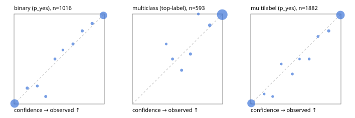

# Evaluation report

- model `Qwen/Qwen3.5-4B` @ `851bf6e806` (shared document / forked native cache branches), adapter/checkpoint `runs/qwen35_4b_tree/adapter`, prompt `challenger-state-first-v1` (6c9d8459ac44)
- data data/ova/eval2.jsonl; splits ['test']; n=1991; calibration `None`
- cuda / bfloat16; 2026-09-25T22:47:30+0000; wall 195.5s

## Overall

question accuracy 95.6%

**binary**: n 1016, positives 435, accuracy 0.969, precision 0.961, recall 0.968, f1 0.964, auroc 0.995, brier 0.025, log_loss 0.088, ece 0.009

**multiclass**: n 593, accuracy 0.968, macro_f1 0.945, log_loss 0.098, brier 0.048, ece_top_label 0.011

**multilabel**: n 382, labels 1882, exact_match 0.901, micro_f1 0.976, macro_f1 0.955, label_auroc 0.996, brier 0.020, log_loss 0.077, ece 0.008

## By family

| family | n | question acc % | details |
|---|---|---|---|
| e2_hard | 673 | 94.7 | bin acc 96.8 F1 95.6 AUROC 0.995 ECE 0.022; mc acc 96.4 mF1 92.7 ECE 0.023; ml EM 86.4 µF1 96.4 ECE 0.024 |
| e2_simple | 664 | 98.6 | bin acc 97.4 F1 97.6 AUROC 0.997 ECE 0.014; mc acc 100.0 mF1 100.0 ECE 0.007; ml EM 100.0 µF1 100.0 ECE 0.007 |
| e2_very_hard | 654 | 93.4 | bin acc 96.6 F1 95.5 AUROC 0.992 ECE 0.029; mc acc 94.0 mF1 90.5 ECE 0.039; ml EM 84.6 µF1 96.5 ECE 0.011 |

## by hard case

| slice | n | question acc % |
|---|---|---|
| (none) | 569 | 98.8 |
| contradiction | 172 | 95.9 |
| distractor | 474 | 92.8 |
| double_negation | 126 | 94.4 |
| evidence_end | 57 | 96.5 |
| evidence_middle | 114 | 98.2 |
| evidence_start | 17 | 94.1 |
| exception | 213 | 93.9 |
| hypothetical | 128 | 94.5 |
| injection | 151 | 94.7 |
| lexical_overlap | 201 | 96.5 |
| long_state | 191 | 95.8 |
| missing_evidence | 141 | 97.9 |
| multi_positive | 322 | 91.3 |
| multi_turn | 149 | 94.0 |
| negation | 257 | 97.3 |
| nota | 118 | 93.2 |
| numeric_reasoning | 224 | 88.4 |
| paraphrase | 218 | 92.2 |
| role_reversal | 187 | 94.1 |
| sarcasm | 149 | 95.3 |
| temporal_reasoning | 203 | 85.7 |
| zero_positive | 73 | 93.2 |
| zero_positive_distractor | 1 | 100.0 |

## by state tokens

| slice | n | question acc % |
|---|---|---|
| 00000-00127 | 666 | 96.2 |
| 00128-00511 | 469 | 92.8 |
| 00512-02047 | 488 | 95.7 |
| 02048-08191 | 329 | 97.9 |
| 08192+ | 39 | 97.4 |

## by candidates

| slice | n | question acc % |
|---|---|---|
| 01 | 1016 | 96.9 |
| 03 | 128 | 96.9 |
| 04 | 515 | 95.5 |
| 05 | 224 | 91.5 |
| 06 | 86 | 89.5 |
| 07 | 18 | 94.4 |
| 08 | 4 | 75.0 |

## Paraphrase groups

76 groups; same prediction 78.9%; all correct 88.2%

## Multiclass abstention (coverage vs error on accepted)

| abstain_below | coverage % | error % |
|---|---|---|
| 0.0 | 100.0 | 3.2 |
| 0.4 | 99.5 | 3.1 |
| 0.5 | 98.5 | 2.6 |
| 0.6 | 97.1 | 1.7 |
| 0.7 | 95.6 | 1.1 |
| 0.8 | 94.9 | 1.1 |
| 0.9 | 92.2 | 0.7 |

## Reliability: binary

| bin | n | mean confidence | observed frequency |
|---|---|---|---|
| [0.0,0.1) | 529 | 0.006 | 0.006 |
| [0.1,0.2) | 17 | 0.146 | 0.176 |
| [0.2,0.3) | 10 | 0.258 | 0.200 |
| [0.3,0.4) | 12 | 0.351 | 0.083 |
| [0.4,0.5) | 10 | 0.454 | 0.500 |
| [0.5,0.6) | 5 | 0.541 | 0.600 |
| [0.6,0.7) | 12 | 0.653 | 0.667 |
| [0.7,0.8) | 16 | 0.756 | 0.812 |
| [0.8,0.9) | 19 | 0.866 | 0.895 |
| [0.9,1.0] | 386 | 0.991 | 0.984 |

## Reliability: multiclass

| bin | n | mean confidence | observed frequency |
|---|---|---|---|
| [0.3,0.4) | 3 | 0.375 | 0.667 |
| [0.4,0.5) | 6 | 0.445 | 0.500 |
| [0.5,0.6) | 8 | 0.546 | 0.375 |
| [0.6,0.7) | 9 | 0.643 | 0.556 |
| [0.7,0.8) | 4 | 0.731 | 1.000 |
| [0.8,0.9) | 16 | 0.858 | 0.875 |
| [0.9,1.0] | 547 | 0.996 | 0.993 |

## Reliability: multilabel

| bin | n | mean confidence | observed frequency |
|---|---|---|---|
| [0.0,0.1) | 797 | 0.006 | 0.008 |
| [0.1,0.2) | 9 | 0.149 | 0.111 |
| [0.2,0.3) | 12 | 0.243 | 0.083 |
| [0.3,0.4) | 9 | 0.339 | 0.444 |
| [0.4,0.5) | 15 | 0.462 | 0.333 |
| [0.5,0.6) | 6 | 0.541 | 0.500 |
| [0.6,0.7) | 14 | 0.648 | 0.500 |
| [0.7,0.8) | 20 | 0.746 | 0.750 |
| [0.8,0.9) | 32 | 0.864 | 0.812 |
| [0.9,1.0] | 968 | 0.994 | 0.989 |
