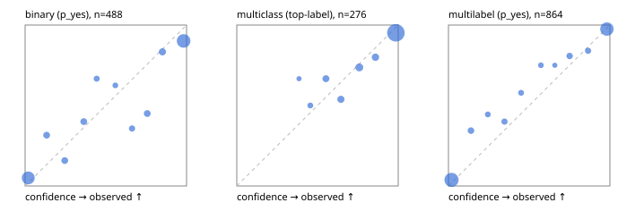

# Evaluation report

- model `Qwen/Qwen3.5-4B` @ `851bf6e806` (shared document / forked native cache branches), adapter/checkpoint `weights/qwen35_4b_tree`, prompt `challenger-state-first-v1` (6c9d8459ac44)
- data data/ova/eval_llm.jsonl; splits ['test']; n=946; calibration `None`
- cuda / bfloat16; 2026-09-27T04:13:07+0000; wall 73.6s

## Overall

question accuracy 82.1%

**binary**: n 488, positives 245, accuracy 0.838, precision 0.822, recall 0.865, f1 0.843, auroc 0.918, brier 0.118, log_loss 0.431, ece 0.082

**multiclass**: n 276, accuracy 0.884, macro_f1 0.819, log_loss 0.388, brier 0.184, ece_top_label 0.044

**multilabel**: n 182, labels 864, exact_match 0.681, micro_f1 0.907, macro_f1 0.834, label_auroc 0.973, brier 0.067, log_loss 0.222, ece 0.033

## By family

| family | n | question acc % | details |
|---|---|---|---|
| tllm_guardrail_hard | 60 | 78.3 | bin acc 78.1 F1 78.8 AUROC 0.901 ECE 0.174; mc acc 88.2 mF1 80.4 ECE 0.082; ml EM 63.6 µF1 85.0 ECE 0.081 |
| tllm_guardrail_simple | 67 | 92.5 | bin acc 91.2 F1 91.4 AUROC 0.996 ECE 0.075; mc acc 100.0 mF1 100.0 ECE 0.074; ml EM 85.7 µF1 97.0 ECE 0.035 |
| tllm_guardrail_very_hard | 43 | 95.3 | bin acc 95.0 F1 95.7 AUROC 1.000 ECE 0.135; mc acc 100.0 mF1 100.0 ECE 0.086; ml EM 88.9 µF1 95.8 ECE 0.070 |
| tllm_jailbreak_hard | 59 | 79.7 | bin acc 74.1 F1 69.6 AUROC 0.933 ECE 0.210; mc acc 95.0 mF1 92.2 ECE 0.117; ml EM 66.7 µF1 92.3 ECE 0.097 |
| tllm_jailbreak_simple | 70 | 92.9 | bin acc 94.6 F1 95.0 AUROC 0.965 ECE 0.055; mc acc 90.9 mF1 81.2 ECE 0.109; ml EM 90.9 µF1 98.6 ECE 0.037 |
| tllm_jailbreak_very_hard | 60 | 76.7 | bin acc 71.9 F1 66.7 AUROC 0.895 ECE 0.200; mc acc 94.4 mF1 95.6 ECE 0.103; ml EM 60.0 µF1 92.6 ECE 0.091 |
| tllm_judge_hard | 86 | 88.4 | bin acc 87.5 F1 83.9 AUROC 0.952 ECE 0.139; mc acc 96.0 mF1 90.9 ECE 0.050; ml EM 81.0 µF1 90.6 ECE 0.062 |
| tllm_judge_simple | 72 | 88.9 | bin acc 92.1 F1 93.9 AUROC 0.988 ECE 0.079; mc acc 90.0 mF1 77.8 ECE 0.071; ml EM 78.6 µF1 95.1 ECE 0.058 |
| tllm_judge_very_hard | 64 | 79.7 | bin acc 90.6 F1 91.9 AUROC 0.869 ECE 0.140; mc acc 81.0 mF1 74.3 ECE 0.198; ml EM 45.5 µF1 82.5 ECE 0.152 |
| tllm_score_hard | 62 | 83.9 | bin acc 88.2 F1 88.2 AUROC 0.913 ECE 0.143; mc acc 87.5 mF1 73.3 ECE 0.080; ml EM 66.7 µF1 92.0 ECE 0.075 |
| tllm_score_simple | 62 | 91.9 | bin acc 97.1 F1 98.0 AUROC 0.950 ECE 0.064; mc acc 100.0 mF1 100.0 ECE 0.095; ml EM 66.7 µF1 94.1 ECE 0.062 |
| tllm_score_very_hard | 76 | 77.6 | bin acc 84.2 F1 75.0 AUROC 0.939 ECE 0.143; mc acc 81.8 mF1 68.0 ECE 0.146; ml EM 56.2 µF1 87.9 ECE 0.047 |
| tllm_verify_hard | 50 | 50.0 | bin acc 50.0 F1 58.1 AUROC 0.776 ECE 0.337; mc acc 62.5 mF1 47.4 ECE 0.256; ml EM 25.0 µF1 56.0 ECE 0.216 |
| tllm_verify_simple | 60 | 86.7 | bin acc 87.9 F1 90.0 AUROC 0.960 ECE 0.080; mc acc 100.0 mF1 100.0 ECE 0.026; ml EM 66.7 µF1 92.3 ECE 0.063 |
| tllm_verify_very_hard | 55 | 60.0 | bin acc 64.5 F1 59.3 AUROC 0.718 ECE 0.320; mc acc 53.3 mF1 40.7 ECE 0.423; ml EM 55.6 µF1 75.0 ECE 0.109 |

## by hard case

| slice | n | question acc % |
|---|---|---|
| (none) | 265 | 92.8 |
| answer_trace_mismatch | 45 | 66.7 |
| benign_lookalike | 88 | 84.1 |
| confident_wrong | 39 | 64.1 |
| contradiction | 22 | 81.8 |
| distractor | 117 | 78.6 |
| double_negation | 3 | 66.7 |
| evidence_end | 11 | 90.9 |
| evidence_middle | 20 | 45.0 |
| evidence_start | 2 | 0.0 |
| exception | 20 | 95.0 |
| fake_authority | 1 | 0.0 |
| flawed_step | 44 | 54.5 |
| format_near_miss | 46 | 76.1 |
| gradual_escalation | 1 | 0.0 |
| hypothetical | 7 | 85.7 |
| indirect_injection | 25 | 80.0 |
| injection | 22 | 86.4 |
| judge_injection | 112 | 76.8 |
| length_bias | 7 | 100.0 |
| lexical_overlap | 103 | 81.6 |
| long_state | 74 | 71.6 |
| missing_evidence | 35 | 94.3 |
| multi_positive | 124 | 62.9 |
| multi_turn | 44 | 72.7 |
| negation | 62 | 88.7 |
| nota | 55 | 83.6 |
| numeric_reasoning | 109 | 70.6 |
| obfuscation | 1 | 0.0 |
| over_refusal | 50 | 78.0 |
| paraphrase | 73 | 89.0 |
| partial_compliance | 31 | 64.5 |
| role_reversal | 6 | 83.3 |
| sarcasm | 8 | 62.5 |
| speaker_confusion | 58 | 84.5 |
| subtle_violation | 16 | 62.5 |
| sycophancy | 13 | 84.6 |
| temporal_reasoning | 20 | 65.0 |
| tool_misuse | 6 | 33.3 |
| unsupported_claim | 96 | 75.0 |
| zero_positive | 55 | 89.1 |
| zero_positive_partial | 1 | 100.0 |

## by state tokens

| slice | n | question acc % |
|---|---|---|
| 00000-00127 | 308 | 82.8 |
| 00128-00511 | 284 | 85.2 |
| 00512-02047 | 222 | 81.5 |
| 02048-08191 | 125 | 76.8 |
| 08192+ | 7 | 42.9 |

## by candidates

| slice | n | question acc % |
|---|---|---|
| 01 | 488 | 83.8 |
| 03 | 82 | 86.6 |
| 04 | 239 | 85.4 |
| 05 | 98 | 70.4 |
| 06 | 33 | 63.6 |
| 07 | 3 | 33.3 |
| 08 | 3 | 66.7 |

## Paraphrase groups

29 groups; same prediction 82.8%; all correct 75.9%

## Multiclass abstention (coverage vs error on accepted)

| abstain_below | coverage % | error % |
|---|---|---|
| 0.0 | 100.0 | 11.6 |
| 0.4 | 98.9 | 11.4 |
| 0.5 | 96.7 | 10.5 |
| 0.6 | 92.4 | 9.4 |
| 0.7 | 87.7 | 7.4 |
| 0.8 | 80.8 | 5.8 |
| 0.9 | 75.4 | 4.8 |

## Reliability: binary

| bin | n | mean confidence | observed frequency |
|---|---|---|---|
| [0.0,0.1) | 160 | 0.019 | 0.050 |
| [0.1,0.2) | 19 | 0.133 | 0.316 |
| [0.2,0.3) | 19 | 0.246 | 0.158 |
| [0.3,0.4) | 20 | 0.363 | 0.400 |
| [0.4,0.5) | 12 | 0.443 | 0.667 |
| [0.5,0.6) | 8 | 0.559 | 0.625 |
| [0.6,0.7) | 14 | 0.662 | 0.357 |
| [0.7,0.8) | 20 | 0.756 | 0.450 |
| [0.8,0.9) | 24 | 0.850 | 0.833 |
| [0.9,1.0] | 192 | 0.981 | 0.901 |

## Reliability: multiclass

| bin | n | mean confidence | observed frequency |
|---|---|---|---|
| [0.3,0.4) | 3 | 0.385 | 0.667 |
| [0.4,0.5) | 6 | 0.456 | 0.500 |
| [0.5,0.6) | 12 | 0.552 | 0.667 |
| [0.6,0.7) | 13 | 0.645 | 0.538 |
| [0.7,0.8) | 19 | 0.759 | 0.737 |
| [0.8,0.9) | 15 | 0.859 | 0.800 |
| [0.9,1.0] | 208 | 0.986 | 0.952 |

## Reliability: multilabel

| bin | n | mean confidence | observed frequency |
|---|---|---|---|
| [0.0,0.1) | 373 | 0.019 | 0.038 |
| [0.1,0.2) | 32 | 0.140 | 0.344 |
| [0.2,0.3) | 18 | 0.244 | 0.444 |
| [0.3,0.4) | 25 | 0.347 | 0.400 |
| [0.4,0.5) | 19 | 0.450 | 0.579 |
| [0.5,0.6) | 16 | 0.573 | 0.750 |
| [0.6,0.7) | 8 | 0.659 | 0.750 |
| [0.7,0.8) | 26 | 0.751 | 0.808 |
| [0.8,0.9) | 25 | 0.865 | 0.840 |
| [0.9,1.0] | 322 | 0.982 | 0.975 |
