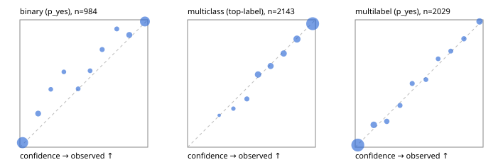

# Evaluation report

- model `Qwen/Qwen3.5-4B` @ `851bf6e806` (shared document / forked native cache branches), adapter/checkpoint `runs/qwen35_4b_tree/adapter`, prompt `challenger-state-first-v1` (6c9d8459ac44)
- data data/ova/hf.jsonl, data/ova/eval.jsonl; splits ['test']; n=3471; calibration `None`
- cuda / bfloat16; 2026-09-25T22:56:23+0000; wall 532.7s

## Overall

question accuracy 84.4%

**binary**: n 984, positives 475, accuracy 0.905, precision 0.932, recall 0.867, f1 0.899, auroc 0.972, brier 0.070, log_loss 0.228, ece 0.038

**multiclass**: n 2143, accuracy 0.857, macro_f1 0.926, log_loss 0.404, brier 0.205, ece_top_label 0.013

**multilabel**: n 344, labels 2029, exact_match 0.593, micro_f1 0.780, macro_f1 0.828, label_auroc 0.959, brier 0.064, log_loss 0.208, ece 0.012

## By family

| family | n | question acc % | details |
|---|---|---|---|
| eval_adversarial | 27 | 100.0 | bin acc 100.0 F1 100.0 AUROC 1.000 ECE 0.014; mc acc 100.0 mF1 100.0 ECE 0.004; ml EM 100.0 µF1 100.0 ECE 0.005 |
| eval_agent_output | 26 | 80.8 | bin acc 100.0 F1 100.0 AUROC 1.000 ECE 0.056; mc acc 85.7 mF1 86.7 ECE 0.226; ml EM 20.0 µF1 75.0 ECE 0.141 |
| eval_evidence | 17 | 94.1 | bin acc 100.0 F1 100.0 AUROC 1.000 ECE 0.002; ml EM 50.0 µF1 66.7 ECE 0.201 |
| eval_multilabel | 32 | 96.9 | bin acc 100.0 F1 100.0 AUROC 1.000 ECE 0.066; mc acc 100.0 mF1 100.0 ECE 0.007; ml EM 95.8 µF1 99.0 ECE 0.015 |
| eval_policy | 22 | 68.2 | bin acc 76.9 F1 76.9 AUROC 0.857 ECE 0.268; mc acc 60.0 mF1 42.9 ECE 0.348; ml EM 50.0 µF1 88.9 ECE 0.160 |
| eval_routing | 25 | 92.0 | bin acc 100.0 F1 100.0 AUROC 1.000 ECE 0.015; mc acc 92.3 mF1 81.8 ECE 0.102; ml EM 50.0 µF1 80.0 ECE 0.052 |
| eval_urgency_sentiment | 22 | 95.5 | bin acc 90.0 F1 92.3 AUROC 0.958 ECE 0.124; mc acc 100.0 mF1 100.0 ECE 0.044; ml EM 100.0 µF1 100.0 ECE 0.003 |
| heldout_boolq | 300 | 85.3 | bin acc 85.3 F1 87.1 AUROC 0.956 ECE 0.078 |
| heldout_emotion_multiclass | 300 | 59.0 | mc acc 59.0 mF1 50.8 ECE 0.104 |
| heldout_intent_clinc | 300 | 95.7 | mc acc 95.7 mF1 95.8 ECE 0.024 |
| heldout_question_type_trec | 300 | 92.0 | mc acc 92.0 mF1 91.7 ECE 0.058 |
| heldout_sentiment_sst2 | 300 | 89.7 | bin acc 89.7 F1 89.0 AUROC 0.973 ECE 0.072 |
| heldout_topic_dbpedia | 300 | 97.7 | mc acc 97.7 mF1 97.4 ECE 0.015 |
| hf_emotions_multilabel | 300 | 56.3 | ml EM 56.3 µF1 73.7 ECE 0.015 |
| hf_intent_banking77 | 300 | 97.0 | mc acc 97.0 mF1 96.3 ECE 0.022 |
| hf_nli | 300 | 95.3 | bin acc 95.3 F1 93.5 AUROC 0.987 ECE 0.027 |
| hf_sentiment_tweets | 300 | 68.0 | mc acc 68.0 mF1 68.7 ECE 0.052 |
| hf_topic_agnews | 300 | 89.7 | mc acc 89.7 mF1 89.7 ECE 0.043 |

## by hard case

| slice | n | question acc % |
|---|---|---|
| (none) | 3042 | 84.2 |
| contradiction | 107 | 100.0 |
| distractor | 33 | 72.7 |
| double_negation | 6 | 83.3 |
| evidence_end | 13 | 92.3 |
| evidence_middle | 11 | 90.9 |
| evidence_start | 9 | 100.0 |
| exception | 7 | 57.1 |
| hypothetical | 7 | 100.0 |
| injection | 10 | 100.0 |
| lexical_overlap | 20 | 100.0 |
| long_state | 50 | 92.0 |
| missing_evidence | 104 | 93.3 |
| multi_positive | 81 | 43.2 |
| multi_turn | 9 | 88.9 |
| negation | 30 | 100.0 |
| new_label_names | 3 | 100.0 |
| nota | 46 | 100.0 |
| numeric_reasoning | 16 | 87.5 |
| paraphrase | 22 | 90.9 |
| role_reversal | 15 | 93.3 |
| sarcasm | 12 | 100.0 |
| temporal_reasoning | 29 | 72.4 |
| zero_positive | 6 | 100.0 |

## by state tokens

| slice | n | question acc % |
|---|---|---|
| 00000-00127 | 3213 | 84.3 |
| 00128-00511 | 206 | 84.0 |
| 00512-02047 | 52 | 92.3 |

## by candidates

| slice | n | question acc % |
|---|---|---|
| 01 | 984 | 90.5 |
| 03 | 310 | 69.0 |
| 04 | 333 | 88.3 |
| 05 | 22 | 90.9 |
| 06 | 1218 | 76.4 |
| 07 | 49 | 100.0 |
| 08 | 555 | 96.0 |

## Paraphrase groups

11 groups; same prediction 81.8%; all correct 90.9%

## Multiclass abstention (coverage vs error on accepted)

| abstain_below | coverage % | error % |
|---|---|---|
| 0.0 | 100.0 | 14.3 |
| 0.4 | 98.3 | 13.3 |
| 0.5 | 95.2 | 11.8 |
| 0.6 | 87.6 | 9.1 |
| 0.7 | 80.8 | 6.8 |
| 0.8 | 73.5 | 4.8 |
| 0.9 | 62.7 | 3.1 |

## Reliability: binary

| bin | n | mean confidence | observed frequency |
|---|---|---|---|
| [0.0,0.1) | 421 | 0.020 | 0.036 |
| [0.1,0.2) | 53 | 0.143 | 0.264 |
| [0.2,0.3) | 22 | 0.242 | 0.455 |
| [0.3,0.4) | 22 | 0.344 | 0.591 |
| [0.4,0.5) | 24 | 0.455 | 0.458 |
| [0.5,0.6) | 25 | 0.549 | 0.600 |
| [0.6,0.7) | 30 | 0.643 | 0.767 |
| [0.7,0.8) | 28 | 0.758 | 0.929 |
| [0.8,0.9) | 59 | 0.855 | 0.881 |
| [0.9,1.0] | 300 | 0.978 | 0.987 |

## Reliability: multiclass

| bin | n | mean confidence | observed frequency |
|---|---|---|---|
| [0.2,0.3) | 4 | 0.247 | 0.250 |
| [0.3,0.4) | 33 | 0.358 | 0.303 |
| [0.4,0.5) | 66 | 0.464 | 0.379 |
| [0.5,0.6) | 163 | 0.551 | 0.571 |
| [0.6,0.7) | 146 | 0.649 | 0.637 |
| [0.7,0.8) | 155 | 0.752 | 0.735 |
| [0.8,0.9) | 232 | 0.855 | 0.849 |
| [0.9,1.0] | 1344 | 0.978 | 0.969 |

## Reliability: multilabel

| bin | n | mean confidence | observed frequency |
|---|---|---|---|
| [0.0,0.1) | 1274 | 0.020 | 0.016 |
| [0.1,0.2) | 165 | 0.145 | 0.176 |
| [0.2,0.3) | 79 | 0.247 | 0.203 |
| [0.3,0.4) | 61 | 0.350 | 0.328 |
| [0.4,0.5) | 62 | 0.445 | 0.500 |
| [0.5,0.6) | 49 | 0.553 | 0.531 |
| [0.6,0.7) | 49 | 0.648 | 0.694 |
| [0.7,0.8) | 57 | 0.747 | 0.754 |
| [0.8,0.9) | 74 | 0.850 | 0.851 |
| [0.9,1.0] | 159 | 0.972 | 0.987 |
