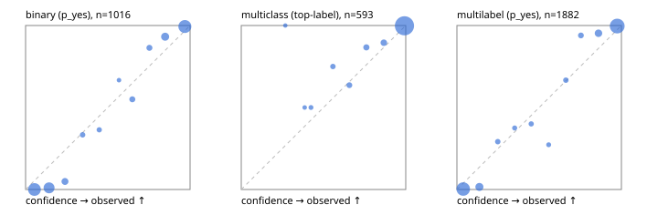

# Evaluation report

- model `Qwen/Qwen3.5-4B` @ `851bf6e806` (shared document / forked native cache branches), adapter/checkpoint `runs/qwen35_4b_tree_cost_jevall/adapter_last`, prompt `challenger-state-first-v1` (6c9d8459ac44)
- data data/ova/eval2.jsonl; splits ['test']; n=1991; calibration `None`
- cuda / bfloat16; 2026-09-26T22:01:09+0000; wall 189.0s

## Overall

question accuracy 95.7%

**binary**: n 1016, positives 435, accuracy 0.969, precision 0.955, recall 0.972, f1 0.964, auroc 0.995, brier 0.031, log_loss 0.138, ece 0.070

**multiclass**: n 593, accuracy 0.976, macro_f1 0.961, log_loss 0.081, brier 0.039, ece_top_label 0.014

**multilabel**: n 382, labels 1882, exact_match 0.895, micro_f1 0.976, macro_f1 0.955, label_auroc 0.996, brier 0.021, log_loss 0.096, ece 0.042

## By family

| family | n | question acc % | details |
|---|---|---|---|
| e2_hard | 673 | 95.2 | bin acc 97.7 F1 96.9 AUROC 0.996 ECE 0.088; mc acc 97.4 mF1 95.0 ECE 0.025; ml EM 85.6 µF1 96.2 ECE 0.045 |
| e2_simple | 664 | 98.5 | bin acc 97.1 F1 97.3 AUROC 0.997 ECE 0.054; mc acc 100.0 mF1 100.0 ECE 0.009; ml EM 100.0 µF1 100.0 ECE 0.044 |
| e2_very_hard | 654 | 93.3 | bin acc 95.7 F1 94.4 AUROC 0.992 ECE 0.078; mc acc 95.5 mF1 92.9 ECE 0.028; ml EM 83.8 µF1 96.4 ECE 0.052 |

## by hard case

| slice | n | question acc % |
|---|---|---|
| (none) | 569 | 98.4 |
| contradiction | 172 | 96.5 |
| distractor | 474 | 94.7 |
| double_negation | 126 | 94.4 |
| evidence_end | 57 | 96.5 |
| evidence_middle | 114 | 100.0 |
| evidence_start | 17 | 100.0 |
| exception | 213 | 93.9 |
| hypothetical | 128 | 97.7 |
| injection | 151 | 92.7 |
| lexical_overlap | 201 | 97.5 |
| long_state | 191 | 98.4 |
| missing_evidence | 141 | 97.9 |
| multi_positive | 322 | 90.1 |
| multi_turn | 149 | 92.6 |
| negation | 257 | 96.1 |
| nota | 118 | 94.1 |
| numeric_reasoning | 224 | 87.1 |
| paraphrase | 218 | 91.7 |
| role_reversal | 187 | 96.3 |
| sarcasm | 149 | 96.0 |
| temporal_reasoning | 203 | 85.7 |
| zero_positive | 73 | 93.2 |
| zero_positive_distractor | 1 | 100.0 |

## by state tokens

| slice | n | question acc % |
|---|---|---|
| 00000-00127 | 666 | 94.7 |
| 00128-00511 | 469 | 92.8 |
| 00512-02047 | 488 | 97.3 |
| 02048-08191 | 329 | 98.8 |
| 08192+ | 39 | 100.0 |

## by candidates

| slice | n | question acc % |
|---|---|---|
| 01 | 1016 | 96.9 |
| 03 | 128 | 96.1 |
| 04 | 515 | 96.1 |
| 05 | 224 | 91.5 |
| 06 | 86 | 89.5 |
| 07 | 18 | 100.0 |
| 08 | 4 | 75.0 |

## Paraphrase groups

76 groups; same prediction 77.6%; all correct 86.8%

## Multiclass abstention (coverage vs error on accepted)

| abstain_below | coverage % | error % |
|---|---|---|
| 0.0 | 100.0 | 2.4 |
| 0.4 | 99.5 | 2.2 |
| 0.5 | 98.8 | 1.9 |
| 0.6 | 97.5 | 1.6 |
| 0.7 | 95.6 | 0.9 |
| 0.8 | 93.1 | 0.5 |
| 0.9 | 89.9 | 0.2 |

## Reliability: binary

| bin | n | mean confidence | observed frequency |
|---|---|---|---|
| [0.0,0.1) | 308 | 0.054 | 0.000 |
| [0.1,0.2) | 201 | 0.143 | 0.010 |
| [0.2,0.3) | 41 | 0.239 | 0.049 |
| [0.3,0.4) | 12 | 0.347 | 0.333 |
| [0.4,0.5) | 11 | 0.448 | 0.364 |
| [0.5,0.6) | 3 | 0.568 | 0.667 |
| [0.6,0.7) | 20 | 0.649 | 0.550 |
| [0.7,0.8) | 22 | 0.753 | 0.864 |
| [0.8,0.9) | 73 | 0.849 | 0.932 |
| [0.9,1.0] | 325 | 0.968 | 0.994 |

## Reliability: multiclass

| bin | n | mean confidence | observed frequency |
|---|---|---|---|
| [0.2,0.3) | 1 | 0.268 | 1.000 |
| [0.3,0.4) | 2 | 0.385 | 0.500 |
| [0.4,0.5) | 4 | 0.424 | 0.500 |
| [0.5,0.6) | 8 | 0.557 | 0.750 |
| [0.6,0.7) | 11 | 0.657 | 0.636 |
| [0.7,0.8) | 15 | 0.761 | 0.867 |
| [0.8,0.9) | 19 | 0.867 | 0.895 |
| [0.9,1.0] | 533 | 0.992 | 0.998 |

## Reliability: multilabel

| bin | n | mean confidence | observed frequency |
|---|---|---|---|
| [0.0,0.1) | 667 | 0.038 | 0.003 |
| [0.1,0.2) | 130 | 0.137 | 0.015 |
| [0.2,0.3) | 24 | 0.248 | 0.292 |
| [0.3,0.4) | 16 | 0.351 | 0.375 |
| [0.4,0.5) | 20 | 0.451 | 0.400 |
| [0.5,0.6) | 11 | 0.558 | 0.273 |
| [0.6,0.7) | 21 | 0.662 | 0.667 |
| [0.7,0.8) | 33 | 0.754 | 0.939 |
| [0.8,0.9) | 106 | 0.860 | 0.953 |
| [0.9,1.0] | 854 | 0.974 | 0.996 |
